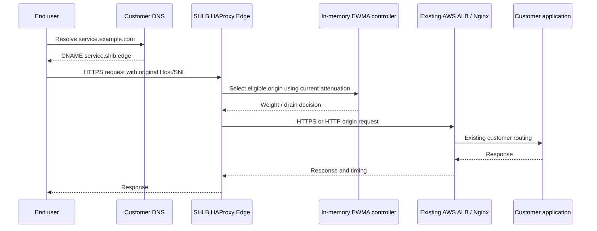

# SHLB Frictionless Onboarding and Edge Overlay

## Product boundary

SHLB is an L7 edge overlay, not a replacement for a customer's AWS
Application Load Balancer, Nginx, ingress controller, or service mesh. A
customer keeps its existing origin infrastructure and delegates only the
public traffic entry point to an SHLB hostname. The integration is reversible
through DNS and does not require an agent, host change, or Docker access in
the customer's environment.

The overlay assumes that the customer's origins are reachable from the SHLB
edge over an approved network path and that the customer has authorized the
declared FQDNs or IPs. Origin ownership and reachability are validated before
activation.

## Bring Your Own Origin dashboard flow

1. **Create an origin group.** The customer signs in to the React dashboard
   and selects **Bring Your Own Origin**.
2. **Declare targets.** The customer enters one or more FQDNs or IP
   addresses, protocol/port, SNI hostname, health-check path, and optional
   region or priority metadata.
3. **Validate ownership and reachability.** The control API verifies DNS
   resolution, TLS/SNI compatibility, health-check response, certificate
   hostname, and configured network policy. A target cannot become eligible
   from a form submission alone.
4. **Preview the route.** The dashboard shows the generated origin group,
   expected CNAME, health-check result, initial weight, and rollback record.
5. **Activate overlay.** The API commits an immutable origin-group version and
   asks the data-plane configuration controller to publish it. Activation is
   staged: `DRAFT -> VALIDATING -> READY -> ACTIVE`.
6. **Delegate DNS.** The customer creates a DNS CNAME from its public service
   name to the SHLB edge hostname. Existing origin infrastructure remains
   unchanged.
7. **Observe and operate.** The dashboard displays origin health, latency,
   attenuation, Runtime readback, and audit events for the origin group.

## Dynamic HAProxy configuration

Customer targets are not manually appended to `haproxy.cfg`. The control API
stores versioned origin-group intent and submits a validated data-plane
configuration transaction. The implementation may use HAProxy Data Plane API
or a controlled hitless reload, depending on the deployment profile:

- Runtime weight and admin-state changes use `/var/run/haproxy/admin.sock`
  without reloads.
- New origin servers, ACLs, certificates, or backend topology changes use a
  versioned configuration render followed by syntax validation, atomic
  publication, and a hitless reload.
- The controller waits for process health and exact backend/server readback
  before marking the origin-group version active.
- Failed validation or readback leaves the prior active version unchanged.
- Every version records actor, request ID, origin targets, generated
  configuration hash, activation result, and rollback pointer.

The fast EWMA controller operates only on an active, validated origin group.
It can attenuate a server's weight or drain it, but cannot invent a target,
change an unapproved hostname, or bypass the configuration ledger.

## CNAME overlay traffic flow

SHLB preserves the customer's host and SNI contract according to the
configured origin policy. Health checks and Runtime observations are scoped to
the declared origin group, so one customer's attenuation cannot consume
another customer's capacity reserve.

## Graceful fallback and bypass

To bypass SHLB, the customer changes its DNS record from the SHLB CNAME back
to the existing AWS ALB/Nginx endpoint. No customer host, application, or
origin configuration change is required. DNS TTL determines propagation time;
the dashboard exposes the active CNAME, last observed TTL, and bypass
verification status.

The customer may then deactivate the origin group. Deactivation drains new
SHLB selections, preserves active connections where possible, and retains the
audit ledger. SHLB does not delete origin definitions immediately, allowing a
safe reactivation or forensic review. Credentials, certificates, and
customer-specific telemetry remain scoped for later revocation according to
retention policy.

## Operational safeguards

- Origin target changes require authenticated authorization and validation.
- Private IP targets require an explicitly approved network attachment; public
  DNS alone is not proof of ownership.
- SSRF protections restrict schemes, ports, address classes, redirects, and
  DNS rebinding.
- TLS verification is enabled by default; disabling verification requires an
  explicit, audited exception.
- Customer traffic, logs, and RCA payloads are tenant-scoped and redacted.
- DNS bypass is always available and is the documented exit strategy.
