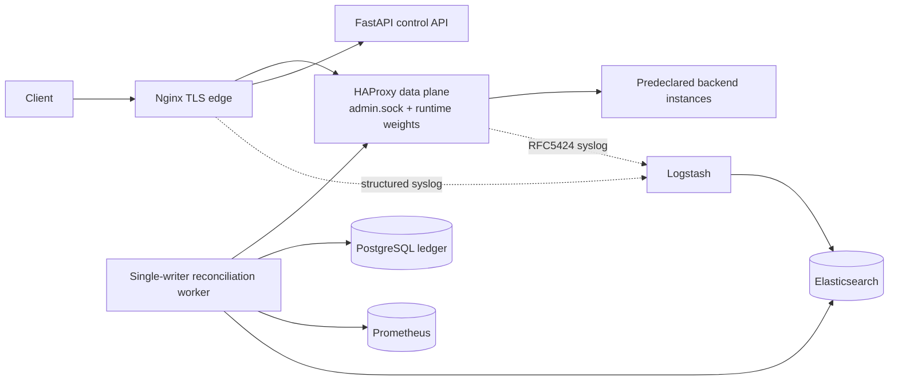

# SHLB 2026: High-Level Design

## Scope and claim boundary

SHLB is an evidence-bounded traffic attenuation controller. It does not
restart hosts or containers. It observes application outcomes, proxy runtime
state, and semantic logs, then applies the smallest reversible HAProxy change
that is supported by the evidence. PostgreSQL is the authoritative ledger;
Redis, Prometheus, Elasticsearch, and Kibana are derived infrastructure.

## Planes

## Failure containment

The API never mounts the HAProxy socket. Only the worker can mutate routing.
The worker has no Docker Engine socket and cannot perform host-level process
control. Every mutation is prepared in PostgreSQL, executed as an absolute
runtime command, read back, and either verified or rolled back. A lost
authority lease stops mutation rather than guessing.

## Resource envelope

The local profile deliberately budgets approximately 1 GiB for Elasticsearch,
512 MiB for Logstash, 768 MiB for Kibana, and bounded memory for all other
services. JVM heaps are lower than container limits to preserve native memory
and filesystem cache headroom.

## AIOps fallback and RCA generation

The deterministic controller remains the authority for ordinary remediation.
The AI diagnostic plane is an explicitly bounded escalation path, not a
replacement for the fast path and not an autonomous command executor.

### Trigger condition

The worker enters `UNRECOVERABLE_STATE` when one or more of the following
conditions is true:

- healthy eligible capacity falls below 33% of the declared physical pool;
- the reserve invariant prevents another safe attenuation;
- all eligible peers violate the latency/error policy window; or
- a previously applied action fails verification and rollback cannot restore a
  confirmed state.

The trigger is debounced by the worker's reconciliation generation and carries
an idempotency key. Repeated observations extend the same diagnostic request;
they do not create an LLM request per polling tick.

### RCA context envelope

The worker creates a redacted, size-bounded diagnostic envelope containing:

| Field | Contents | Boundary |
|---|---|---|
| `observation_window` | window ID, start/end timestamps, completeness | no raw credentials |
| `capacity` | declared, eligible, drained, and reserved capacity | physical nodes counted once |
| `latency` | per route/instance EWMA, p95/p99, sample count | bounded numeric summaries |
| `errors` | status-class rates, 5xx deltas, timeout counts | no request bodies |
| `queues` | HAProxy `qcur`, `qmax`, sessions, connection errors | exact backend/server tuple |
| `runtime_state` | weight, admin state, operational status, readback | last confirmed command |
| `semantic_signatures` | normalized Logstash/Elasticsearch anomaly signatures | allow-listed fields only |
| `actions` | prior commands, acknowledgements, verification, rollback | durable action IDs |

The envelope is sent through a minimal provider adapter, preferably the native
Google GenAI SDK or a direct structured HTTP/Pydantic client, only after
redaction, schema validation, payload-size limits, and explicit provider
availability checks. A broad LangChain dependency is not required. The
provider receives retrieved runbooks and architecture facts, not unrestricted
cluster data.

### Output and safety boundary

The model must return Markdown with a fixed schema: incident summary, likely
causes ranked with evidence, confidence and missing evidence, immediate
containment options, and recommended next diagnostics. The adapter stores the
report and streams it to the frontend over SSE as an `rca_report` event.

The report is advisory. It cannot issue HAProxy commands, mutate PostgreSQL,
invoke Docker, or mark an incident resolved. If the provider times out,
exceeds token limits, or returns invalid Markdown/schema, the worker records
`RCA_UNAVAILABLE` and preserves the deterministic `NEEDS_REVIEW` state.

## Detection-time and throughput limits

The fast path is low-latency relative to the asynchronous forensic plane, but
it is not described as universally sub-second. With polling interval `P`,
dual-EWMA settling time `T_settle`, and hysteresis count `K`, the derived
upper-bound approximation is:

`T_detect <= P + T_settle + (K - 1) * P`

Request volume must also be part of the evidence gate. A tick with no real
samples cannot count as a meaningful unhealthy observation. Future revisions
should replace fixed tick counts with minimum-sample windows and bounded
continuous control.

The current implementation additionally enforces a 20-sample probation period
and a 15 ms absolute latency gap: a latency anomaly requires
`sample_count >= 20`, `current > 2.5 * baseline`, and
`current - baseline > 15 ms`. Missing Runtime values remain missing and do not
become healthy zeroes.

The current durable writer can become a PostgreSQL write bottleneck during
high-cardinality incidents. Asynchronous, bounded action-event queues and
batch persistence are future work; they must not remove the fencing record
required before a Runtime mutation.

## Research roadmap

The next control-model comparisons are a continuous PID controller and
change-point detectors such as CUSUM and Page-Hinkley. These are evaluation
targets, not current implementation claims.

## Interactive presentation sandbox

The presentation sandbox is an isolated frontend experience backed by the
Compose `demo-backend` pool. It is explicitly separated from customer-origin
traffic and cannot silently modify production origin registrations. A
presenter enables the sandbox, selects a demo node, and invokes authenticated
chaos scenarios such as CPU pressure, memory pressure, and network latency.

The UI renders real Runtime readback, incident events, attenuation stages,
canary recovery, and MTTR timestamps. It does not synthesize a healed state:
the timeline advances only when the control API publishes corresponding
durable events. The sandbox automatically displays its target environment and
fault expiry so a demonstration cannot be mistaken for customer traffic.
