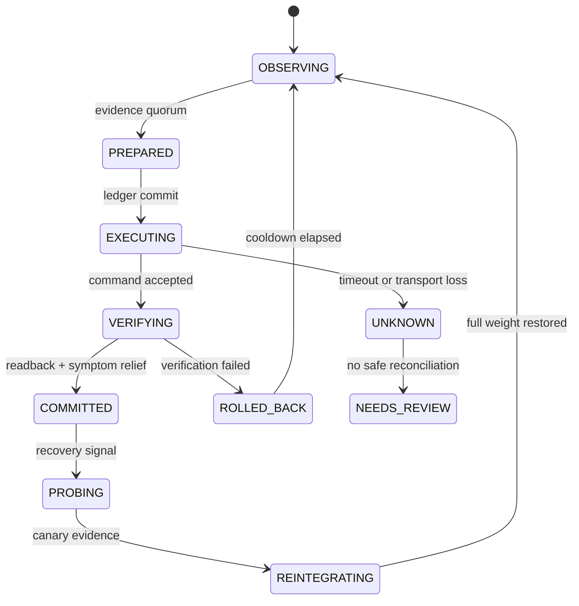

# SHLB 2026: Low-Level Design

## Worker concurrency model

The worker is a single logical writer. Its loop is non-overlapping:

1. Refresh the PostgreSQL advisory lock and Redis lease.
2. Read HAProxy Runtime state through `admin.sock`.
3. Read bounded metric/log evidence windows.
4. Compute a deterministic classification and candidate mutation.
5. Commit `PREPARED` state and an idempotency key in one PostgreSQL transaction.
6. Execute the runtime command.
7. Read back the exact backend/server tuple.
8. Commit `COMMITTED`, `VERIFYING`, `ROLLED_BACK`, or `NEEDS_REVIEW`.

Network calls use bounded timeouts. A timeout is an unknown outcome, never a
successful mutation. The worker may use threads for independent reads only if
the database writer remains serialized and every result carries an observation
window identifier.

## Runtime IPC

The only privileged IPC is the HAProxy Unix socket mounted at
`/var/run/haproxy/admin.sock`. Commands are allow-listed by backend/server
identity and are followed by readback. Runtime weights and drain state are
attenuation primitives: active connections finish, new selection changes, and
no process reload is required.

## State machine



## Predictive anomaly scoring

Each route/instance tuple receives a bounded score from independent signals.
The latency component is relative to a per-key dynamic baseline rather than a
global millisecond threshold:

`score = w_e * error_delta + w_l * latency_delta + w_q * queue_delta + w_s * semantic_anomaly`

The fast path maintains:

```text
current_t  = 0.30 * latency_t + 0.70 * current_(t-1)
baseline_t = 0.05 * latency_t + 0.95 * baseline_(t-1)
latency_anomaly := sample_count >= 20 AND current_t > 2.5 * baseline_t AND (current_t - baseline_t) > 15ms
```

The first 20 finite samples are probation: neither latency deviation nor error
rate can trigger an anomaly. After probation, the detector requires three
consecutive unhealthy observations before attenuation. Recovery requires the configured healthy cooldown and advances
through 25%, 50%, and 100%. The polling interval, EWMA settling behavior, and
hysteresis count determine the detection bound:

`T_detect <= P + T_settle + (K - 1) * P`

The score is calculated over aligned observation windows. A mutation requires
minimum evidence completeness, a route-scope quorum, available peer capacity,
and a cooldown check. Scores prioritize investigation and do not bypass the
deterministic safety policy.

## Backpressure and future control models

The current single-writer loop persists durable state synchronously to preserve
ordering. Under high-cardinality incidents this can create a PostgreSQL
write-storm. The next design should queue immutable observation/action events
asynchronously, apply bounded batching, and retain a synchronous fencing
record for mutations.

Future research should compare the dual-EWMA detector with a continuous PID
controller and sequential CUSUM or Page-Hinkley change-point detectors. These
must remain bounded by the same reserve, authority, and readback invariants.

## Runtime socket adapter

The Runtime adapter uses an ephemeral asynchronous Unix-socket connection for
each command. It calls `asyncio.open_unix_connection`, writes one command,
accumulates reads until EOF, and closes the descriptor through an `async with`
context manager. The total budget is 150 ms, below the nominal 500 ms
observation cadence. `show stat` parsing is header-name based, skips `BACKEND`
and `FRONTEND` aggregate rows, maps `-` to `None`, and discards negative
cumulative-counter deltas after a HAProxy reset.

## Security invariants

- No application service receives `/var/run/docker.sock`.
- No host port exposes PostgreSQL, Redis, Prometheus, HAProxy stats, or ELK.
- Secrets are mounted as files and are never placed in image layers.
- Elasticsearch/Logstash/Kibana are internal-only and are not treated as
  authority for remediation.
