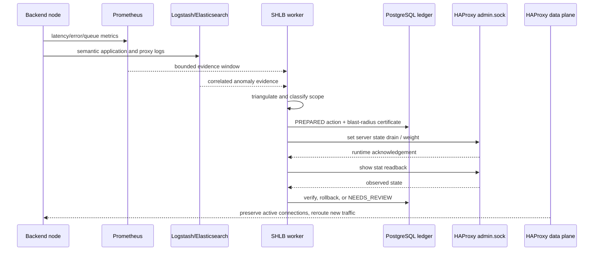
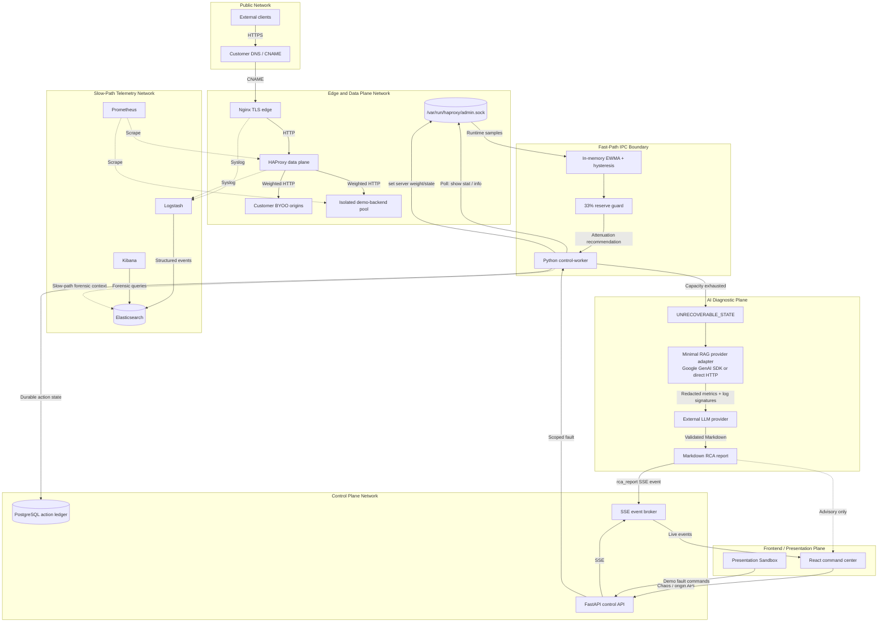

Archived: out of scope for the current single-environment lab prototype and the Phase 1 rule-only implementation (see CONTEXT/project-overview.md and CONTEXT/architecture.md). Kept for historical reference only.

# SHLB Research Diagrams

## SHLB autonomous healing lifecycle

## SHLB topology

