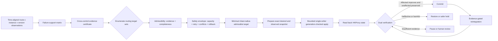

# Selected Invention Disclosure — Engineering Draft

> **Non-legal document.** This disclosure is prepared for technical review by a college IP cell or patent professional. It does not assert novelty, inventive step, patentability, validity, infringement, legal status, or freedom to operate. All conclusions are preliminary.

## 1. Suggested invention title

**Evidence-Bounded Minimum-Scope Transactional Remediation for Application Load Balancing**

Alternative: **Cross-Control-Constrained Routing Scope Selection with Reversible Effect Verification**

## 2. Technical field

Application-layer load balancing, reverse proxies, distributed-systems failure mitigation, runtime traffic control, failure-scope inference, and safe closed-loop routing remediation.

## 3. Background technical problem

An L7 load balancer commonly treats a backend endpoint as healthy or unhealthy. Real failures can have finer or broader scope:

- one process is unreachable;
- an instance is slow across all routes;
- one route is broken on one instance;
- a route is broken across all instances because of shared application/dependency behavior;
- load and retries create saturation;
- instances in one deployment version regress.

If a controller ejects a whole instance for a route-local failure, it removes capacity that could still serve other routes. If it retries a shared route failure across instances, it adds load without increasing success. If it removes a whole version without stable capacity, it can cause an outage. If it restores traffic merely because errors disappear while the target receives no traffic, it can flap.

## 4. Limitations of existing approaches

Existing systems already disclose or implement request-specific health, member ejection, peer outliers, ejection percentage caps, weighted routing, version subsets, confidence-gated remediation, canary verification, and gradual reintroduction. These mechanisms often operate at a preconfigured scope or map a detection directly to an action. They do not establish novelty for this disclosure individually.

The engineering limitation addressed here is the absence, in the reviewed material, of the exact combined procedure that:

1. requires cross-controls to certify the support for each candidate routing scope;
2. treats HAProxy-expressible target sets as alternatives in a constrained selection problem;
3. rejects an action scope when evidence, completeness, remaining capacity, retry safety, or rollback state is insufficient;
4. verifies both the predicted affected-cohort response and a preservation invariant on unaffected route cells before committing the scope.

Whether that combination is legally non-obvious is unresolved.

## 5. Summary of the proposed mechanism

The controller receives time-aligned, privacy-minimized observations keyed by route group, physical instance, and deployment version. It derives a failure-support matrix and a structured fingerprint. Rules and an optional calibrated classifier estimate a top-level failure class, but classification alone cannot actuate.

For each candidate routing target set, the controller creates or tests an **evidence certificate** containing the comparisons required to justify that scope. It then applies a deterministic **action safety envelope**. Among admissible candidates it selects the lowest blast-radius cost, prepares an exact rollback snapshot, and applies a bounded HAProxy state change with a durable action identifier and controller generation. It reads back observed state and evaluates two obligations:

- **effect obligation:** the symptom should change as predicted in the affected cohort;
- **preservation obligation:** disjoint route cells predicted to remain healthy must not regress or lose unnecessary capacity.

The controller commits the action, restores the snapshot where safe, or requires review. Traffic is later reintroduced through evidence-gated stages.

## 6. System components

- NGINX public/TLS ingress;
- HAProxy L7 dynamic data plane with one logical backend per route group;
- HAProxy Runtime API and Data Plane API adapter;
- telemetry window builder and failure fingerprint engine;
- deterministic rule classifier and optional calibrated ML classifier;
- conflict, confidence, and completeness resolver;
- evidence-certificate builder;
- routing-unit enumerator and blast-radius cost function;
- capacity/retry/action safety engine;
- durable action transaction and desired-state store;
- observed-state reader and reconciliation loop;
- verification and reintegration controller;
- incident/audit stores and operator interface.

## 7. Input data

Required input categories are:

- route-group identifier and criticality;
- physical instance identifier and endpoint;
- deployment-version identifier;
- request method safety category;
- request counts, status families, timeouts, connection failures, HAProxy termination state, and retry counts;
- latency quantiles and peer-relative deviation;
- active connections, queue depth, configured/observed weight, and nominal capacity;
- direct synthetic probe results;
- optional CPU/memory signals and sanitized application error codes;
- prior action/reintegration state;
- source timestamps, provenance, staleness, conflicts, and data completeness;
- retry, reserve-capacity, and rollback policies.

The method does not require request or response bodies.

## 8. Intermediate representations

### Observation cell

An observation cell is identified by `(environment, service, route_group, instance, version, window)` and contains aggregate counts/rates/quantiles plus provenance.

### Failure-support matrix

For each cell, the matrix records:

- target deviation from robust route peers;
- deviation of the same instance across other routes;
- deviation of the same version from control versions;
- absolute health/probe failures;
- saturation/load alignment;
- uncertainty, sample size, conflict, and completeness.

### Evidence certificate

The certificate is a versioned machine-readable record:

```text
certificate_id
fingerprint_id and observation-window IDs
candidate failure class and probability/rule result
proposed target membership set
required contrasts and their pass/fail/insufficient outcomes
sample counts and confidence bounds
source provenance, staleness, conflicts, completeness
remaining-capacity calculation
retry-safety and criticality results
predicted affected effect
predicted unaffected preservation set
rollback snapshot availability
policy/model/schema versions
certificate expiry and canonical hash
```

It is evidence-carrying, not a formal mathematical proof and not an assertion of causal root cause.

### Routing-unit candidates

Each candidate is represented by its concrete set of HAProxy logical memberships and/or a predeclared route policy:

`NO_CHANGE`, `INSTANCE_WEIGHT`, `COMPLETE_INSTANCE`, `ROUTE_INSTANCE`, `COMPLETE_ROUTE`, `VERSION_GROUP`, or `GLOBAL_TRAFFIC_POLICY`.

## 9. Detailed technical method

### Step A — Window construction

Build aligned short and medium windows. Reject or mark stale sources. Compute robust peer baselines only when minimum peer/sample requirements hold.

### Step B — Scope evidence

For a suspected route-instance cell `(r, i)`:

- compare `(r, i)` with `(r, peers(i))` to show instance-specific deviation for the same route;
- compare `(other_routes(r), i)` with their peers to show the physical instance is otherwise healthy;
- compare version cohorts where relevant;
- test whether request rate/queue/resource saturation explains the symptom;
- record direct probe and connection evidence.

Equivalent certificate templates exist for instance, shared route, overload, and version scopes. A missing required contrast yields `INSUFFICIENT`, not `PASS`.

### Step C — Candidate enumeration and admissibility

Generate concrete action candidates whose target sets cover the suspected failed cells. A candidate is admissible only if:

1. its certificate template passes at the confidence/completeness threshold for the route criticality;
2. it does not remove cells the certificate predicts healthy beyond the policy allowance;
3. post-action remaining capacity exceeds reserve and queue/headroom constraints;
4. retry semantics cannot duplicate unsafe work or amplify a shared failure;
5. no higher-priority operator override or conflicting incident overlaps the target;
6. cooldown and active-quarantine caps allow it;
7. the requested state is expressible by predeclared HAProxy structures;
8. prior desired/observed state and rollback behavior are available;
9. the certificate remains within its expiry and controller generation.

### Step D — Minimum-blast-radius selection

For each admissible candidate calculate a deterministic cost:

```text
lost_healthy_capacity_cost
+ critical_route_scope_cost
+ number_of_memberships_changed
+ retry_amplification_risk
+ reload_or_structural_change_penalty
+ uncertainty_penalty
+ rollback_difficulty_penalty
```

Select the lowest cost. Ties select the more reversible, non-structural action; remaining ties require review. “Minimum” therefore means a target-set/cost decision under evidence and safety constraints, not a fixed enum order.

### Step E — Prepare

- acquire the environment single-writer lock;
- verify controller generation;
- create immutable action ID/idempotency key;
- persist certificate and expected effect;
- capture desired and observed state for every target;
- calculate before/after capacity;
- persist rollback strategy and expiry;
- re-read conflicts and certificate staleness.

### Step F — Bounded apply

The first change is the least harmful magnitude that can produce evidence, unless a hard failure requires immediate drain. Examples:

- ambiguous degradation: reduce weight from 100 to 50 or 20, policy-dependent;
- high-confidence route-instance failure: drain only that membership;
- shared-route overload: suppress retries before activating bounded load shedding;
- confirmed instance down: drain all memberships without waiting for a traffic canary.

Commands are idempotent set-to-state operations. Multi-membership action is a saga; each command result and readback is recorded.

### Step G — State confirmation

Read HAProxy observed state. If the acknowledgment was lost but state matches, continue. If state differs, retry within deadline or enter partial-action recovery. Stale controller generations cannot start new attempts.

### Step H — Dual verification

Observe until sample/evidence requirements or a maximum deadline:

- affected symptom improvement relative to pre-action and peer/control values;
- preserved success/latency/headroom on the certificate’s unaffected set;
- observed HAProxy state and remaining capacity;
- queue/retry changes and synthetic probe results.

Return `EFFECTIVE`, `INEFFECTIVE`, `HARMFUL`, or `INSUFFICIENT_EVIDENCE`.

### Step I — Commit, abort, or review

- `EFFECTIVE`: retain/expand to the requested final state and start cooldown.
- `INEFFECTIVE`: restore the exact prior state if that restoration is safe; otherwise hold the safer state and review.
- `HARMFUL`: restore the last verified safe state immediately where expressible; freeze overlapping automation.
- `INSUFFICIENT_EVIDENCE`: keep only a policy-defined safe bounded state or restore; never silently commit.
- rollback failure: freeze automation, preserve the least risky observed state, and require operator intervention.

### Step J — Reintegration

Direct probes precede live traffic. Default stages are 5%, 20%, 50%, and 100%, but each stage size and window is policy-defined. Advance only when affected and preservation obligations pass. Recurrent failure returns to quarantine and increases cooldown within fixed bounds; after the maximum attempts, require review.

## 10. Routing intervention embodiment

In HAProxy, one physical backend endpoint appears as an independent logical server entry in each route backend. A route-instance intervention changes only the server entry in that route backend. A complete-instance action changes all entries that share the controller’s physical `instance_id`. A version action changes the union of entries whose instances share a version ID. A complete-route action toggles a predeclared policy/map rather than attempting to discover or edit application code.

## 11. Transaction and consistency semantics

- PostgreSQL desired state is authoritative.
- Runtime API commands are volatile and reconciled after restart.
- Structural changes use Data Plane API optimistic configuration version, validation, and reload, but are not automatic incident actions in MVP.
- At-least-once apply plus idempotent state setting is used; exactly-once is not claimed.
- HAProxy state readback resolves lost acknowledgments.
- A single socket-mounted writer prevents Runtime API split brain in MVP; Redis locks are duplicate suppression, not the ultimate fence.

## 12. Verification technical effect

The dual obligation is intended to prevent two false successes:

1. Errors fall because too much capacity was removed, causing unrelated route degradation later.
2. Errors disappear because the suspect target receives no traffic, falsely implying recovery.

The first is addressed by unaffected-cohort capacity/performance checks; the second by controlled re-exposure and direct probes.

## 13. Expected measurable technical effect

Compared with whole-instance health checks and static thresholds, the mechanism is expected to:

- preserve a larger fraction of ground-truth healthy route capacity during localized faults;
- reduce unnecessary complete-instance removals;
- reduce retry amplification during shared-route/overload faults;
- bound false routing actions and harmful commits;
- reconstruct consistent desired state after controller or HAProxy restart.

These are hypotheses until measured.

## 14. Alternative embodiments

- Another L7 proxy may replace HAProxy if it exposes independent route-member state and observed-state readback.
- The support matrix may include tenant, region, dependency class, or protocol operation, provided cardinality and privacy are bounded.
- The classifier may be rules-only; EBMSH does not require ML.
- Evidence thresholds may use deterministic bounds, calibrated probabilities, Bayesian intervals, or sequential tests.
- Bounded apply may reduce weight, cap concurrency, shadow synthetic probes, or toggle a predeclared route policy.
- Single-writer may be replaced by a local actuator that enforces fencing tokens.
- Reintegration stages may be evidence-selected rather than fixed percentages within hard policy bounds.

## 15. Failure handling

- incomplete/conflicting evidence: abstain or downgrade;
- Prometheus unavailable: freeze automatic evidence-based actions; HAProxy checks remain;
- database unavailable: no new actions;
- Redis unavailable: disable automation because locks/events are degraded;
- HAProxy API unavailable: retain last-known-good data-plane state;
- partial apply: read all targets, converge or restore per action policy;
- controller restart: resume from durable state and observed HAProxy state;
- model unavailable/schema mismatch: rules-only;
- verification unavailable: insufficient evidence, never success;
- LLM unavailable: deterministic report; no control effect.

## 16. Experimental evidence required

1. Thirty matched trials for each of four baselines across each primary fault scenario.
2. Ground-truth membership/route/version fault labels.
3. Healthy-capacity preservation with successful-request guardrail.
4. Unnecessary whole-instance removal, retry amplification, false-action rate, and rollback rate.
5. Class macro-F1, per-class precision/recall, confusion matrix, calibration error, and confidence intervals.
6. Partial apply, lost acknowledgment, controller restart, HAProxy restart, missing telemetry, and rollback-failure tests.
7. Ablation: remove cross-route control, completeness gate, safety envelope, and dual preservation verification one at a time.

## 17. Known prior art

At minimum, review and claim-chart:

- [US20110238733A1 / US9058252B2](https://patents.google.com/patent/US20110238733A1), request-based server health;
- [US8949658B1](https://patents.google.com/patent/US8949658B1), anomalous host selection/ejection and ejection limit;
- [US11943131B1](https://patents.google.com/patent/US11943131B1/en), confidence reinforcement through service health tests;
- [US8171130B2](https://patents.google.com/patent/US8171130B2/en), information-gain active probing;
- [US20220038347A1 / US11711271B2](https://patents.google.com/patent/US20220038347A1/en), ML predictive routing;
- [US20240045739A1](https://patents.google.com/patent/US20240045739A1/en), backend-health-driven API routing;
- Envoy/Istio outlier detection, circuit breaking, retry budgets, subsets, and ejection caps;
- F5 per-pool/member monitors and dynamic load balancing;
- Google Canary Analysis Service/Kayenta and declarative rollout validation;
- Narya and Gandalf.

## 18. Open prior-art questions

1. Does any ADC patent explicitly enumerate route-member, instance, route, and version target sets and choose the smallest evidence-supported set?
2. Do commercial controllers verify unaffected-route capacity as a commit invariant after a scoped route action?
3. Is there prior art for machine-checkable evidence certificates tied to network-actuation admissibility rather than audit alone?
4. Do continuation families of request-based health modeling cover version dimensions or transactional verification?
5. Does non-US literature disclose the same cross-control matrix and bounded actuation sequence?
6. Would a skilled person regard the combination as an obvious use of outlier detection, policy optimization, and canary verification?

## 19. Confidentiality recommendation before filing review

Until the IP cell advises otherwise, avoid publicly disclosing:

- the exact certificate fields and required cross-control templates;
- the blast-radius cost/admissibility procedure;
- default threshold combinations and action-magnitude mapping;
- the dual affected/unaffected commit criteria;
- unpublished experiment results and ablation findings;
- diagrams or source that map the complete procedure end to end.

General statements that the project uses failure-scope-aware HAProxy routing are already close to public prior art and provide little protectable secrecy. Follow college policy and obtain legal advice before papers, repositories, posters, or public demos.

## 20. Non-legal independent-claim concept

An out-of-path application-load-balancing method that: receives route- and backend-resolved observations; forms a multidimensional support representation; generates evidence results for multiple differently scoped routing target sets using peer and cross-route controls; excludes target sets that fail evidence-completeness or traffic-capacity constraints; selects a remaining target set according to a blast-radius measure; persists prior routing state; applies a bounded routing modification to that set; observes the applied state; evaluates both a predicted effect for an affected cohort and a preservation condition for an unaffected cohort; and retains or reverses the routing modification according to those evaluations.

This is a technical concept for attorney discussion, not a drafted legal claim.

## 21. Non-legal dependent-claim concepts

- the support representation additionally includes deployment version;
- a route-instance certificate requires same-route peer abnormality and same-instance other-route normality;
- incomplete or conflicting telemetry invalidates the certificate;
- the safety constraint includes remaining route capacity and retry idempotency;
- the first modification is a bounded weight change and a later state is drain;
- hard reachability failure bypasses bounded exposure and drains immediately;
- HAProxy Runtime API set operations are reconciled against a durable desired state;
- controller generation and idempotency key reject stale attempts;
- verification uses synthetic probes when live samples are insufficient;
- reintegration advances only when affected and unaffected evidence obligations pass;
- recurrence increases cooldown and eventually requires review;
- an LLM is excluded from the decision and receives only validated evidence for reporting.

## 22. Diagrams required for professional disclosure

1. System context and trust boundaries.
2. Route × instance logical membership mapping.
3. Failure-support matrix example for each class.
4. Evidence certificate construction.
5. Candidate routing-unit target sets and blast-radius comparison.
6. Safety-envelope decision flow.
7. Durable bounded-apply/verify/commit/restore sequence.
8. Desired versus observed reconciliation after restart.
9. Dual affected/unaffected verification windows.
10. Staged reintegration and flapping state machine.
11. Alternative version-group embodiment.
12. Experiment setup and measured technical effect.

## 23. Patent-exploration mechanism diagram



**Diagram explanation:** observations do not directly cause routing. They produce a scope-specific certificate; candidates without sufficient evidence or safety are removed; the remaining lowest-blast-radius target is changed reversibly; and the action is committed only after two independent technical obligations pass.
