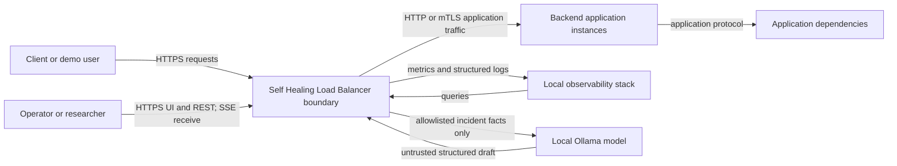
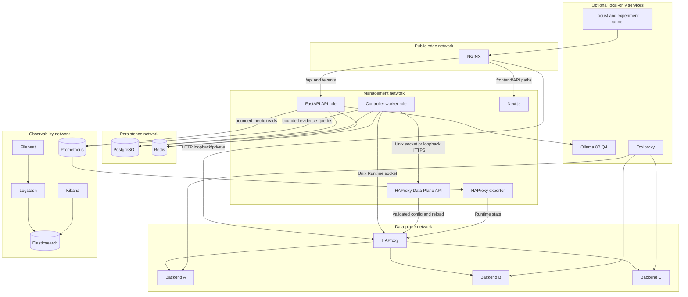
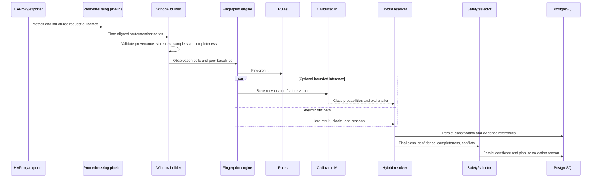

# Complete System Architecture

## 1. Architecture principles

1. **Traffic independence:** only NGINX, HAProxy, backends, and their dependencies are in the client request path.
2. **One traffic authority:** HAProxy owns backend selection and application retries; NGINX does not run a competing upstream-healing policy.
3. **Durable intent, observed reality:** PostgreSQL desired state is reconciled with HAProxy observed state. Redis is never the sole copy of safety-critical truth.
4. **Single writer:** one controller worker has the HAProxy Runtime socket in MVP.
5. **Rules before ML:** the complete system must heal controlled faults without an ML model, LLM, ELK, or frontend.
6. **Predeclared actuation:** automatic incident actions manipulate existing route pools/policies; structural edits are separate validated administration.
7. **Abstention is valid:** unknown or incomplete evidence results in no destructive action.
8. **Failure containment:** optional reporting, research, and presentation services can fail without altering routing.

## 2. Plane model

| Plane | Components | Primary responsibility | Data owner |
|---|---|---|---|
| 1. Client and Edge | client, NGINX | TLS/public boundary and forwarding | NGINX owns edge logs only |
| 2. Data | HAProxy, Data Plane API | live L7 route matching and member selection | HAProxy owns observed runtime state; controller owns desired state |
| 3. Backend Application | backend instances, probe surfaces | execute customer requests | customer/application |
| 4. Dependency | databases/external dependencies; Toxiproxy in lab | support application operations | customer; lab owns injected proxy state |
| 5. Observability | exporter, Prometheus, Filebeat, Logstash, Elasticsearch, Kibana, cAdvisor/Node Exporter | measurements and searchable logs | Prometheus/Elasticsearch by data type |
| 6. Control | FastAPI API, controller worker, registries, scheduler, HAProxy adapter, reconciliation | authenticated intent and durable control workflow | PostgreSQL desired/domain state |
| 7. Intelligence | window/fingerprint/rules/ML/resolver/safety/planner/verification/reintegration | evidence and bounded decision procedure | versioned derived records in PostgreSQL; working windows in Redis |
| 8. Persistence | PostgreSQL, Redis, volumes | durable and ephemeral state | stores themselves |
| 9. Reporting | deterministic renderer, Ollama | grounded human-readable incident reports | PostgreSQL report record/artifact metadata |
| 10. Presentation | Next.js UI, SSE client | operator evidence and control experience | no authoritative state in browser |
| 11. Research/Fault Injection | experiment runner, Locust, Toxiproxy, demo fault hooks, notebooks | controlled labels and evaluation | experiment artifacts/PostgreSQL |
| 12. Deployment/Operations | Docker Compose, GitHub Actions, backups, host supervisor | lifecycle, isolation, restore, verification | configuration and backup volumes |

## 3. System context diagram



**Explanation:** the boundary contains NGINX, HAProxy, and the out-of-path controller. The backend and dependency remain customer systems. Ollama receives no credentials and produces no control decision.

## 4. Container/component architecture



**Explanation:** `api` and `controller-worker` are two process roles built from one Python modular-monolith codebase. The worker alone receives control socket access. ELK, Ollama, Toxiproxy, and the load generator are profile-gated.

## 5. Component contracts

The tables combine all required attributes. “Sync/async” describes the component interaction, not an implementation framework. Resource values are planning ranges for a demo/lab container and must be benchmarked.

### 5.1 Client and Edge Plane

| Component | Responsibility and data ownership | Inputs → outputs; protocol | Operation, retry, timeout | Persistence | Failure/security boundary | Stage; planning resource |
|---|---|---|---|---|---|---|
| Browser/API client | sends application or operator requests; owns client data | HTTPS → response; browser receives SSE | synchronous; client retry only per documented API policy; app timeout route-specific, UI API 10 s | client-local cookies only | untrusted public zone; never trusted for identity headers | MVP; external |
| NGINX | TLS termination, HTTP→HTTPS redirect, security headers, request/correlation ID, static/Next.js delivery forwarding, `/api` and SSE forwarding, access logs | public HTTP(S) → HAProxy, Next.js, or FastAPI; HTTP/1.1 or HTTP/2 externally | synchronous; no cross-backend retry; connect 1 s, API 5 s, SSE idle >60 s, app timeout route policy | certificates/config/log streams | only public service; strips spoofable internal headers; rate-limits login/admin, not a WAF claim | MVP; 1–2 vCPU shared, 64–128 MB |

NGINX does not probe, weight, drain, or retry application instances. If NGINX fails, public access fails; HAProxy and the control system can remain healthy but cannot repair NGINX itself.

### 5.2 Data Plane

| Component | Responsibility and data ownership | Inputs → outputs; protocol | Operation, retry, timeout | Persistence | Failure/security boundary | Stage; planning resource |
|---|---|---|---|---|---|---|
| HAProxy Community | route-group ACL match, logical pool selection, health checks, weights, drain/maintenance, predeclared retry/rate/concurrency/fail-fast policies, request logs | NGINX HTTP → backend HTTP; Runtime API Unix socket; stats socket | synchronous traffic; maximum one cross-instance retry under hard policy; connect 1 s default, response per route; health check 2 s/5 s default | config and optional server-state file; runtime state volatile | data-plane trust zone; socket not network-exposed | MVP; 1–2 vCPU, 128–512 MB depending load |
| HAProxy Data Plane API | structured structural edits, optimistic config version, validation, backup, reload | authenticated local API → HAProxy config/reload | synchronous administrative transaction; controller retries version conflict only after re-read; 2 s connect/10 s API/30 s reload ceiling | config, transaction, backup directories | management-only Unix socket or loopback mTLS; never public | MVP for setup; 0.25–0.5 vCPU, 64–192 MB |

HAProxy request processing continues if Data Plane API or the controller is unavailable. HAProxy failure is a data-plane outage and requires host/process HA outside MVP.

### 5.3 Backend Application Plane

| Component | Responsibility and data ownership | Inputs → outputs; protocol | Operation, retry, timeout | Persistence | Failure/security boundary | Stage; planning resource |
|---|---|---|---|---|---|---|
| Customer/demo backend instance | executes `/public`, `/auth`, `/catalog`, `/checkout`; emits sanitized metrics/logs; exposes separate non-mutating probes | HAProxy HTTP → response; Prometheus scrape; management probe | synchronous request; backend owns dependency retry; proxy timeout by route; probe ≤2 s | customer data outside controller; demo may be stateless | reachable from HAProxy; metrics/probes only on management network | MVP; demo each 0.25–0.5 vCPU, 128–256 MB |
| Direct probe surface | returns route readiness without user payload mutation and identifies stable instance/version | controller HTTP(S) probe → small structured result | async schedule; no retries within a probe, next interval handles failure; 2 s | none | allowlisted controller source; no secrets/body echoes | MVP for automatic recovery; included in backend |

The controller never treats an application debug/fault endpoint as a production health surface.

### 5.4 Dependency Plane

| Component | Responsibility and data ownership | Inputs → outputs; protocol | Operation, retry, timeout | Persistence | Failure/security boundary | Stage; planning resource |
|---|---|---|---|---|---|---|
| Application dependency | database/API/cache used by backend; remains customer-owned | backend-specific protocol | outside controller; its retry semantics are application-owned | customer system | never directly controlled by SHLB | external; not sized |
| Toxiproxy | lab-only latency, reset, bandwidth, and outage injection between demo app/dependency | research API and proxied TCP | asynchronous experiment control; actions idempotent by experiment ID; API 3 s | experiment config only | isolated research network; disabled in non-lab | MVP lab; 0.25 vCPU, 64–128 MB |

### 5.5 Observability Plane

| Component | Responsibility and data ownership | Inputs → outputs; protocol | Operation, retry, timeout | Persistence | Failure/security boundary | Stage; planning resource |
|---|---|---|---|---|---|---|
| HAProxy exporter | translates HAProxy stats to Prometheus metrics | stats socket/read-only endpoint → `/metrics` | synchronous scrape; 2 s; no write capability | none | read-only socket/credentials | MVP; 0.1 vCPU, 32–64 MB |
| Prometheus | scrapes numeric time series and answers range/instant queries | HTTP scrape → PromQL results | async scrape 5–15 s; bounded scrape retry by next interval; controller query 3 s | TSDB volume | management network; no public UI | MVP; 0.5–2 vCPU, 512 MB–2 GB |
| Filebeat | tails container/proxy logs, adds source metadata, forwards | log files/stdout → Logstash | async; backoff with bounded local queue; never blocks traffic | small registry/queue | read-only log mounts; Docker socket avoided where possible | Lab/full; 0.2 vCPU, 64–128 MB |
| Logstash | parse, redact, validate, enrich, and route structured logs | Beats/TCP → Elasticsearch bulk | async; bounded persistent queue; malformed records quarantined | optional persistent queue | observability network; no secrets | Lab/full; 0.5–1 vCPU, 512 MB–1.5 GB |
| Elasticsearch | searchable request/control/experiment logs | bulk ingest/query HTTPS | async ingest; controller query 3 s; no control dependency | data volume with ILM | not public; project filter enforced by API | Optional lab; 2–4 vCPU, 3–6 GB |
| Kibana | analyst-only raw observability exploration | browser via admin network → Elasticsearch | interactive; not embedded as authority | saved objects | admin/VPN only, never public demo by default | Optional lab; 0.5–1 vCPU, 512 MB–1.5 GB |
| cAdvisor | per-container CPU/memory/network metrics for controlled lab | Docker/host stats → Prometheus | async scrape 15 s | none | privileged host visibility; lab only | Optional lab; 0.2 vCPU, 128 MB |
| Node Exporter | host metrics in multi-machine deployment | host stats → Prometheus | async scrape 15 s | none | host management network | Multi-machine; 0.1 vCPU, 32 MB |

Prometheus loss suppresses evidence-based actions; Elasticsearch loss affects investigation/reporting only.

### 5.6 Control Plane

| Component | Responsibility and data ownership | Inputs → outputs; protocol | Operation, retry, timeout | Persistence | Failure/security boundary | Stage; planning resource |
|---|---|---|---|---|---|---|
| FastAPI API role | authentication/RBAC, project/environment/backend/route/policy CRUD, incident/action/report/experiment reads and approved commands, SSE endpoint | NGINX HTTP → PostgreSQL/Redis; JSON REST/SSE | synchronous API; DB deadline 3 s, overall 10 s; writes use idempotency and optimistic versions | PostgreSQL; sessions/event cursors in Redis | management/public-admin boundary; no HAProxy socket | MVP; 0.5–1 vCPU, 256–512 MB |
| Controller worker role | scheduler, telemetry ingestion, evidence pipeline, action state machine, reconciliation, event outbox publisher | PostgreSQL/Redis/Prometheus/probes → HAProxy and durable records | asynchronous loops; cadence 1–5 s; external calls bounded; durable retry by attempt state | PostgreSQL durable, Redis working | only process with Runtime/DPA socket; single writer | MVP; 1–2 vCPU, 512 MB–1 GB |
| Registries/policy modules | validate service, backend, route, retry, routing, capacity, and criticality intent | API/domain commands → versioned domain rows | synchronous; no external retry | PostgreSQL | tenant/project authorization | MVP; in API/worker process |
| Health scheduler | schedules direct probes with jitter and concurrency cap | registry → probe results | async; 5 s default, 2 s timeout, no immediate retry storm | recent Redis; compact PG evidence refs | egress allowlist/SSRF controls | MVP; worker module |
| HAProxy adapter | canonical read/set operations, DPA transactions, validation/readback | action plan → Runtime/DPA result | sync within worker; Runtime 500 ms connect/2 s command; bounded retry after readback | attempts/results in PG | least-privilege sockets | MVP; worker module |
| Reconciliation loop | compare desired and observed state, repair drift, recover restarts | PG desired + HAProxy observed → idempotent sets/events | async; 2 s active/5 s steady; exponential bounded retry | checkpoints/actions in PG | freezes on generation/DB conflict | MVP; worker module |
| Event publisher | PostgreSQL outbox to Redis Stream and SSE consumers | durable event → Redis stream/SSE | async at-least-once; de-duplicate by event ID | PG outbox; Redis bounded stream | project-scoped delivery | MVP; API/worker module |

### 5.7 Intelligence Plane

| Component | Responsibility and data ownership | Inputs → outputs; protocol | Operation, retry, timeout | Persistence | Failure/security boundary | Stage; planning resource |
|---|---|---|---|---|---|---|
| Telemetry ingestion/window builder | query bounded metric/log/probe sources; align 30/60/120 s windows; compute provenance/completeness | PromQL, counters, probe events → observation cells | async every 5 s; query 3 s; no unbounded catch-up | recent Redis, refs/derived PG | read-only observability access | MVP; worker CPU 100–300 MB working set |
| Fingerprint engine | canonical mixed feature representation, robust peer deviations, affected sets, signature, similarity | cells → versioned fingerprint | synchronous in worker; deadline 100 ms/window | recent Redis; incident fingerprints PG | no raw payloads | MVP |
| Rule classifier | hard reachability, completeness, conflict, and scope rules | fingerprint → rule result/reasons | synchronous; <20 ms target | classification row PG | deterministic safety baseline | MVP |
| ML classifier | calibrated Logistic/RF inference and explanation | schema-validated vector → probabilities | synchronous; 200 ms hard timeout; no retry; failure falls back to rules | versioned artifact on read-only volume; metadata PG | no network/tools; checksum verified | Evaluation MVP; actuation feature-gated |
| Hybrid resolver/confidence engine | combine non-overridable rules and calibrated probabilities; abstain on conflict/OOD | rule + ML + completeness → final class/confidence | synchronous; <50 ms target | classification PG | ML cannot override hard block | MVP |
| Certificate/safety/selector/planner | build scope certificate, enumerate target sets, apply invariants/cost, produce expected effect and rollback | classification + policy + state → action plan | synchronous; optimistic state versions; stale plans rejected | certificate/action PG | deterministic; auditable | MVP |
| Verification engine | evaluate state readback, affected effect, preservation, queue/retry and probe evidence | post-action windows → outcome | async 30 s–5 min; no-data is insufficient | verification PG | cannot mark success from absence | MVP |
| Reintegration controller | probing, staged weights, hysteresis, rollback, max attempts | committed quarantine + evidence → next desired stage | async 1–60 min | reintegration PG; timers Redis | route policy bounds | MVP |

### 5.8 Persistence Plane

| Component | Responsibility and data ownership | Inputs → outputs; protocol | Operation, retry, timeout | Persistence | Failure/security boundary | Stage; planning resource |
|---|---|---|---|---|---|---|
| PostgreSQL | authoritative domain, desired state, incidents, evidence refs, classifications, actions, verification, audit, reports, experiments, controller generations, event outbox | SQL transactions | synchronous commits; 3 s app deadline; no action if unavailable | durable volume/backups | private network, separate DB roles, TLS multi-host | MVP; 1–2 vCPU, 512 MB–2 GB |
| Redis | sessions, short locks, dedup, active incidents, recent windows, cooldown timers, rate counters, SSE streams/cursors | RESP/TLS or private network | low-latency sync/async; fail disables automatic action | ephemeral; optional AOF not relied on | private network, ACL/password | MVP; 0.25 vCPU, 128–512 MB |
| Config/state volume | HAProxy config/maps/state files, DPA transactions/backups, model artifacts | local filesystem | atomic file replacement where supported | host volume, backed up selectively | mounted read/write only to required services | MVP; <2 GB except models |

### 5.9 Reporting Plane

| Component | Responsibility and data ownership | Inputs → outputs; protocol | Operation, retry, timeout | Persistence | Failure/security boundary | Stage; planning resource |
|---|---|---|---|---|---|---|
| Deterministic report renderer | guaranteed report from validated facts and templates | incident schema → Markdown/JSON/PDF-ready document | async; <5 s; no external dependency | report/artifact metadata PG | authoritative fallback | MVP; in API/worker |
| Ollama + Qwen3 8B Q4_K_M | optional wording of grounded report fields | allowlisted JSON → untrusted structured JSON | async; one job at a time on low resource; 60–180 s timeout; at most one retry | local model volume; output retained after validation | loopback-only, no tools/credentials/control network | Optional MVP/lab; 4–8 CPU, 6–10 GB RAM while active, ~5.2 GB model |

### 5.10 Presentation Plane

| Component | Responsibility and data ownership | Inputs → outputs; protocol | Operation, retry, timeout | Persistence | Failure/security boundary | Stage; planning resource |
|---|---|---|---|---|---|---|
| Next.js UI | evidence-first operator screens, topology/matrix, configuration forms, experiment UX | REST/SSE → rendered UI | async queries; TanStack retry only idempotent reads; SSE reconnect with last event | no authoritative state; theme/local preferences only | browser receives project-scoped data; CSP/CSRF | MVP; 0.25–0.5 vCPU, 256–512 MB |

SSE is sufficient because server-to-client state changes are one-way; operator commands remain auditable REST calls. WebSockets add no needed bidirectional semantics.

### 5.11 Research and Fault-Injection Plane

| Component | Responsibility and data ownership | Inputs → outputs; protocol | Operation, retry, timeout | Persistence | Failure/security boundary | Stage; planning resource |
|---|---|---|---|---|---|---|
| Python experiment runner | randomizes baselines/faults, records ground truth, lifecycle, checksums, seeds | experiment spec → Compose/API/Locust/Toxiproxy actions and results | async finite runs; cleanup is idempotent; failed cleanup blocks next run | PG metadata + artifact files | Lab role/network only | MVP lab; 0.5 vCPU, 256 MB |
| Locust | reproducible route/method/load profiles in Python | scenario → HTTP traffic/results | bounded run; no client retry unless scenario says so | CSV/JSON artifacts | research network; never public uncontrolled | MVP lab; 1–4 vCPU, 256 MB–2 GB |
| Demo semantic fault hooks | deterministic route/instance/version error/delay ground truth | signed lab command → fault state | experiment-ID idempotent; auto-expiry | small demo state | no public route; compiled/config-disabled in non-lab | MVP lab; included in backend |
| Jupyter/Pandas/Matplotlib | offline analysis, plots, statistics, paper artifacts | checksummed experiment data → notebooks/figures | offline/manual; not control plane | research artifacts | no production credentials | MVP research; started on demand, 1–4 GB |

### 5.12 Deployment and Operations Plane

| Component | Responsibility and data ownership | Inputs → outputs; protocol | Operation, retry, timeout | Persistence | Failure/security boundary | Stage; planning resource |
|---|---|---|---|---|---|---|
| Docker Compose | deterministic profiles, networks, volumes, health/start order, resource limits | versioned manifests → containers | host lifecycle; health checks do not imply app correctness | named/bind volumes | Docker admin is root-equivalent; restricted operators | MVP |
| GitHub Actions | lint, unit/component/integration/security/model/deployment smoke | commits → test artifacts/status | finite CI with pinned actions; no production credentials | CI artifacts retention | least-privilege token; fork secrets blocked | MVP |
| Backup/restore jobs | PostgreSQL/config/report/experiment backup and restore verification | volumes/DB → encrypted offline copy | nightly/weekly; failure alerts | user-owned external disk/host | encryption keys separate | MVP operations |

## 6. Normal request sequence

```mermaid
sequenceDiagram
    participant C as Client
    participant N as NGINX
    participant H as HAProxy
    participant B as Selected backend
    participant D as Dependency

    C->>N: HTTPS request
    N->>N: Terminate TLS; assign/validate request ID; add security headers
    N->>H: HTTP request on private network
    H->>H: Match route group; load-balance eligible logical members
    H->>B: Forward with route/member/correlation metadata
    opt Application needs dependency
        B->>D: Dependency request
        D-->>B: Dependency response
    end
    B-->>H: Application response
    H-->>N: Response; emit timing/member/retry log
    N-->>C: HTTPS response
```

**Explanation:** neither FastAPI nor any intelligence component participates. HAProxy selects a logical membership whose identity is later available in telemetry.

## 7. Telemetry and classification sequence



**Explanation:** the ML branch is optional. Rules and evidence completeness are always evaluated, and every output is persisted before an action can begin.

## 8. End-to-end asynchronous control flow

```text
Scrape/log/probe -> window -> fingerprint -> classification -> certificate
-> safety/selection -> durable action -> HAProxy set -> readback
-> verification -> commit/restore/review -> reintegration
```

Each arrow crosses a versioned record boundary or a bounded in-process call. There is no general-purpose message broker. PostgreSQL action/outbox rows provide durability; Redis provides short-lived coordination and fan-out.

## 9. Simplified college-presentation ASCII architecture

```text
                         PUBLIC REQUEST PATH

   Client
      |
    HTTPS
      v
 +-----------+      private HTTP      +-----------+
 |   NGINX   | ---------------------> |  HAProxy  |
 | TLS/edge  |                        | routes/LB |
 +-----------+                        +-----+-----+
                                           |
                     +---------------------+--------------------+
                     |                     |                    |
                +----v----+           +----v----+          +----v----+
                |Backend A|           |Backend B|          |Backend C|
                +----+----+           +----+----+          +----+----+
                     \_____________________|___________________/
                                           |
                                      Dependencies

                     OUT-OF-PATH SELF-HEALING LOOP

 HAProxy metrics/logs/probes
             |
             v
 +---------------------+     +-------------------------------+
 | Prometheus + logs   | --> | Python controller            |
 +---------------------+     | fingerprint -> rules/ML      |
                             | -> safety -> minimum scope    |
                             | -> apply -> verify/rollback   |
                             +---------+---------------------+
                                       |
                           desired     |     observed
                       +---------------+---------------+
                       |                               |
                 +-----v-----+                  +------v------+
                 |PostgreSQL |                  |HAProxy APIs |
                 | durable   |                  |Runtime/DPA  |
                 +-----------+                  +-------------+

 UI <- REST/SSE - Controller       Ollama <- facts only; reports only
```

## 10. Architecture-level resource envelope

| Profile | Always-on core | Optional | Approximate total |
|---|---|---|---|
| Local development | NGINX, HAProxy, DPA, API, worker, UI, PostgreSQL, Redis, Prometheus, exporter, 3 demo backends | Toxiproxy on demand | 4 cores, 6–8 GB host RAM, 20 GB disk |
| Full research lab | all core plus ELK, Filebeat, cAdvisor, Toxiproxy, Locust/runner, Ollama on demand | Jupyter | 8 cores, 24–32 GB RAM, 100–150 GB disk |
| Public demo | core; Prometheus short retention; deterministic reports | Ollama on demand; ELK off | 4–8 cores, 12–16 GB RAM, 40–60 GB disk |

Resource estimates include host/Docker headroom and are not performance guarantees. Detailed retention and service profiles are in `16_ZERO_COST_DEPLOYMENT_PLAN.md`.
