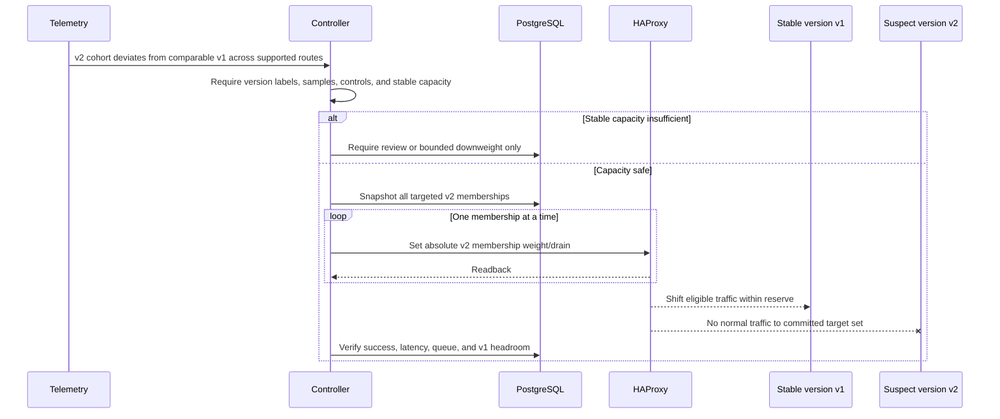

# Data Plane and HAProxy Design

## 1. Responsibility split

| Concern | NGINX | HAProxy | Rationale |
|---|---|---|---|
| Public ports 80/443 | Owns | Not public | one hardened edge |
| TLS certificates and termination | Owns | Plain HTTP on private link for MVP; backend TLS optional | avoids duplicated certificate lifecycle |
| HTTP/2 client connection | Owns | not required on NGINX→HAProxy | simpler internal contract |
| Security headers and request-size limit | Owns | validates protocol/routing fields | edge concern; not a WAF claim |
| Correlation ID | validates or creates | propagates/logs | end-to-end evidence |
| Frontend/API forwarding | Owns | no | HAProxy only balances customer application traffic |
| Application route-group match | no | Owns | one routing authority |
| Backend health, weights, drain, connection limit | no | Owns | no conflicting health systems |
| Cross-instance retry | explicitly disabled | Owns under per-route policy | one retry budget |
| Route rate/concurrency/fail-fast action | coarse public abuse limit only | Owns service reliability policy | separates edge protection from backend healing |
| Application access logs | edge timing only | authoritative route/member/retry/timing log | member identity exists at HAProxy |
| Dynamic routing actuation | no | Runtime/Data Plane APIs | NGINX remains stable during incidents |

NGINX may retry the FastAPI/UI upstream on a connection failure only if that request is demonstrably idempotent; it never retries customer application requests to a second HAProxy or backend in MVP.

## 2. Route-group model

The initial route registry is explicit and ordered:

| Route group | Match | Example criticality | Default retry posture | Notes |
|---|---|---|---|---|
| `public` | normalized path prefix `/public` | low | GET/HEAD only, max one | cacheable/read-only demo |
| `auth` | prefix `/auth` | high | none unless operation-specific | login POST is side-effect/security sensitive |
| `catalog` | prefix `/catalog` | medium | GET/HEAD only, max one | read-mostly demo |
| `checkout` | prefix `/checkout` | critical | none by default; conditional only with verified idempotency key | payment/order ambiguity |

These criticalities and policies are examples, not universal defaults. The Route Registry validates:

- normalized, decoded path handling and precedence;
- an exact prefix/template allowlist—no arbitrary user-supplied HAProxy expression;
- one winning route group for every supported path;
- a configured default route behavior (usually reject/unmapped, not silently send to a random pool);
- method-category and retry policy independent of the path string;
- bounded route count to control HAProxy config and metric cardinality.

Query strings, fragments, session IDs, user IDs, and raw path parameters never form route-group IDs.

## 3. Physical instances and logical memberships

### Controller representation

```text
Physical backend instance
  instance_id = inst_b
  address = 10.20.0.12:8080
  version = v2
  nominal_capacity = 100 concurrent requests

Logical route memberships
  (route=public,   instance=inst_b) -> be_public / srv_inst_b
  (route=auth,     instance=inst_b) -> be_auth / srv_inst_b
  (route=catalog,  instance=inst_b) -> be_catalog / srv_inst_b
  (route=checkout, instance=inst_b) -> be_checkout / srv_inst_b
```

HAProxy allows server names to repeat in different backends; the pair `(backend_name, server_name)` is the unique runtime target. PostgreSQL `route_memberships` maps this pair to the globally stable `instance_id` and `route_group_id`. Generated names use lowercase ASCII letters, digits, and underscores with a short stable hash; user text is never concatenated into configuration.

All four entries point to the same address/port but have independent:

- operational state (`ready`, `drain`, `maint`);
- runtime weight;
- per-membership health result, if a route-specific check is configured;
- max connections/requests where configured;
- route-level log and metric labels.

### Capacity accounting

Logical membership must not multiply physical capacity. The safety engine keeps two values:

- **physical capacity** of an instance, shared across all routes;
- **route allocation/limit**, a policy share or measured headroom for that membership.

It rejects an action that assumes each logical copy has the full physical capacity. Cross-route load is summed when evaluating instance headroom.

## 4. Route × instance quarantine semantics

To quarantine instance B only for `/checkout`:

1. identify the stable membership `(be_checkout, srv_inst_b)` from the registry;
2. persist requested desired state `DRAIN`, action ID, membership version, and controller generation;
3. verify the evidence certificate, capacity reserve, and current observed state are still valid;
4. issue Runtime API set-to-state operation `drain` for only that pair;
5. read the exact pair from HAProxy stats/server state;
6. confirm it is drained and other B memberships remain unchanged;
7. verify checkout error behavior and unaffected-route preservation;
8. commit or restore the saved state according to the action outcome.

`drain` removes the membership from normal new selection while retaining active health checks. Persistent/sticky behavior must be tested for the chosen HAProxy configuration; route criticality can require stickiness override or a stricter policy. `maint` disables normal traffic and health checks and is reserved for confirmed hard-down/admin cases because it removes a useful recovery signal.

Weight zero is not used as a synonym for every quarantine. Weight changes express staged reduction/reintegration; `drain` expresses quarantine, and `maint` expresses administrative/hard-down removal. This keeps observed semantics interpretable.

## 5. Runtime API operations

The HAProxy adapter exposes a small allowlisted command vocabulary, not a general CLI tunnel.

| Controller operation | Runtime behavior | Readback | Persistence/recovery |
|---|---|---|---|
| set membership weight | `set weight` / `set server ... weight` | `get weight`, `show stat`, server state | desired row + state-file snapshot; reconcile after restart |
| set membership `ready`/`drain`/`maint` | `set server ... state` | `show stat`/`show servers state` | desired row; reconcile |
| set server/member max connection limit | allowlisted `set maxconn server` where version supports | stats/config readback | desired policy; reconcile |
| observe health/admin state | read-only `show stat`, `show servers state`, `show info` | parsed schema with HAProxy process/config IDs | observation only |
| inspect current connections/queue | stats/read-only commands | aggregate only, bounded output | Prometheus/observation |
| predeclared map toggle | transactional/atomic map-key update supported by tested version | read map/key and behavior probes | desired map row + DPA-managed disk map |

### Runtime command contract

- Unix socket mode `0660`, dedicated group, no TCP listener.
- Connect deadline 500 ms; command/read deadline 2 s; response-size cap.
- Exact backend/server names resolved from database IDs; never accepted from a public request.
- Adapter parses explicit success/error and rejects unexpected multiline output/schema.
- One retry is allowed only after observed-state readback. Repeating a set-to-value command is idempotent.
- Commands carry no native action ID; the controller correlates attempt and readback in PostgreSQL.
- Runtime state is volatile. A successful command is not committed until observed state matches.

## 6. Data Plane API operations

Structural operations include:

- create/delete route-group backend;
- add/remove a logical server membership;
- create/modify safe ACL and `use_backend` relationships;
- predeclare retry/rate/concurrency/fail-fast policy structures;
- create/update persistent map files;
- change check definitions or structural timeout defaults.

They are not issued by the automatic healing loop in MVP.

### Structural transaction

1. API/admin command writes a proposed desired configuration revision in PostgreSQL.
2. Worker reads current Data Plane API configuration version and checksum.
3. It opens a DPA transaction tied to that version.
4. It applies typed object changes; no raw config fragment is accepted.
5. It runs DPA validation plus explicit `haproxy -c` through the configured validator.
6. It checks invariants: every route has a backend, no orphan/duplicate membership, names resolve, default route defined, management sockets remain private, capacity metadata exists.
7. It commits; DPA performs a hitless reload using master-worker/listener transfer configuration.
8. It waits for process/config version change and probes each configured route.
9. It reads structural and runtime state, updates observed checksum/version, and marks the revision active.
10. On failure, it aborts the uncommitted transaction or submits a new transaction restoring the stored last-known-good config. “Rollback” is itself versioned; old files are never blindly copied over a newer version.

Configuration version conflict is not blindly retried. The worker re-reads, computes whether the proposed edit still applies, and either rebases once or reports conflict.

## 7. Control transaction boundaries

Three different boundaries must not be conflated:

1. **PostgreSQL transaction:** atomically persists desired state/action transition/outbox event.
2. **DPA structural transaction:** atomically validates/commits one HAProxy configuration revision, subject to reload behavior.
3. **Healing action saga:** coordinates one or more volatile Runtime API sets plus readback and compensation. HAProxy does not make these multi-command operations atomic.

For a capacity-removing multi-membership action, commands are applied one membership at a time with readback. Partial removal is normally safer than partial re-enablement, but capacity is recalculated before every step. For capacity restoration, the worker never enables all members first; it brings back the smallest permitted stage and observes it.

## 8. Desired versus observed state

Each membership has:

```text
desired_admin_state, desired_weight, desired_maxconn
desired_generation, desired_version, desired_reason/action_id
observed_admin_state, observed_health_state, observed_weight
observed_haproxy_process_id, observed_config_version
observed_at, drift_reason
```

State comparison rules:

- desired equality is semantic, not text-config equality;
- health-driven HAProxy state and controller administrative state remain separate fields;
- an automatic action cannot overwrite a newer operator desired version;
- observed state older than two reconciliation periods is stale;
- config checksum mismatch outside a known DPA revision is `UNMANAGED_DRIFT` and freezes structural automation;
- a runtime mismatch is repaired only if the owning action/generation remains current.

## 9. Rejection and failure cases

### HAProxy rejects a Runtime command

1. Persist exact sanitized error and observed state.
2. Do not advance the action lifecycle.
3. Re-read once to detect “state applied but response malformed/lost.”
4. If not applied and error is transient, retry within the attempt deadline.
5. If target is missing, schema changed, or command unsupported, mark `NEEDS_REVIEW`, freeze overlapping actions, and raise a critical control alert.
6. Never fall back to shell editing or an unvalidated reload.

### Timeout or lost acknowledgment

The worker reads observed state. If it equals the requested state and the target/config identity matches, the attempt is recorded as `APPLIED_ACK_LOST` and proceeds. If it differs, the same set operation may be retried. If state is ambiguous, hold and review; do not issue an inverse command speculatively.

### HAProxy rejects structural change/reload

Uncommitted DPA transaction is aborted. The running process remains on its prior config. If commit occurred but route smoke checks fail, create a new restoration revision from the stored last-known-good typed model, validate, reload, read back, and freeze further structural changes.

### HAProxy restarts

1. HAProxy loads the static config and, where configured, the latest server-state file.
2. Worker detects new process ID/start time.
3. It reads complete structure and runtime server state before writing.
4. It compares to active desired generation and action states.
5. It replays only current idempotent desired values; expired actions are resolved by policy first.
6. It confirms route probes and clears restart drift.

The state file reduces the gap but does not replace reconciliation because it may be stale or incomplete.

### Controller restarts

The worker first acquires single-writer ownership, increments controller generation, reads unfinished actions, observes HAProxy, and resumes from facts. It never assumes the last attempted command failed.

## 10. Stale configuration and unmanaged changes

The active structural revision stores:

- DPA configuration version;
- canonical typed-object hash;
- rendered config checksum;
- map checksums;
- HAProxy process/config identifiers;
- commit/reload timestamps and actor.

The reconciliation loop periodically retrieves version/checksum. Unknown changes result in:

1. `UNMANAGED_DRIFT` system incident;
2. automatic structural and incident actuation freeze for the environment;
3. read-only diff for operator review;
4. explicit choices to adopt observed configuration into a new desired revision or reapply desired state through a validated transaction.

It never silently overwrites a human’s out-of-band edit.

## 11. Concurrency, split brain, and idempotency

### Concurrency

- MVP serializes all actions per environment, even if targets do not overlap.
- A PostgreSQL advisory lock plus an environment row version protects action planning/transition.
- Redis `SET NX` leases provide fast duplicate suppression and are renewed, but are not the safety boundary.
- Every target row uses optimistic `desired_version`; an action prepared against an older version is stale.
- Structural DPA version and routing desired version are separate and both must match.

### Split brain

HAProxy Runtime API cannot evaluate a controller fencing token. Therefore:

- exactly one worker container receives the Runtime socket and DPA credential/mount;
- standby/API containers have no network route or filesystem permission to them;
- active-active worker replicas are unsupported;
- failover is an explicit operational transfer after the former writer is stopped/fenced at the host/container layer;
- a future HA design requires a local actuator that validates monotonically increasing tokens before accessing HAProxy.

Calling Redis Redlock or a database generation “split-brain prevention” without target-side fencing would be unsafe; this design does not do so.

### Idempotency

- API mutation has an `Idempotency-Key` scoped to actor/project/endpoint and a request hash.
- Action ID is immutable; duplicate plans for the same incident/target/policy version coalesce.
- HAProxy commands are absolute set-to-state, not toggle/increment operations.
- Attempt sequence is monotonic under one action.
- Readback determines completion after retry or restart.
- Events have stable event IDs and may be delivered at least once.

## 12. Route-instance quarantine sequence

```mermaid
sequenceDiagram
    participant T as Telemetry pipeline
    participant C as Controller
    participant DB as PostgreSQL
    participant H as HAProxy Runtime API
    participant V as Verification

    T->>C: checkout x instance B abnormal; peers and B other routes normal
    C->>C: Build route-instance evidence certificate
    C->>C: Check remaining checkout capacity and retry policy
    C->>DB: Persist action + exact prior membership state
    DB-->>C: Action generation/version committed
    C->>H: Set be_checkout/srv_B to drain
    H-->>C: Result
    C->>H: Read target and all B memberships
    H-->>C: checkout/B drained; public/auth/catalog B unchanged
    C->>DB: State confirmed; begin verification
    V-->>C: Checkout errors fall; unaffected B routes preserved
    C->>DB: Commit quarantine and schedule reintegration
```

**Explanation:** the controller proves both halves of localization before apply and explicitly reads unaffected memberships after the command.

## 13. Shared-route failure sequence

```mermaid
sequenceDiagram
    participant T as Telemetry
    participant C as Controller
    participant H as HAProxy
    participant B as All checkout backends
    participant DB as PostgreSQL

    T->>C: Checkout fails on quorum/all instances; other routes healthy
    C->>C: Reject independent instance-ejection candidates
    C->>C: Verify shared-route certificate and overload/capacity evidence
    C->>DB: Prepare route-policy action and prior map values
    C->>H: Suppress checkout cross-instance retries
    H-->>C: Readback retries=0
    alt Overload or recoverable dependency pressure
        C->>H: Activate bounded checkout rate/concurrency policy
    else Fast failure is safer
        C->>H: Select predeclared checkout fail-fast backend
    end
    H-->>C: Observed policy state
    H-->>B: No retry fan-out; bounded or no new checkout work
    C->>DB: Verify other routes and queue/retry effect; commit or restore
```

**Explanation:** a shared route fault does not cause the controller to drain the same route membership on every host, which would masquerade as several independent faults.

## 14. Version-specific failure sequence



**Explanation:** the system removes traffic from a version cohort but does not roll back the deployment or assert a code root cause. Insufficient stable capacity blocks the broad action.

## 15. Traffic-overload sequence

```mermaid
sequenceDiagram
    participant L as Load generator/clients
    participant H as HAProxy
    participant T as Telemetry
    participant C as Controller
    participant B as Backends

    L->>H: Demand surge
    H->>B: Requests; queues/concurrency rise
    T->>C: Rate + queue + saturation + latency alignment
    C->>C: Prefer overload over instance-degradation classification
    C->>C: Confirm retry and critical-route safety
    C->>H: Set retries to zero for affected route
    C->>H: Activate bounded rate/concurrency protection
    H-->>L: Admit within policy; explicit 429/503 for shed load
    H->>B: Reduced admitted concurrency; no retry amplification
    T-->>C: Queue/retry/latency verification
    C->>H: Commit, adjust within bounds, or restore
```

**Explanation:** overload healing protects useful work; it does not eject a busy but otherwise healthy instance and concentrate load on fewer servers.

## 16. Data-plane boundaries

- Per-request dynamic ML routing is out of scope; classification changes durable HAProxy state outside the request path.
- Automatic structural reload during a live incident is out of scope.
- Long-lived streaming/WebSocket routes require explicit drain semantics and are not in the initial experiment set.
- Cookie stickiness is disabled in the demo unless a dedicated experiment evaluates it.
- Backend TLS/mTLS is supported as a deployment option; plaintext is permitted only on an isolated single-host network.
- HAProxy high availability, VRRP, anycast, and global DNS failover are later infrastructure concerns, not part of the invention evaluation.

