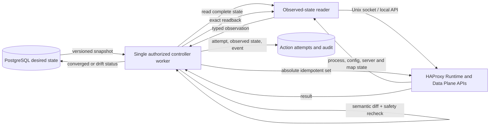

# Control Plane and Reconciliation

## 1. Deployment shape: modular monolith

The Python control plane is one codebase and one domain model with two process roles:

- **API role:** FastAPI HTTP/SSE, authentication, authorized domain commands, and read models. It has no HAProxy control credential or socket.
- **Worker role:** schedules observation, builds evidence, plans actions, owns the reconciliation loop, verifies effects, and publishes durable events. It alone receives the HAProxy control mounts.

This is a modular monolith, not a fleet of microservices. Modules communicate by typed in-process calls and PostgreSQL transactions. Long-running work is a durable state machine polled by the worker; no Celery, Kafka, RabbitMQ, or general broker is required.

## 2. Conceptual modules

| Module | Responsibility | Main durable objects | Hard boundary/failure behavior |
|---|---|---|---|
| Authentication and Authorization | local login/session/API tokens, RBAC, project/environment scope | users, teams, memberships, sessions metadata, API token hashes | deny on ambiguity; no data-plane credential |
| Project Manager | project lifecycle and ownership | projects | cannot delete with active environments without explicit archival workflow |
| Environment Manager | `DEV`, `LAB`, `DEMO`, `PILOT`; mode and automation state | environments, controller generations | production-like mode forbids fault injection |
| Backend Registry | stable instance identity, endpoint allowlist, capacity, version | backend_instances | SSRF-safe validation; no arbitrary probe URL |
| Route Registry | ordered safe path groups and logical memberships | route_groups, route_memberships | rejects overlap/ambiguous precedence |
| Policy Registry | routing, reserve, retry, criticality, verification, reintegration | routing_policies, retry_policies | versioned; active action pins policy version |
| Health Scheduler | jittered direct route/member probes with concurrency budget | probe evidence refs | egress allowlist; overload pauses nonessential probes |
| Telemetry Ingestion | bounded Prometheus/log/HAProxy queries | observation references | missing source lowers completeness; never fabricates zero |
| Feature Window Builder | aligned short/medium windows and robust baselines | observation windows/feature refs | rejects time skew/stale samples |
| Failure Fingerprint Engine | canonical fingerprint, affected sets, response signature | fingerprints | no raw payload/secret data |
| Rule Classifier | hard failure/scope rules and safety blockers | classifications/reason codes | always available baseline |
| ML Classifier | schema-checked calibrated probability inference | model_versions, classifications | timeout/checksum/schema failure → rules-only |
| Hybrid Decision Resolver | rules/ML precedence, conflicts, OOD, unknown | classifications | no forced tie-break into an actionable class |
| Confidence Engine | combines calibration, support, completeness, stability | classification confidence fields | confidence cannot bypass rules |
| Safety Policy Engine | capacity, retry, criticality, cooldown, conflict, rollback gates | evidence certificates/safety result | deterministic allow/downgrade/block/review |
| Routing Unit Selector | enumerate concrete targets and lowest blast-radius admissible candidate | candidate summaries/certificate | `NO_CHANGE` if none admissible |
| Action Planner | exact requested state, order, expected effect, rollback criteria | actions | pins all input versions and expiry |
| HAProxy Adapter | allowlisted Runtime/DPA calls, validation, readback parsing | action_attempts, observed snapshots | no raw CLI endpoint; bounded timeouts |
| Desired State Store | authoritative membership/policy intent and versions | desired_route_states, desired_policy_states | PostgreSQL only; writes transactional |
| Observed State Reader | typed HAProxy structure/runtime snapshot | observed state cache/history | stale is explicit, not healthy |
| Reconciliation Loop | converge intent, detect drift, resume incomplete actions | controller checkpoints/generations | only single writer; freezes on unmanaged drift |
| Verification Engine | affected and unaffected obligations | verification_results | no data → insufficient evidence |
| Reintegration Controller | probes, staged weights, hysteresis, max attempts | reintegration_runs/stages | never jumps to 100% after quarantine |
| Incident Manager | grouping, lifecycle, conflict/ownership, resolution | incidents | one active incident may reference many fingerprints/actions |
| Audit Ledger | append-only security/config/action/operator record | audit_events | separate insert-only DB role; no update/delete application path |
| Report Generator | deterministic report and optional validated LLM wording | reports | template fallback always works |
| Event Publisher | transactional outbox to Redis Stream/SSE | event_outbox | at-least-once; consumers de-duplicate |
| Experiment Manager | lab specs, randomization, fault ground truth, artifacts | experiments, experiment_runs | requires `LAB`, `RESEARCHER`, and `fault:execute` for injections |

## 3. Control modes

| Mode | Classification | Automatic plan | Automatic apply | Reintegration | Intended use |
|---|---|---|---|---|---|
| `OBSERVE_ONLY` | yes | yes | no | no | onboarding/soak/research labels |
| `RULES_ONLY` | rules | yes | policy-gated | yes | mandatory safe baseline |
| `HYBRID_SHADOW` | rules + ML comparison | yes, both traces | rules path only | yes | model evaluation |
| `HYBRID_ACTIVE` | rules + approved model | yes | policy-gated after model acceptance | yes | later pilot |
| `SAFE_MODE` | hard checks/read-only evidence | no new automatic plan | no | paused | dependency/control degradation |
| `MANUAL` | evidence continues | operator requests | approved operator only | operator or gated automation | incident response |

Mode is environment-scoped, audited, and cannot be changed by the ML model or LLM. Entering a more permissive mode requires `PROJECT_ADMIN` authorization, an `APPROVER` when policy designates the transition critical, and an optimistic version match.

## 4. Desired-state model

Desired state is a materialized controller intent, not merely the latest action:

```text
Environment desired mode
Route desired policy revision
Route-membership desired admin_state / weight / maxconn
Desired source priority:
  1. emergency operator override
  2. explicit administrative maintenance
  3. committed incident action
  4. reintegration stage
  5. registered baseline
```

Each desired row contains `version`, `controller_generation`, `source_type`, `source_id`, `expires_at`, `created_by`, and `updated_at`. An update uses compare-and-swap against `version`. Baseline is never lost when an incident layer is added; removing/expiring the higher layer reveals the prior baseline deterministically.

## 5. Observed-state model

The worker reads:

- HAProxy process start time/PID, config version/checksum;
- frontend/backend/server object identities;
- per-membership administrative and health state;
- current/initial weight, max connection/request limit;
- sessions, queue, checks, last state change, and errors as available;
- predeclared map/policy values.

Observed state carries `read_started_at`, `read_completed_at`, source process/config identifiers, and parse-schema version. A partial snapshot is never used to declare convergence.

## 6. Reconciliation loop

### Cadence

- 1 second during an action’s `APPLIED`/`STATE_CONFIRMED` boundary;
- 2 seconds for environments with active incidents/reintegration;
- 5 seconds in steady state;
- structural checksum every 30 seconds and after every DPA operation;
- health/fingerprint analysis every 5 seconds using 30/60/120-second windows;
- jitter ±10% prevents synchronized polling in future multi-environment setups.

These are lab defaults, benchmarked and configurable. One iteration has a 4-second deadline in steady state; if it overruns, the next iteration does not overlap.

### Algorithm

```text
reconcile(environment):
  assert this process is the physically authorized writer
  acquire PostgreSQL environment advisory lock
  confirm environment generation == worker generation
  attempt short Redis duplicate-suppression lease
  read complete desired snapshot and versions
  read complete HAProxy observed snapshot
  if structural checksum is unmanaged:
      freeze writes; create/update drift incident; return
  recover unfinished action state using observed facts
  compute semantic drift for each current desired target
  reject drift whose desired source expired or version changed
  order changes: safety removals, policy suppression, bounded restoration
  before each write:
      recheck generation, desired version, conflicts, and capacity
      issue absolute idempotent set
      read back exact target
      persist attempt and observation
  publish durable outbox events
```

Retries do not span iterations invisibly. Each attempt is durable and bounded. A target exceeding its attempt policy enters `NEEDS_REVIEW` rather than being retried forever.

## 7. Leader ownership and fencing

### MVP authority

The safe MVP choice is one worker, not a replicated election:

- Compose schedules exactly one worker.
- Only its container receives the Runtime Unix socket, DPA Unix socket/credential, and relevant group membership.
- The API role and any standby process cannot route to or mount these resources.
- Host/container supervision must stop the old worker before a new one receives the mounts.

### Generation

On clean worker start/failover:

1. acquire a PostgreSQL advisory lock for the environment;
2. update the environment’s `controller_generation` under a serializable/row-locked transaction;
3. record worker identity, boot ID, lease timestamps, and generation;
4. stamp every new action/attempt with that generation;
5. reject any durable action from an older generation unless recovery logic explicitly adopts it after observing HAProxy.

Generation prevents stale database workflow, but HAProxy cannot inspect it. Physical single-writer access is the actual target-side fence.

### Redis locking

Redis keys such as `lock:env:{id}:action` use a random owner token, 15-second TTL, and 5-second renewal. Unlock compares the token. They reduce duplicate scheduling and thundering herds; Redis loss immediately suppresses new automatic actions. They are not described as sufficient distributed consensus.

### Future active-passive option

A future local actuator beside HAProxy could persist the highest accepted generation and reject lower tokens before every Runtime command. Until that exists and is tested under partitions, active-active or automatic remote failover is unsupported.

## 8. Action versioning and stale rejection

An action pins:

- environment/controller generation;
- incident and classification version;
- fingerprint/certificate schema and hash;
- route, backend, version, routing, retry, capacity, verification, and model-policy versions;
- desired target-row versions;
- observed HAProxy process/config identifiers;
- preparation and expiry timestamps.

Before apply, any changed safety-relevant input causes replan or rejection. Cosmetic metadata does not. A classification older than its configured window cannot be applied. Default action-plan expiry is 15 seconds for incident healing and 5 minutes for operator-approved maintenance; critical route policy may be shorter.

## 9. Concurrency control

- Per-environment action execution is pessimistically serialized in MVP.
- Domain configuration uses optimistic row versions and `If-Match`/ETag at the API.
- Planning reads a repeatable snapshot; apply revalidates under a row lock.
- An overlap index maps each action to concrete route-membership and route-policy targets.
- Operator override and maintenance targets conflict with every automatic target they cover.
- A complete-instance action conflicts with all route-instance actions for that instance.
- A complete-route action conflicts with all memberships and retry/rate policy actions for that route.
- A version action conflicts with any action targeting one of its memberships.

Later parallelism may permit provably disjoint target sets, but it is unnecessary for the student MVP.

## 10. Restart and partial-action recovery

At worker boot:

1. enter `SAFE_MODE` and acquire authority;
2. read structural checksum and complete observed state;
3. load actions in non-terminal states ordered by environment/action sequence;
4. for each action, compare observed targets to `previous`, `bounded_requested`, and `final_requested` snapshots;
5. adopt a matching state and resume verification, converge missing targets if still safe/current, or enter partial recovery;
6. rebuild Redis active incidents, cooldowns, dedup keys, and SSE streams from PostgreSQL;
7. run direct route probes and one full steady reconciliation;
8. leave safe mode only if database, Redis, HAProxy readback, and structural checksum are healthy.

### Recovery examples

| Durable state | Observed state | Recovery |
|---|---|---|
| `PREPARED` | previous | action may apply if current and unexpired |
| `PREPARED` | requested | treat as acknowledgment loss; persist applied attempt, verify |
| `APPLIED` | requested | resume state confirmation/verification |
| `APPLIED` | previous | decide whether compensation already occurred; do not reapply until audit/versions checked |
| multi-target `APPLIED` | mixed | recompute capacity, finish only if safe; otherwise compensate safe subset or review |
| `ROLLING_BACK` | previous | mark rolled back after readback |
| `ROLLING_BACK` | mixed/unknown | freeze overlap, critical alert, review |

## 11. Dead-letter/manual-review state

There is no message queue dead-letter topic. A durable action becomes `NEEDS_REVIEW` with a structured reason when:

- target/config identity is missing or unmanaged;
- maximum apply/readback attempts are exceeded;
- rollback cannot restore a safe known state;
- evidence expires during a partial action;
- database/Redis/control dependency is unavailable beyond the action deadline;
- conflicting operator intent appears;
- verification is repeatedly insufficient;
- the action would violate capacity after load changes;
- parser/model/policy schema mismatch occurs.

The UI exposes exact previous/requested/observed states, attempts, errors, and safe operator options. “Retry action” creates a new action linked to the old one; it never mutates history.

## 12. Audit immutability

Audit events are appended in the same PostgreSQL transaction as the domain/action change where possible. Controls:

- application DB role has `INSERT`/`SELECT` but no `UPDATE`/`DELETE` on `audit_events`;
- each event stores actor, effective role, project/environment, event type, subject, before/after hashes, correlation/action IDs, source IP, user agent class, timestamp, and outcome;
- a per-environment hash chain makes tampering evident but is not called cryptographic immutability against a database administrator;
- daily signed/checksummed export to an offline backup increases detection;
- retention is at least two years for pilot, one semester for lab unless policy requires longer;
- sensitive secrets and raw tokens are never logged.

## 13. Operator override

Override types are `FORCE_READY`, `FORCE_DRAIN`, `FORCE_WEIGHT`, `FREEZE_AUTOMATION`, `ACKNOWLEDGE_REVIEW`, and `RELEASE_OVERRIDE`.

Every override requires:

- target and explicit requested state;
- reason and ticket/reference;
- expiry (maximum policy duration; no silent permanent override);
- current target ETag;
- RBAC authorization, with a second approver for critical route enablement or broad version/global action in pilot mode;
- capacity preview and rollback/readback plan.

The system may block an unsafe `FORCE_READY` for a confirmed-down endpoint unless an `APPROVER` uses a separately audited emergency path with the required separation of duty. Operator authority does not mean bypassing configuration validation.

## 14. Safe-mode behavior

Safe mode is entered on PostgreSQL/Redis loss, unmanaged HAProxy structure, ambiguous writer authority, repeated adapter parse errors, severe time skew, model/schema failure combined with rules failure, or operator command.

In safe mode:

- HAProxy keeps last-known-good state;
- no new automatic action or reintegration advance occurs;
- existing actions stop before the next mutation;
- health checks, read-only observations, and alerts continue where possible;
- API configuration writes that affect routing are rejected with a structured degraded-state error;
- operator sees the exact entry reason and recovery checklist;
- leaving safe mode requires a complete desired/observed reconciliation, not merely dependency health.

## 15. HAProxy desired-state reconciliation diagram



**Explanation:** commands never originate from a cached recommendation. The worker reads durable intent and live state, rechecks safety, applies an absolute value, and records readback.

## 16. Incident state machine

```mermaid
stateDiagram-v2
    [*] --> SUSPECTED: observation threshold crossed
    SUSPECTED --> OBSERVING: create evidence windows
    OBSERVING --> CLOSED_NO_ACTION: evidence clears
    OBSERVING --> CLASSIFIED: supported class or UNKNOWN
    CLASSIFIED --> REVIEW_REQUIRED: unknown, blocked, or manual policy
    CLASSIFIED --> MITIGATING: safe action prepared
    MITIGATING --> VERIFYING: observed HAProxy state confirmed
    MITIGATING --> REVIEW_REQUIRED: partial apply or control failure
    VERIFYING --> STABILIZED: action effective
    VERIFYING --> MITIGATING: safe alternative/replan
    VERIFYING --> REVIEW_REQUIRED: harmful or insufficient evidence
    STABILIZED --> REINTEGRATING: recovery evidence available
    REINTEGRATING --> STABILIZED: stage fails; quarantine restored
    REINTEGRATING --> RESOLVED: 100 percent verified
    REVIEW_REQUIRED --> MITIGATING: approved new action
    REVIEW_REQUIRED --> RESOLVED: operator resolves with evidence
    CLOSED_NO_ACTION --> [*]
    RESOLVED --> [*]
```



**Explanation:** `UNKNOWN` can be classified but routes to review rather than automatic mitigation. An incident is resolved only after recovery or an explicit evidence-backed operator resolution, not when an alert is merely acknowledged.

## 17. Control-plane request-path exclusion

No NGINX application location proxies through FastAPI. The application path has a direct upstream to HAProxy. FastAPI can be completely stopped and established/new client traffic continues while NGINX, HAProxy, backends, and required dependencies remain operational. This is an acceptance test, not just an architecture statement.
