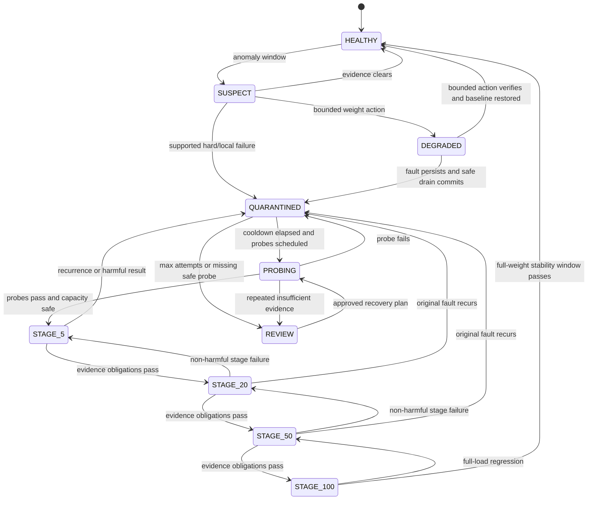

# Verification and Reintegration

## 1. Verification objective

Verification determines the traffic effect of an action; it does not prove root cause or application correctness. Every action declares its expected change before apply and evaluates two obligations:

1. **Affected-effect obligation:** the metric pattern that justified the action changes in the predicted direction.
2. **Unaffected-preservation obligation:** route/member cohorts predicted healthy retain eligibility, headroom, success, and latency within configured non-regression bounds.

An action that reduces errors by exhausting peers is harmful, not effective. An action followed by no target traffic is insufficient evidence of recovery.

## 2. Verification evidence

| Source | Use | Limit |
|---|---|---|
| HAProxy observed state | proves requested state/weight/map is active | does not prove service effect |
| real traffic | client-relevant error, latency, retry, queue outcomes | confounded by demand changes and low volume |
| same-route peers | controls broad load/time changes | correlated failures can invalidate independence |
| same-instance other routes | tests preservation/localization | routes may have different demand/dependencies |
| version-control cohort | tests version association | requires comparable traffic and enough instances |
| direct synthetic probes | target evidence at zero/low traffic | may not match authenticated/side-effecting production flow |
| request rate/queue/concurrency | overload and shifted-load effect | capacity metadata may be uncertain |
| CPU/memory | supporting saturation evidence | never sufficient alone |
| retry counts | confirms amplification reduction | exporter/log completeness required |

## 3. Predeclared verification specification

Every action stores:

```text
baseline window IDs and values
affected cohort and metrics
unaffected control cohorts and metrics
direction/magnitude expected
absolute safety thresholds
minimum sample count and minimum/maximum duration
confidence/interval method
synthetic probe plan
effective, ineffective, harmful, and insufficient criteria
rollback/hold behavior for each result
```

Criteria are pinned before apply to prevent post-hoc success definitions.

## 4. Initial evidence rules

Initial lab defaults are starting hypotheses, calibrated per route/load:

- minimum 30 seconds and 100 real requests for an ordinary high-traffic bounded action;
- maximum 120 seconds for first mitigation verification;
- critical routes: at least 300 real requests or 3 minutes unless a harmful threshold fires sooner;
- synthetic probe: three consecutive passes spaced across at least 15 seconds for `PROBING`; never the sole basis for 100% restoration;
- compare error-rate proportions with Wilson intervals and latency using robust bootstrap/peer bounds offline; online engine uses stable prevalidated thresholds plus intervals;
- early harmful stop is allowed when a hard capacity, queue, error, or latency ceiling is crossed;
- a zero-request cohort cannot pass a real-traffic criterion.

### Example route-instance mitigation criteria

An initial lab plan may declare:

- affected checkout error rate should fall at least 50% versus pre-action, or its upper interval should fall below the route’s failure threshold;
- checkout peer queue utilization must remain below the policy ceiling;
- instance B’s `/public`, `/auth`, and `/catalog` eligible weight must remain unchanged;
- those unaffected routes must not lose more than 1 percentage point success or regress p95 by more than 10% versus their aligned controls;
- retry amplification must not increase;
- observed HAProxy target must remain at requested state.

These numeric non-regression values are experiment defaults, not universal production SLOs.

## 5. Result definitions

| Result | Definition | Controller response |
|---|---|---|
| `EFFECTIVE` | state confirmed; affected obligation passes; preservation passes; no safety breach | commit current stage or prepare safe expansion |
| `INEFFECTIVE` | enough evidence shows predicted improvement did not occur, but action did not materially worsen safety/SLO | restore safe prior state or replan a separately certified action |
| `HARMFUL` | capacity, queue, success, latency, retry, or unaffected cohort breaches the harmful bound | immediate safe compensation; freeze overlap; review if compensation unsafe |
| `INSUFFICIENT_EVIDENCE` | samples/sources/controls are inadequate or conflicting by deadline | never commit based on silence; hold bounded state, restore, or review per criticality policy |

One result cannot be upgraded by an LLM or operator narrative; an operator can create a new approved action with documented evidence.

## 6. Confounding and comparison strategy

- Windows align by wall time and demand phase.
- Peer/control comparisons require similar request mix; route group prevents raw-path mix explosion but method category is checked.
- If demand changes beyond the configured ratio during verification, extend/restart the window within the deadline or return insufficient.
- A currently active unrelated deployment experiment or fault invalidates controls and pauses automatic commit.
- Reconciliation/control-loop delay is subtracted from the post-action observation start; pre-apply samples never leak into the post window.
- Multiple actions per environment are serialized in MVP, reducing causal ambiguity.

## 7. Low-traffic behavior

No traffic is not health. For low-volume routes:

1. extend the real-traffic window up to the policy maximum (initially 5 minutes for lab, longer/manual for pilot);
2. run only registered non-mutating synthetic probes with safe credentials/test accounts;
3. allow progress from `QUARANTINED` to `PROBING` and a small 5% stage when probes pass and capacity permits;
4. require at least a minimum real request sample before 20%/50%/100%, unless an operator approves a route-specific synthetic-only policy;
5. for side-effecting checkout/auth operations without safe synthetic probes, require natural traffic or manual review;
6. expose `waiting_for_samples`, current count, and maximum deadline in the UI.

Synthetic requests carry a test marker, use isolated test identities/data, are excluded from business success metrics, and remain included in probe evidence.

## 8. Reintegration state and stages

Default progression:

```text
QUARANTINED -> PROBING -> 5% -> 20% -> 50% -> 100% -> HEALTHY
```

Percentages are weights relative to the membership’s configured baseline, not shares of global traffic. Actual traffic may differ because of request distribution, sessions, queue, and other weights. UI labels show “configured weight stage” and observed traffic share separately.

### Stage record

```text
reintegration_run_id, originating_action/incident
target unit and concrete memberships
stage name, requested/observed weights and states
started/confirmed/window timestamps
minimum samples/duration, maximum deadline
probe outcomes, real traffic metrics, control metrics
verification result/reasons
attempt count, flap count, cooldown_until
previous/next/rollback stage
actor/policy versions
```

## 9. Stage advancement

```text
evaluate_stage(stage):
  require complete observed HAProxy match
  if hard harmful threshold -> rollback immediately
  collect until min_duration AND min_samples
  if sources stale/conflicting -> pause, then insufficient at deadline
  compare target error/latency/timeout to peers and baseline
  compare unaffected controls and remaining capacity
  if both obligations pass with required bounds -> next stage
  if target fails -> quarantine or last verified stage
  if only evidence is insufficient -> hold or review; never advance
```

Initial lab windows:

| Transition | Minimum window/sample | Rationale |
|---|---|---|
| quarantine → probing | 3 successful non-mutating probes over ≥15 s; hard reachability stable | no user exposure |
| probing → 5% | capacity safe and probes pass | minimal live evidence |
| 5% → 20% | ≥60 s and ≥100 target requests (critical: ≥300) | early regression detection |
| 20% → 50% | ≥120 s and ≥300 target requests | broader queue/load evidence |
| 50% → 100% | ≥180 s and ≥500 target requests; critical policy may be longer | material exposure |
| 100% → healthy | stable full weight for ≥5 min and required samples | separate full recovery from momentary success |

An early hard failure may roll back immediately. Advancement may not occur early merely because initial samples pass.

## 10. Scope-specific reintegration

### Route × instance

Only the quarantined logical membership is staged. Other routes on the same instance remain at their existing desired state throughout. Verification uses same-route peers and other routes on the same instance.

### Complete instance

After direct probes, routes are restored one at a time according to configured criticality and diagnostic safety—not a hard-coded path order. A noncritical, safely probeable route is exposed first. Each route membership passes at least a 5% stage before another high-criticality route is added. Physical cross-route capacity is recalculated after each step.

### Version group

Select one representative membership/instance whose route is safely probeable, advance it first, then expand within the version cohort in batches. Stable-version capacity is preserved. This resembles canary deployment and is not claimed as novel; it is used because it safely tests traffic recovery.

### Complete route/shared failure

Restore in reverse protective order:

1. direct route dependency/probe evidence;
2. keep retries suppressed;
3. reduce fail-fast/rate protection to a small admitted share;
4. increase admitted traffic while observing queue/success;
5. remove protection;
6. enable the route’s normal safe retry policy last.

### Overload

Rate/concurrency limits relax in bounded steps based on queue headroom and latency, not target health probes. Retry policy is restored last and only when amplification remains below threshold.

## 11. Flapping, hysteresis, and cooldown

### Flap definition

A target flaps when it fails verification or returns to the same supported failure class within the recurrence window after a reintegration advance. Initial recurrence window: 10 minutes; calibrated by experiment.

### Hysteresis

- failure-entry thresholds are faster/more sensitive than recovery-exit thresholds;
- recovery needs more consecutive windows/samples than quarantine entry;
- stage success must be sustained; one good sample does not advance;
- state changes have a minimum dwell time except harmful rollback;
- peer baselines exclude the reintegrating target when calculating initial recovery support.

### Adaptive cooldown within fixed bounds

```text
cooldown = min(base_cooldown * 2^flap_count, maximum_cooldown)
```

Initial lab `base=60 s`, `maximum=1 h`. A stable 100% period gradually clears flap count; it does not reset immediately at the first pass. After three failed recovery attempts, enter `NEEDS_REVIEW` and stop automatic attempts.

This deterministic backoff is supporting engineering, not a patent claim.

## 12. Rollback behavior

- Stage failure returns to the last **verified** stage, not automatically to the state before the original incident.
- Hard recurrence of the original fault returns to quarantine.
- Preservation/peer-capacity harm can require a lower stage even if the target itself looks healthy.
- HAProxy readback must confirm rollback before another attempt.
- Rollback failure freezes all overlapping reintegration/action work and pages the operator.
- An operator may keep a bounded stage for diagnosis, with expiry and audit.

## 13. Adaptive windows as patent/research support

Waiting for a minimum sample count, adjusting a canary window, and using sequential evidence are well-known. Adaptive windows are therefore not the selected invention. Within EBMSH they have a narrower supporting role:

- completeness and observed request rate determine whether a verification obligation is decidable;
- the controller may extend only within a predeclared maximum exposure/time envelope;
- stage advancement requires both affected and unaffected obligations;
- incomplete evidence pauses rather than becoming a positive result.

This may strengthen an engineering disclosure as a dependent embodiment, but prior-art risk remains high. The research plan should include a fixed-window versus evidence-gated-window ablation if schedule permits.

## 14. Backend/reintegration state machine



**Explanation:** mitigation state and recovery state are explicit. The controller can step back one verified stage for mild regression or return to quarantine for recurrence; repeated attempts end in review.

## 15. Verification metrics and alerts

Metrics include verification duration, samples needed, result counts, affected improvement, unaffected regression, insufficient-evidence rate, stage duration, stage rollback, flap count, cooldown, recovery attempts, and false recovery in experiments. Alerts fire for harmful result, rollback failure, verification deadline, repeated insufficient evidence, max recovery attempts, observed-state drift, and critical route below reserve.

## 16. Acceptance conditions

Verification/reintegration is accepted only when tests demonstrate:

- no action commits from a zero-sample window;
- an acknowledgment-loss action resumes verification after matching readback;
- a load spike during verification blocks expansion;
- route-instance recovery does not alter other memberships of the physical instance;
- a shared-route recovery restores retries last;
- a recurrent fault rolls back and increases cooldown;
- three failed recovery attempts produce review, not an infinite loop;
- worker/HAProxy restart at every state reconstructs a safe deterministic next step.

