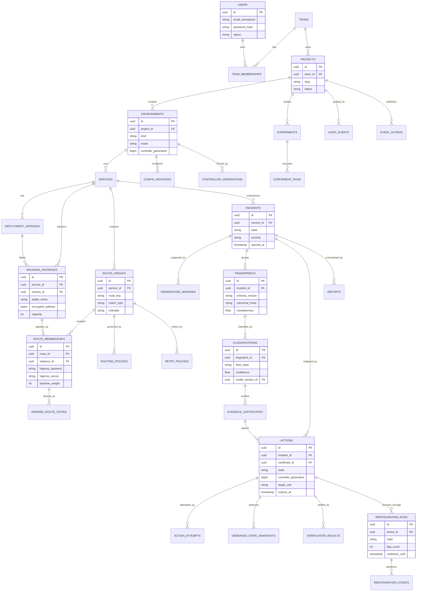

# Data Model and API Contracts

## 1. Storage allocation

| Store | Owns | Must not own |
|---|---|---|
| PostgreSQL | identity/RBAC, registry/policy revisions, authoritative desired state, incidents, compact evidence, classifications, actions/attempts, verification, reintegration, reports, model metadata, experiments, audit, controller generations, event outbox | high-volume raw metrics/logs, secrets in plaintext |
| Redis | sessions, short leases, dedup cache, active incident cache, recent fingerprints/windows, cooldown timers, rate counters, SSE stream/cursors | sole copy of action, desired state, audit, classification, or report |
| Prometheus | raw/derived numeric time series | domain configuration, logs, audit |
| Elasticsearch | structured request/control/research logs | authoritative incident/action state, credentials |
| Artifact volume | model files, experiment datasets/plots, exported reports, config backups | mutable authoritative relational state |

## 2. PostgreSQL relational model

All primary keys are UUIDv7/UUID or database-generated opaque IDs; timestamps are timezone-aware UTC; mutable domain rows have `version BIGINT`. Every project-scoped table carries `project_id` directly or through an environment foreign key, and repository queries require an authorization scope.

### Identity and tenancy

| Table | Key fields and relationships | Important indexes/constraints | Sensitivity/retention |
|---|---|---|---|
| `users` | email_normalized, password_hash, status, last_login_at | unique lower(email); status index | password Argon2id hash; account life + policy |
| `teams` | name, slug | unique slug | durable |
| `team_memberships` | team_id, user_id, role | unique pair; role check | durable/audited |
| `api_tokens` | user/team, token_hash, scopes, expires_at, last_used_at | unique token prefix/hash; expiry | hash only; delete/revoke per policy |
| `projects` | team_id, name, slug, status | unique team+slug; status | durable; archive before delete |
| `environments` | project_id, name, kind, mode, automation_frozen, controller_generation, policy defaults | unique project+name; project/status | durable |

A minimal team is justified because four students need shared RBAC and project isolation. It is not a multi-tenant SaaS architecture.

### Service/routing registry

| Table | Key fields and relationships | Important indexes/constraints | Sensitivity/retention |
|---|---|---|---|
| `services` | environment_id, name, protocol, status | unique environment+name | durable |
| `deployment_versions` | service_id, version_label, artifact_digest, deployed_at, status | unique service+label/digest; deployed_at | artifact digest may be internal; durable |
| `backend_instances` | service_id, version_id, stable_name, encrypted address, port, capacity, probe profile, status | unique service+stable_name; version/status; address uniqueness as policy | endpoint restricted; history retained |
| `route_groups` | service_id, route_key, safe match type/value, priority, criticality, default behavior | unique service+route_key; unique/validated priority; no ambiguous matches | durable revisions |
| `route_memberships` | route_id, instance_id, HAProxy backend/server names, baseline weight/maxconn, status | unique route+instance; unique backend+server; instance index | durable/history |
| `routing_policies` | environment/route scope, revision, reserve, quarantine caps, timeouts, verification/reintegration settings | one active revision per scope; immutable revisions | durable |
| `retry_policies` | route/operation, method category, key requirement, failure conditions, max attempts | one active revision; constraint max cross-instance ≤1 MVP | durable |
| `desired_route_states` | membership_id, source priority/type/id, admin_state, weight, maxconn, version, generation, expires_at | current-source uniqueness; membership/version; expiry | authoritative; full history via audit/revisions |
| `desired_route_policy_states` | route_id, retry/rate/concurrency/fail-fast named state, source/version/generation | route/version; expiry | authoritative |
| `config_revisions` | environment, DPA version, canonical/rendered hashes, status, parent, actor | environment+created; unique hashes optional | retain all activated/failed metadata; config artifacts external |

### Incident, evidence, and decision

| Table | Key fields and relationships | Important indexes/constraints | Retention |
|---|---|---|---|
| `incidents` | environment/service, state, severity, opened/resolved, active classification/action, correlation ID | environment+state+opened; service+state; correlation unique | 1 year lab, 2 years pilot |
| `observation_windows` | incident optional, start/end, source/query hashes, sample counts, completeness | service+window; incident; immutable | compact metadata 90 days/1 year; raw remains Prom/ES |
| `fingerprints` | incident, schema, canonical HMAC, feature JSONB, affected sets, completeness/conflicts | incident+time; HMAC; GIN only on bounded fields if justified | 90 days lab, 1 year pilot |
| `classifications` | incident/fingerprint, rule result, ML probabilities, final class/confidence, explanations, model/policy versions | incident+created; final class; immutable | incident lifetime |
| `evidence_certificates` | classification, candidate/selected target, controls/results, capacity, retry, expiry, canonical hash | classification; target scope; hash | action/incident lifetime |

Feature JSONB is schema-validated and bounded. Frequently queried fields such as class, confidence, route, instance, version, and timestamps are normal columns; JSONB is not a substitute for relational design.

### Action, verification, and recovery

| Table | Key fields and relationships | Important indexes/constraints | Retention |
|---|---|---|---|
| `actions` | incident/certificate, lifecycle state/version, generation, target unit, concrete target JSON, prior/bounded/final states, safety, expected effect, expiry, actor | environment+state; incident; idempotency unique within scope; generation/sequence | 2 years pilot; 1 year lab |
| `action_attempts` | action, sequence, command kind, target, request/result classification, timestamps, before/after observed refs | unique action+sequence; action+status | action lifetime |
| `observed_state_snapshots` | action/config/process, complete typed target/control state, captured_at | action+time; process/config | action lifetime; steady snapshots shorter |
| `verification_results` | action or stage, windows, outcome, affected/preservation metrics, samples/reasons | action+created; outcome | action lifetime |
| `reintegration_runs` | origin action, target, state, attempt/flap, cooldown, current stage | environment+state; target | action lifetime |
| `reintegration_stages` | run, ordinal/name, requested/observed values, sample/window requirements, result | unique run+ordinal+attempt; run+state | run lifetime |
| `operator_overrides` | target, requested state, reason, approvals, start/expiry/released | environment+active; target overlap | 2 years/audit |

### Models, reports, experiments, audit, control

| Table | Key fields and relationships | Important indexes/constraints | Retention |
|---|---|---|---|
| `model_versions` | algorithm, artifact URI/hash, schemas, dataset/split hashes, metrics JSON, approval/active status | unique artifact hash; active partial unique | durable while referenced |
| `reports` | incident, generator type/model, input fact hash, validated JSON, export URI/hash, status | incident+created; input hash | incident lifetime |
| `experiments` | project, spec revision, hypotheses/baselines/scenarios, owner, status | project+created/status | project/research retention |
| `experiment_runs` | experiment, baseline, scenario, load, seed, ground truth, image/config/model hashes, start/end/outcome, artifact manifest | unique experiment+run index/seed tuple; scenario/baseline | preserve published data indefinitely where permitted |
| `audit_events` | environment/project, sequence, actor, event, subject, before/after hashes, correlation/action IDs, prior/event hash, timestamp | unique environment+sequence; timestamp; actor; event | append-only; ≥2 years pilot |
| `controller_generations` | environment, generation, worker/boot ID, acquired/released/heartbeat, outcome | unique environment+generation; active partial unique | 2 years/audit |
| `event_outbox` | project/environment, event ID/type/version, aggregate/version, payload, created/published | unique event ID; unpublished partial index; project+created | delete/archive after confirmed publish + 7 days; audit event persists |
| `idempotency_records` | actor/scope/key, request hash, resource/result, expiry | unique actor+scope+key; expiry | 24 h ordinary, action lifetime for control commands |

## 3. ER diagram



**Explanation:** route memberships are the bridge between a physical instance and independently controllable route pools. Incident evidence leads to a certificate/action; verification and reintegration remain linked to that immutable action history.

## 4. Redis key design

Keys are namespaced and carry opaque IDs, not user text.

| Pattern | Value/type | TTL/reconstruction |
|---|---|---|
| `sess:{session_id}` | user/team/project scopes, CSRF secret, auth version | idle 8 h/absolute 24 h; login again if lost |
| `lock:env:{env}:action` | owner token/generation | 15 s, renew 5 s; PG remains authoritative |
| `lock:env:{env}:reconcile` | owner token | short iteration TTL |
| `dedup:{scope}:{key_hash}` | result/resource ref | 24 h; durable action dedup in PG |
| `incident:active:{env}:{service}` | active incident IDs/state versions | 5 min sliding; rebuild from PG |
| `fingerprint:recent:{service}` | bounded sorted set/hash refs | 1 h |
| `window:{route}:{instance}:{end}` | recent derived features only | 15 min |
| `cooldown:{target_hash}` | run/stage/cooldown time | until cooldown + 1 h; rebuild from PG |
| `reintegrate:{run}` | current timer/progress cache | 24 h sliding; PG source |
| `counter:{route}:{bucket}` | short rate/retry counters if needed | 2–10 min |
| `events:{project}` | Redis Stream with event envelope | max length/time, e.g. 10k/24 h |
| `sse_cursor:{session}` | last acknowledged/served event | session TTL |

Redis eviction policy must avoid silently evicting locks/sessions under memory pressure; use a dedicated instance/database with `noeviction` for coordination or explicit key budgets. Failure enters safe mode for automatic action.

## 5. Prometheus and Elasticsearch data

### Prometheus

Labels are bounded: project/environment/service/route/instance/version/status family, not raw URL/request ID/user. High-cardinality request IDs live only in logs. Recording rules compute route/member rates and quantiles. Retention is profile-capped in deployment design.

### Elasticsearch

Indices/data streams:

- `shlb-request-*` for redacted NGINX/HAProxy/backend request events;
- `shlb-control-*` for classification/safety/action/verification logs;
- `shlb-experiment-*` for fault/load lifecycle logs;
- `shlb-security-*` for authentication/authorization/control-access alerts.

Every document has project/environment, timestamp, schema version, event type, severity, correlation IDs, and source. ILM rolls/deletes; browser access goes through authorized API for product screens. Kibana is lab-admin only.

## 6. Consistency, migration, deletion, and backup

### Consistency

- Domain write, audit event, and outbox event occur in one PostgreSQL transaction.
- HAProxy mutation occurs after durable `PREPARED`; readback then advances action.
- Prometheus/Elasticsearch are eventually consistent evidence stores; their lag is reflected in completeness.
- Redis can be rebuilt; if unavailable, automatic mutation stops.

### Alembic migration

- forward-only reviewed migrations for normal releases;
- expansion/contraction for destructive column changes;
- schema compatibility matrix for API/worker during rolling process restart, although controller remains single writer;
- database backup and restore rehearsal before a destructive migration;
- model/feature schema migrations are versioned separately and never reinterpret old evidence silently.

### Deletion/archival

- project deletion is a two-step archive then approved purge after active actions/incidents finish;
- audit records retain tombstoned subject IDs/hashes as policy permits;
- sensitive endpoint ciphertext and user PII are deleted/anonymized according to policy;
- Prometheus/Elasticsearch retention expires independently;
- published research datasets must be separately consented/redacted and are not automatically deleted with demo telemetry.

### Backup

- nightly `pg_dump`-style logical backup with 7 daily rotations; weekly encrypted copy to user-owned external disk/second machine;
- backup config revisions, maps, report artifacts, model metadata/artifacts, and published experiment manifests;
- do not back up Redis; Prometheus/Elasticsearch are reproducible/operational and not mandatory backups;
- encrypt backup media; keep key separately; checksum manifests;
- monthly/semester restore drill into an isolated environment and record RPO/RTO evidence.

## 7. API-wide contract

Base path: `/api/v1`. Media type JSON unless export/SSE. All timestamps are RFC 3339 UTC with milliseconds. IDs are opaque strings. Every response includes `X-Correlation-ID`; clients may supply a valid bounded ID, otherwise NGINX creates one. Domain resources return `ETag` based on version.

### Authentication and authorization

- browser: Secure, HttpOnly, SameSite session cookie plus CSRF token for mutations;
- automation: scoped opaque API token stored only as a hash;
- canonical resource-scoped roles: `VIEWER`, `RESEARCHER`, `OPERATOR`, `APPROVER`, `PROJECT_ADMIN`, `SYSTEM_ADMIN`;
- every query is project/environment scoped server-side; client-supplied project ID never grants access;
- critical broad action/override can require two approvals in `PILOT` mode.

### Success envelopes

Single resource:

```json
{
  "data": {"id": "...", "version": 7},
  "meta": {"request_id": "...", "generated_at": "..."}
}
```

List:

```json
{
  "data": [],
  "page": {"next_cursor": "opaque-or-null", "limit": 50},
  "meta": {"request_id": "...", "generated_at": "..."}
}
```

### Error model

Use `application/problem+json`:

```json
{
  "type": "https://shlb.local/problems/stale-version",
  "title": "Stale resource version",
  "status": 409,
  "code": "STALE_VERSION",
  "detail": "The route policy changed after it was read.",
  "instance": "/api/v1/...",
  "request_id": "...",
  "errors": [{"field": "if_match", "reason": "expected version 8"}],
  "retryable": false
}
```

Common codes: `VALIDATION_ERROR` 422, `UNAUTHENTICATED` 401, `FORBIDDEN` 403, `NOT_FOUND` 404, `STALE_VERSION`/`CONFLICTING_ACTION`/`IDEMPOTENCY_MISMATCH` 409, `PRECONDITION_REQUIRED` 428, `RATE_LIMITED` 429, `CONTROL_SAFE_MODE` 503, `DEPENDENCY_UNAVAILABLE` 503, `HA_PROXY_REJECTED` 502, and `EVIDENCE_INSUFFICIENT` 409.

### Idempotency and concurrency

- `POST` commands that create/action/fault/override require `Idempotency-Key`; same key+hash returns original response, different hash returns 409.
- `PUT/PATCH/DELETE` require `If-Match` for safety-relevant resources; missing is 428.
- reads are idempotent; UI retries only reads and explicitly retryable errors with jitter.
- action apply/rollback is asynchronous: 202 returns an action/command resource; SSE/GET supplies progress.

### Pagination/filtering

Cursor pagination is default; `limit` 1–100, default 50. Stable sort is `created_at DESC, id DESC`. Filters are allowlisted; time range maximums prevent expensive queries. Responses include timestamps and IDs per the universal envelope; list rows expose their own `created_at/updated_at`.

## 8. REST API catalog

The universal contract above supplies error model, correlation ID, timestamps, API version, authorization enforcement, ETag, pagination, and idempotency for every row. The table defines endpoint-specific request/response fields and minimum role.

### Authentication

| Endpoint | Request fields | Response fields | Role/idempotency |
|---|---|---|---|
| `POST /auth/login` | email, password, CSRF bootstrap, optional requested team | user, teams/scopes, session expiry; cookie | public; rate-limited; idempotency not used |
| `POST /auth/logout` | CSRF token | logged_out_at | authenticated; repeat-safe |
| `GET /auth/me` | none | user, teams, project scopes, roles, session expiry | authenticated read |
| `POST /auth/api-tokens` | name, scopes, expiry | token shown once, token metadata | authenticated owner; `PROJECT_ADMIN` for a project member; idempotency key |
| `DELETE /auth/api-tokens/{id}` | If-Match | revoked metadata | owner/`PROJECT_ADMIN`; repeat returns current revoked state |

Login errors never reveal whether an email exists.

### Projects and environments

| Endpoint | Request fields | Response fields | Role/idempotency |
|---|---|---|---|
| `GET/POST /projects` | list filters; create name, slug, team_id | project summary/status/version | `VIEWER` authorized list; team-scoped `PROJECT_ADMIN` create + key |
| `GET/PATCH/DELETE /projects/{id}` | patch name/status + If-Match; delete archive confirmation | full project or archive job | `VIEWER` read; `PROJECT_ADMIN` mutate |
| `GET/POST /projects/{id}/environments` | name, kind, initial mode, timezone display pref | environment, mode, generation, health | `VIEWER` read; `PROJECT_ADMIN` create + key |
| `GET/PATCH /environments/{id}` | name/mode/default policies/freeze + If-Match | environment status/version/degraded reasons | `VIEWER` read; `PROJECT_ADMIN` mutate; permissive mode escalation may require `APPROVER` |

### Backends, versions, and routes

| Endpoint | Request fields | Response fields | Role/idempotency |
|---|---|---|---|
| `GET/POST /environments/{id}/backends` | service_id, stable_name, address, port, version_id, capacity, probe_profile | registry entry, validation, memberships, observed summary | `VIEWER` read; `PROJECT_ADMIN` create; key |
| `GET/PATCH/DELETE /backends/{id}` | capacity/version/status/probe + If-Match; delete requires no active target | desired/observed/member health/version | `VIEWER` read; `OPERATOR` may set approved maintenance state; `PROJECT_ADMIN` other mutate |
| `GET/POST /services/{id}/versions` | label, artifact_digest, deployed_at | version cohort/health | `VIEWER` read; `PROJECT_ADMIN` create; key |
| `GET/POST /services/{id}/routes` | route_key, safe match, priority, criticality, default behavior | route, validation, config revision preview | `VIEWER` read; `PROJECT_ADMIN` create; key |
| `GET/PATCH/DELETE /routes/{id}` | versioned route fields/archival | route/membership/health summary | `VIEWER` read; `PROJECT_ADMIN` structural workflow |
| `GET/POST /routes/{id}/memberships` | instance_id, baseline_weight/maxconn | membership and config preview/revision | `VIEWER` read; `PROJECT_ADMIN` create; key |
| `PATCH/DELETE /route-memberships/{id}` | baseline/status + If-Match | membership desired/observed | `PROJECT_ADMIN`; structural rules |

Endpoint validation errors include SSRF/allowlist and ambiguous-route details without exposing forbidden network data to unauthorized users.

### Policies

| Endpoint | Request fields | Response fields | Role/idempotency |
|---|---|---|---|
| `GET/POST /routes/{id}/routing-policies` | reserve, quarantine cap, thresholds, action allowlist, windows, reintegration | immutable policy revision + validation preview | `VIEWER` read; `PROJECT_ADMIN` create; key |
| `GET/POST /routes/{id}/retry-policies` | operation/method category, idempotency contract, allowed failures, max retries ≤1 | immutable retry revision + compiled-policy preview | `VIEWER` read; `PROJECT_ADMIN` create; key |
| `POST /policies/{id}/activate` | expected active policy version, reason | new active pointer/version/config action | `PROJECT_ADMIN`; `APPROVER` when impact policy requires; key; 202 if DPA work |
| `GET /policies/{id}/impact` | optional proposed revision | affected memberships, before/after capacity, reload need | `OPERATOR` read |

### Incidents, decisions, and actions

| Endpoint | Request fields | Response fields | Role/idempotency |
|---|---|---|---|
| `GET /incidents` | environment/service/state/class/severity/time cursor | incident summaries | Viewer; cursor |
| `GET /incidents/{id}` | include allowlist | full incident, evidence/classification/action/recovery links | Viewer |
| `GET /incidents/{id}/decision-trace` | trace version optional | ordered evidence→outcome nodes with versions/reasons | Viewer |
| `POST /incidents/{id}/acknowledge` | note | acknowledgment audit ref | Operator; key; does not resolve |
| `POST /incidents/{id}/resolve` | resolution category, evidence refs, note | terminal/updated incident | `OPERATOR`/`PROJECT_ADMIN`; key + If-Match |
| `GET /actions` | environment/incident/state/target/time | action summaries | Viewer; cursor |
| `GET /actions/{id}` | include attempts/verification | complete action snapshots/attempts/status | Viewer |
| `POST /actions/{id}/approve` | approval decision, reason, expected version | approval/action state | `APPROVER`; key; distinct actor when separation policy applies |
| `POST /actions/{id}/cancel` | reason, expected version | cancellation or compensation action | `OPERATOR`/`APPROVER`; key |
| `POST /actions/{id}/rollback` | reason, expected version, target last-safe snapshot | new linked rollback command/action | `OPERATOR`/`APPROVER`; key; never edits original |

Automatic internal actions use the same domain service and records but are not exposed as an unauthenticated API.

### Reintegration and reports

| Endpoint | Request fields | Response fields | Role/idempotency |
|---|---|---|---|
| `GET /reintegration` | environment/state/target cursor | run summaries/stage/sample progress | Viewer |
| `GET /reintegration/{id}` | none | full stage history, cooldown, evidence | Viewer |
| `POST /reintegration/{id}/pause` | reason/version | paused state | Operator; key |
| `POST /reintegration/{id}/resume` | reason/version | scheduled next evidence check | Operator; key |
| `POST /reintegration/{id}/rollback-stage` | reason/last verified stage/version | linked action/progress | Operator; key |
| `GET /reports` | incident/status/generator/time | report summaries | Viewer |
| `POST /incidents/{id}/reports` | template, use_local_llm boolean, format | report job and deterministic fallback status | Operator; key |
| `GET /reports/{id}` | format negotiation | validated report, provenance, limitations, artifact hash | Viewer |

### Experiments and fault injection

| Endpoint | Request fields | Response fields | Role/idempotency |
|---|---|---|---|
| `GET/POST /experiments` | name, hypotheses, baselines, scenarios, loads, repetitions, seed plan | immutable spec revision/status | Researcher; key |
| `GET /experiments/{id}` | none | spec, runs, aggregate artifact refs | Viewer/Researcher |
| `POST /experiments/{id}/start` | expected revision, selected matrix | run batch command/status | Researcher; key; LAB only |
| `POST /experiments/{id}/stop` | reason | stop/cleanup status | Researcher; key |
| `GET /experiment-runs` | experiment/scenario/baseline/outcome cursor | run summaries | Viewer/Researcher |
| `GET /experiment-runs/{id}` | none | ground truth, hashes, timeline, metrics/artifacts | Viewer/Researcher |
| `POST /faults/injections` | environment, experiment_run_id, target, fault_type, parameters, start/expiry | injection resource/ground truth | `RESEARCHER` with `fault:execute`; key; LAB only/internal network |
| `DELETE /faults/injections/{id}` | reason/If-Match | cleared state/time | `RESEARCHER` with `fault:execute`; repeat-safe; LAB only |

Public/non-LAB environments return 404 for fault endpoints, not merely 403.

### Manual overrides and system status

| Endpoint | Request fields | Response fields | Role/idempotency |
|---|---|---|---|
| `GET/POST /overrides` | target, force state/weight, reason, expiry, ticket, expected target versions | override, capacity preview, approval state | `OPERATOR` request; `PROJECT_ADMIN` configure; key; approval by policy |
| `POST /overrides/{id}/approve` | decision/reason/version | active/rejected override | distinct `APPROVER`; key |
| `DELETE /overrides/{id}` | reason/If-Match | released state and resulting desired target | creator/`PROJECT_ADMIN`; repeat-safe |
| `GET /system/status` | environment optional | data/control/observability dependencies, mode, last reconcile, drift, LKG IDs | Viewer; sensitive detail role-filtered |
| `GET /system/capabilities` | none | supported HAProxy/DPA commands, feature flags, schema/model versions | Viewer |
| `POST /environments/{id}/safe-mode` | enable/disable, reason, expected version | mode/recovery prerequisites | `OPERATOR` may enable; `APPROVER` or `PROJECT_ADMIN` disables after healthy reconcile; key |

## 9. SSE contract

Endpoint: `GET /api/v1/events?project_id=...&environment_id=...&types=...`. Authentication uses the normal secure session; the server filters all events by authorized scope. `Last-Event-ID` resumes while retained; if too old, server emits `resync_required` and UI refetches REST state. Heartbeat comments every 15 seconds; proxy buffering disabled; client reconnect uses bounded jitter. Events are at-least-once.

### Universal event envelope

```json
{
  "event_id": "...",
  "event_type": "action_applied",
  "event_version": 1,
  "occurred_at": "2026-07-18T12:00:00.000Z",
  "published_at": "2026-07-18T12:00:00.120Z",
  "project_id": "...",
  "environment_id": "...",
  "service_id": "...",
  "aggregate_type": "action",
  "aggregate_id": "...",
  "aggregate_version": 6,
  "correlation_id": "...",
  "incident_id": "...",
  "action_id": "...",
  "data": {}
}
```

All fields use the API timestamp/ID rules. `event_version` versions the payload; incompatible major changes create a new type/version. No event contains secrets/raw logs. SSE has no mutation/idempotency semantics; source mutations already have idempotency/audit. Event delivery authorization is rechecked on connect and session revocation closes streams.

### Required event types

| Event type | Type-specific `data` fields |
|---|---|
| `backend_state_changed` | instance_id, route_membership_id optional, previous/current desired and observed state, weight, reason, observed_at |
| `route_state_changed` | route_id, previous/current policy state, eligible capacity, retry/rate/fail-fast state, reason |
| `incident_detected` | incident_id, severity, suspected scope, affected route/instance/version IDs, completeness, opened_at |
| `classification_completed` | classification_id, final_class, confidence, completeness, alternatives, rule/model versions, unknown/conflict reasons |
| `action_planned` | action_id, target_unit, target summary, safety decision, expected effect, approval requirement, expires_at |
| `action_applied` | action_id, bounded/final stage, requested and observed summary, attempt, applied_at |
| `verification_updated` | action/stage ID, result or progress, sample counts, elapsed/max duration, affected and preservation status |
| `reintegration_progress` | run_id, previous/current stage, requested/observed weight, samples, cooldown, next eligibility |
| `rollback_started` | original action_id, rollback action/state, reason, target snapshot, started_at |
| `incident_resolved` | incident_id, resolution category, final action/recovery state, resolved_at, resolver |
| `report_generated` | report_id, incident_id, generator/template/model, validation status, formats, generated_at |

Additional operational events such as `safe_mode_changed`, `drift_detected`, and `resync_required` are permitted but do not replace the required types.

## 10. API security and performance limits

- request body cap 1 MiB for ordinary JSON and smaller per endpoint; artifact uploads use separate bounded workflow;
- route/fault/regex-like fields use typed allowlists and length limits;
- expensive metric/log queries have maximum range and server-side templates;
- password/login and control mutations have distinct rate limits;
- no browser can query Elasticsearch, Redis, Prometheus, DPA, or HAProxy directly;
- API returns 202 for operations longer than the HTTP deadline;
- list response fields are projection-limited; raw fingerprint JSON requires elevated role;
- health endpoint is split into shallow liveness and authenticated detailed readiness so public callers cannot enumerate dependencies.
