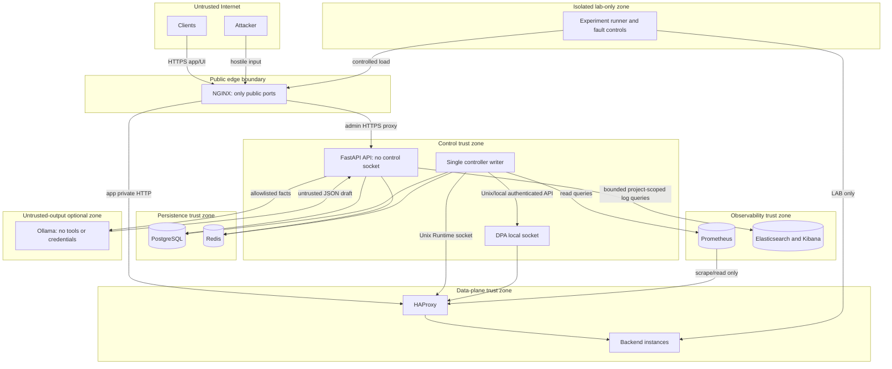
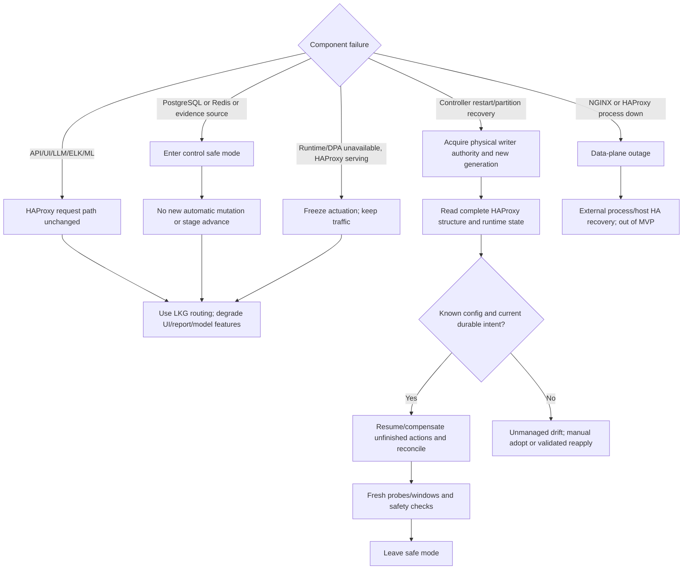

# Security, Threat Model, and Failure Fallbacks

## 1. Security objectives

1. Only authorized, attributable actors and the single controller writer can change routing.
2. Compromise of the browser, LLM, observability UI, or backend telemetry cannot directly invoke HAProxy control.
3. Registration/probing cannot become SSRF into internal or metadata networks.
4. One project cannot observe or mutate another project’s data.
5. Incomplete/poisoned evidence causes abstention or review rather than broad traffic removal.
6. Loss of control/intelligence services leaves HAProxy on last-known-good state whenever the data plane still works.
7. Fault injection is impossible from the public interface and absent outside lab mode.

## 2. Assets and adversaries

### Assets

- HAProxy Runtime socket, DPA credential/socket, configs/maps/state files;
- routing desired state, action snapshots, operator overrides, and audit ledger;
- backend addresses, topology, version labels, capacity, and route policy;
- user credentials, sessions, API tokens, backup keys;
- request metadata/logs and experiment datasets;
- model artifacts and report facts;
- availability and integrity of client traffic.

### Adversaries/fault sources

- unauthenticated Internet attacker;
- authenticated low-privilege user;
- malicious/compromised operator;
- compromised backend or telemetry exporter;
- compromised frontend/observability/LLM container;
- supply-chain or configuration attacker;
- accidental operator error;
- network partition, clock skew, stale process, or resource exhaustion.

## 3. Trust-boundary diagram

**Explanation:** the API, UI, ELK, and Ollama cannot reach HAProxy control. Only the worker has socket access. Fault tooling is a separate network/profile and cannot exist in a pilot/public data-plane network.

## 4. Authentication and session design

- Local username/email plus password is the zero-cost default.
- Passwords use Argon2id with parameters benchmarked on target hardware; hashes are rehashed on login when policy changes.
- Browser authentication uses an opaque server-side Redis session with Secure, HttpOnly, SameSite cookie; session metadata includes user auth version so revocation is immediate.
- CSRF token is required for all cookie-authenticated mutations; Origin/Referer validation is defense in depth.
- Session idle timeout 8 hours and absolute maximum 24 hours in demo; critical pilot policy can be shorter.
- API automation uses high-entropy opaque tokens; only a prefix and cryptographic hash are stored; scopes/project/expiry are mandatory.
- Login, token creation, role change, failed authorization, and session revocation are audited.
- Optional OIDC/SSO is future; no paid identity provider is required.
- Recovery/bootstrap admin credentials are generated out-of-band and rotated after first use; no default password.

## 5. RBAC

| Role | Read | Mutate | Explicit exclusions |
|---|---|---|---|
| Viewer | project-scoped status, evidence, reports | none | endpoint addresses/raw sensitive logs may be redacted |
| Researcher | Viewer + experiments/model evaluation | create/run experiments and allowlisted faults in an experiment-owned `LAB` environment | cannot control non-lab HAProxy, change production-style policy, or approve healing |
| Operator | Viewer + incidents/actions/reintegration/overrides within policy | acknowledge, request permitted action, pause/rollback/reintegrate allowed scopes | cannot change users, structural routes, lab faults, model activation, or approve critical broad action |
| Approver | Operator + action impact/evidence | approve policy-designated critical/version/route/global actions and force-enable workflows | cannot change project users or bypass safety/config validation |
| Project Admin | all project configuration and audit | project users, routes/policies, modes, structural revisions, retention and integration settings | no raw HAProxy CLI; cannot administer other projects or host-level secrets |
| System Admin | host/service/backup/bootstrap status | platform users, recovery, secret rotation and deployment settings through audited procedures | no implicit project action authority; project access/elevation must be explicit and audited |

Critical version/global action or force-enable on a critical route can require two distinct authorized approvers. Service accounts receive the minimum scopes and no interactive session.

## 6. HAProxy least privilege and network segmentation

- Runtime API listens only on a Unix socket with owner/group mode `0660`; only HAProxy and worker groups access it.
- DPA listens on Unix socket/loopback by default. If a remote management hop is unavoidable, use its TLS/mTLS capability, source firewall allowlist, separate credential, and private management network.
- The API/frontend/ELK/Ollama/backend/fault containers never mount control sockets.
- Worker command adapter exposes a fixed typed operation set; no endpoint accepts arbitrary command/config fragments.
- HAProxy runs unprivileged after binding, with read-only root filesystem where feasible and only required config/state volumes writable.
- Public network reaches NGINX only. PostgreSQL, Redis, Prometheus, Elasticsearch, Kibana, DPA, Ollama, backend management probes, and Docker daemon are not public.
- Customer/backend traffic and management/probe traffic use separate networks/interfaces where multi-machine deployment permits.
- cAdvisor’s Docker visibility is lab-only; Docker socket is treated as root-equivalent.

## 7. Input and configuration safety

### Backend registration/SSRF

- Project/environment has explicit allowed CIDRs and ports.
- Reject loopback, link-local, multicast, unspecified, broadcast, IPv4-mapped bypasses, cloud metadata ranges, Docker/host control addresses, persistence/observability/control subnets, and public addresses unless explicitly approved.
- Prefer literal IP registration. If DNS is allowed, resolve using trusted resolver, validate every A/AAAA result, pin the resolved set, revalidate on change, and defend rebinding.
- Probe paths are selected from registered route templates; users cannot supply full URLs, schemes, redirects, or arbitrary headers.
- Prober does not follow redirects and enforces response-size/time limits.
- Egress firewall is the final SSRF boundary.

Guidance aligns with the [OWASP SSRF Prevention Cheat Sheet](https://cheatsheetseries.owasp.org/cheatsheets/Server_Side_Request_Forgery_Prevention_Cheat_Sheet.html), but controls are tailored to this topology.

### Route/config injection

- Route matches are typed exact prefixes/templates with normalized decoding and deterministic precedence.
- Generated HAProxy names derive from opaque IDs and a constrained alphabet.
- Structural edits use DPA typed objects; no raw HAProxy/NGINX text from user input.
- Validate with DPA and `haproxy -c`, invariant checks, config diff, and route smoke probes before activation.
- Unknown out-of-band checksum freezes automation instead of overwriting.

### Log injection and resource bounds

- Structured JSON encoding; newline/control-character escaping; schema/length limits.
- Redact secrets at edge and pipeline; malformed events go to a bounded quarantine stream.
- Request bodies and untrusted error text never enter classifier/LLM.
- Metric/log queries use server-owned templates and capped ranges/rows.
- Uploaded artifacts, if later supported, are content/type/size checked and never executed.

## 8. Threat analysis

| Threat | Attack/failure path | Primary controls | Residual risk/failure posture |
|---|---|---|---|
| Unauthorized HAProxy control | public/API user reaches Runtime/DPA | Unix socket, mount isolation, worker-only credential, typed adapter, firewall, RBAC/audit | worker compromise remains high impact; freeze/restore from audit/LKG |
| Stolen control-plane credentials | session/token theft | secure cookies, CSRF, scoped/expiring tokens, revocation, rate limit, TLS, audit | operator actions may occur until revocation; critical dual approval |
| Malicious backend registration/SSRF | register metadata/admin target | CIDR/port allowlists, DNS pinning, redirect off, egress firewall | misconfigured allowlist; Project Admin review and audit |
| Route/config injection | crafted route name/pattern | typed templates, opaque generated names, DPA objects, validation/diff | parser/version bug; structural freeze/LKG |
| Log injection | headers/error text forge records | structured encoding, source-set fields, length/redaction, no raw text decisions | poisoned sanitized app codes; cross-source conflict lowers confidence |
| Poisoned telemetry | backend/exporter reports false health | requester/HAProxy/direct probe cross-controls, source provenance, mTLS/private scrape, completeness/conflict | colluding sources; automatic caps and review |
| ML evasion/poisoning | shaped metrics or mislabeled data | lab ground truth, run-group split, artifact hashes, no online training, rules/safety gates, OOD/unknown | novel adversarial patterns; abstain |
| False quarantine | classifier/policy error | evidence certificate, capacity cap, bounded apply, dual verification, rollback, max one action | short exposure/lost capacity; audit and false-action metric |
| Replayed control request | duplicate approve/apply/override | idempotency key+request hash, ETag, session CSRF, action generation | delayed valid action; short action expiry |
| Cross-project leakage | IDOR/query bug | server-derived scopes, project FK/query filter, auth tests, no browser direct stores | application bug; audit/security test |
| Secret leakage | logs/config/backups/LLM | secret files/env provider, no secret logs, field redaction, encrypted backups, LLM facts allowlist | host admin compromise |
| Public fault injection | attacker calls lab endpoint | separate Compose profile/network/role, 404 outside LAB, token+expiry, no public proxy route | deployment mistake; startup assertion blocks public+fault profile combination |
| Redis/PostgreSQL exposure | network scan/default creds | private network, ACL/password, TLS multi-host, firewall, unique roles, backups | host/network compromise |
| Elasticsearch/Kibana exposure | raw logs/data | private/admin network, API-mediated product queries, auth, ILM/redaction | lab admin can see logs; minimize collection |
| Operator misuse | broad force-ready/global change | impact preview, ETag, expiry, reason, approval, audit, safety block/emergency path | malicious privileged admin; separation of duty/backups |
| Control-plane DoS | expensive API/query/SSE/login | NGINX/API rate limits, body/range/cursor caps, worker isolation, DB pool caps, SSE limits | UI/API degraded; traffic path continues |
| Compromised frontend | malicious JS calls API | CSP, HttpOnly cookies, CSRF, RBAC, no control socket, dependency pinning | actions within user privilege; audit |
| Compromised LLM output | prompt injection/unsupported advice | structured facts only, no raw logs/tools/network/credentials, JSON schema, entity/claim validator, label as draft | misleading prose may reach human; deterministic fallback/limitations |
| Split-brain controllers | two workers set different states | exactly one socket mount/writer, host fencing before failover, generation checks | orchestration error granting two mounts; unsupported/critical alert |
| Backup theft/tamper | external disk copied/changed | encryption, separate key, checksums, restricted permissions, restore verification | key+backup compromise; rotate and investigate |

## 9. Telemetry trust and ML safety

- Each evidence field carries source/provenance/freshness.
- Backend self-reported health never alone disables a peer or passes reintegration.
- HAProxy request outcomes are requester-side but can be affected by proxy/network faults; direct probe and peer controls remain necessary.
- Model files are checksum-verified, mounted read-only, and loaded only when schema/approval status matches.
- Training data is checksummed; fault labels come from experiment state, not backend text.
- No automatic retraining/promotion; no model-generated policy/threshold modification.
- Hard retry, capacity, conflict, operator, and rollback rules run after classification.

## 10. Local LLM isolation and validation

The report generator sends Ollama a bounded JSON document with opaque/safe entity names and numeric facts. The model has:

- no HAProxy/DPA/Redis/PostgreSQL credential;
- no tool/function calls;
- no outbound Internet requirement;
- no raw request/response body, raw log line, secret, source file, or arbitrary operator note;
- no API path to create/approve/apply actions.

Output must match a JSON schema. Validator rejects:

- entity IDs/names not in the input allowlist;
- numeric claims not equal to or explicitly derived from input facts;
- source-code locations, causal certainty, action recommendations beyond the recorded action, or unsupported root cause;
- missing limitations/provenance;
- control-like strings/links/instructions.

Rejected/timeout output is discarded and the deterministic template is stored. UI labels all LLM text as generated narrative from recorded facts.

## 11. Encryption and secret management

- TLS 1.2+ public edge, modern curated cipher policy, automatic certificate renewal only after tested; self-signed/local CA for offline mode.
- Single-host private Docker networks may use plaintext HTTP only for NGINX→HAProxy/demo backends; multi-host management/persistence requires TLS or an encrypted private network.
- PostgreSQL/Redis TLS in multi-host mode; server identity verified.
- Full-disk encryption is recommended for laptops/hosts; backup encryption mandatory.
- Sensitive endpoint addresses and optional credentials are application-field encrypted where access separation warrants it.
- Secrets are mounted from permission-restricted files/Compose secrets mechanism, not committed, not embedded in images, and rotated.
- Password/API token hashes are one-way; original tokens shown once.
- Model and report artifacts contain no secrets by construction.

## 12. Fail-open versus fail-closed matrix

| Boundary | Failure posture |
|---|---|
| normal client traffic when controller/intelligence fails | **fail open to last-known-good HAProxy state**; traffic continues |
| new automatic routing action when evidence/control dependency fails | **fail closed**; no mutation |
| authentication/authorization uncertainty | fail closed |
| structural config validation/reload | fail closed; running config remains |
| unknown classifier | fail closed for destructive action; evidence/report continues |
| retry safety uncertainty | retries suppressed |
| reintegration evidence missing | stage paused/held, never advanced |
| audit persistence failure | block mutation that cannot be audited |
| report/LLM failure | deterministic report or no report; no control impact |
| all HAProxy members unhealthy | follow explicitly configured route failure policy; never silently invent a backend |

## 13. Control-plane and dependency failure behavior

| Failure | Normal traffic | Automatic control | User/report behavior | Recovery |
|---|---|---|---|---|
| FastAPI/API offline | continues | worker may finish already prepared action only if its dependencies/versions remain healthy; safest policy pauses new plans | UI/API unavailable | restart API; no data-plane reconciliation needed |
| controller worker offline | continues on LKG | none; HAProxy native checks still work | status stale once API detects heartbeat | restart in safe mode, new generation, observe/resume |
| PostgreSQL offline | continues | no new mutation; stop before next command; cannot audit | read/write mostly unavailable | restore DB, validate generation/actions, full reconcile |
| Redis offline | continues | suppress new automatic actions/reintegration because coordination/session/events degraded | sessions/SSE fail; some DB reads possible by token policy | rebuild caches/streams from PG, reconcile, leave safe mode |
| Prometheus unavailable/stale | continues | no evidence-based action; HAProxy hard checks continue | metrics degraded banner | wait for fresh windows; do not backfill zeros |
| Elasticsearch/Logstash/Filebeat unavailable | continues | metric/rule actions may continue only if required log evidence is not needed; completeness reflects loss | logs/search and rich reports degraded | resume ingest; late data not retroactively changes committed action |
| ML model unavailable/bad | continues | rules-only mode | Decision Trace shows fallback | verify artifact or keep rules-only |
| Ollama unavailable | continues | unaffected | deterministic report | retry optional later |
| frontend unavailable | continues | unaffected | REST remains | restart frontend |
| HAProxy Runtime/DPA API unavailable but HAProxy serves | continues | no write/readback; freeze | critical control degraded state | restore API/socket, read complete state, reconcile |
| HAProxy process unavailable | traffic outage | controller cannot route around its own missing data plane | critical | external supervisor/redundant HAProxy later; product does not self-restart it |
| NGINX unavailable | public traffic/UI outage; HAProxy private may serve | controller remains out of path but public service unavailable | critical | external supervisor/redundant edge later |
| partial network partition worker↔DB | traffic continues | worker stops mutation immediately; old generation cannot be assumed safe | stale | restore, reestablish authority, observe HAProxy first |
| partition worker↔HAProxy | traffic continues | no mutation/verification; action deadline → review | control alert | reconnect/readback; never assume command failed |
| backend/dependency partition | traffic impacted | classify only with adequate evidence; capacity/retry safety | incident | route intervention as supported |

### Deferred persistence

Safety-critical mutations are never “temporarily stored in memory for later database write.” If PostgreSQL/audit commit is unavailable, no new command is issued. Numeric telemetry/log delivery can buffer within bounded local queues; overflow is explicit data loss and lowers completeness.

## 14. Last-known-good and recovery reconciliation

Last-known-good (LKG) consists of:

- active validated structural config revision and checksum;
- current committed desired route/member/policy state;
- latest confirmed HAProxy observed snapshot;
- state-file/config backup for reload;
- active operator overrides and unexpired committed actions.

After a failure, the worker does not blindly write the LKG. It reads the current process/config/state, checks for valid operator/unmanaged changes, resumes or compensates durable actions, and converges only current desired versions. If a structural checksum is unknown, it freezes and asks the operator to adopt or reapply.

## 15. Failure/fallback diagram

**Explanation:** intelligence failures degrade control, not traffic. A failed NGINX/HAProxy process is different: it is the actual data plane and requires external HA/supervision.

## 16. Security acceptance gates

- public port scan exposes only NGINX 80/443 (80 redirects) and no fault/admin datastore ports;
- API role cannot access Runtime/DPA even after remote-code-execution simulation;
- Viewer/Researcher cannot mutate routing; project ID tampering cannot cross scope;
- SSRF test corpus covers alternate IP encodings, IPv6, DNS rebinding, redirects, metadata/link-local, and allowed-CIDR changes;
- route/log/config injection corpora cannot change rendered semantics or forge log fields;
- duplicate/replayed control requests are idempotent or rejected;
- poisoned source conflicts produce lower confidence/unknown, not broad action;
- Redis/PG/Prometheus/ELK/Ollama loss follows the failure matrix;
- LLM adversarial input cannot emit an accepted unsupported entity/action/root cause;
- secrets scanner and log inspection find no credentials in repo/images/logs/reports/backups;
- restore drill validates encrypted backup integrity and audit continuity.
