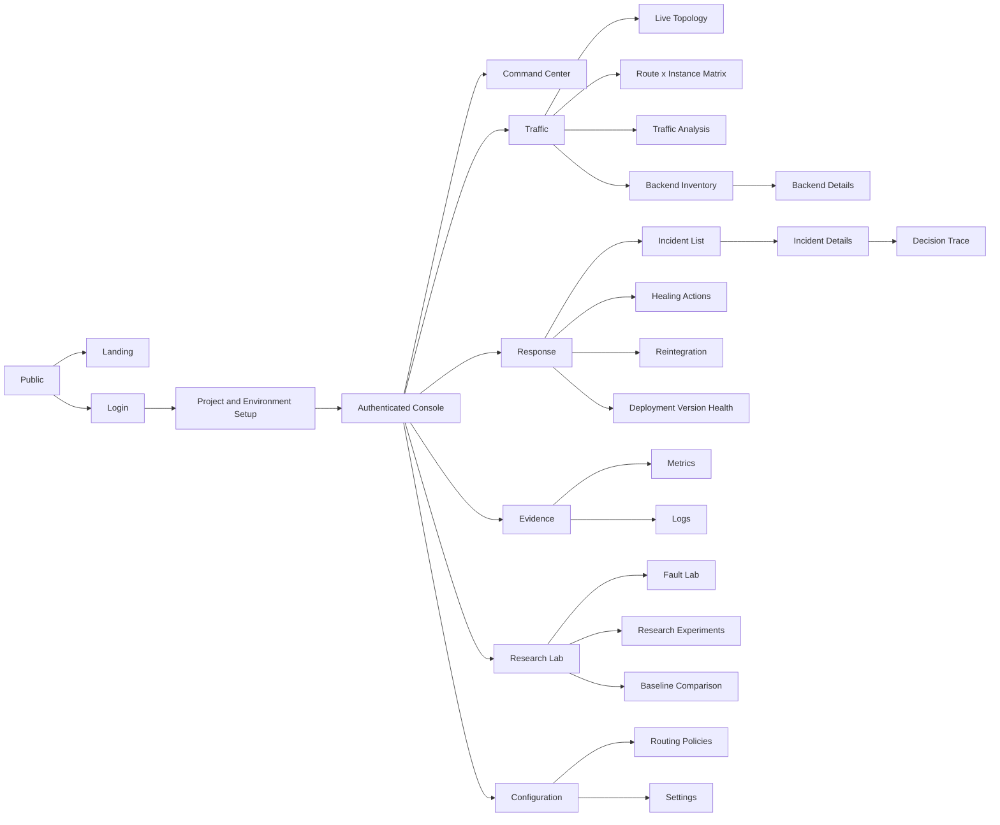
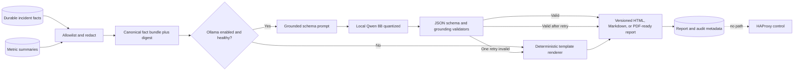

# Frontend and Product Experience Specification

`FRONTEND_UX_DESIGN.md` at the repository root is the canonical implementation design. This dossier chapter records the frozen product contract and must be interpreted consistently with that document.

## 1. Experience objective

The interface is an operations console for proving **what the system observed, why it selected a routing scope, what it changed, and whether the change helped**. It is not an AI chat surface and it does not conceal uncertainty behind a single health score.

The visual character is premium, quiet, human-readable, and reversible: deep OLED surfaces, subtle charcoal structure, electric indigo for active routing context, crisp emerald for verified health, muted rose for quarantine, and amber for unresolved obligations. Generous spacing and narrative hierarchy lead; forensic density appears through progressive disclosure. The product name remains **Self Healing Load Balancer**.

### Product principles

1. **Evidence before action:** every action links to a Decision Trace and immutable evidence window.
2. **Scope is visible:** route, instance, version, and complete-route interventions look materially different.
3. **Desired and observed state are separate:** drift is never rendered as success.
4. **Uncertainty is explicit:** confidence, completeness, conflicts, sample count, and freshness appear together.
5. **Reversibility is first-class:** previous state, rollback availability, verification deadline, and operator control remain visible.
6. **Clarity before density:** the default surface breathes; hover, focus, density modes, and inspectors reveal operational and forensic detail.
7. **Human-readable first:** typed evidence produces cautious situation briefs that link every quantitative clause to facts.
8. **No decorative real time:** animation communicates selection, scope, readback, verification, or recovery only.

## 2. Information architecture



**Navigation model:** a quiet collapsible rail groups Command, Traffic, Response, Evidence, Research Lab, and Configuration. A Raycast-style `Cmd/Ctrl+K` command hub is the fastest navigation and workflow entry point. The global header carries environment, operating mode, event freshness, command trigger, help, theme, and user controls. Premium dark mode is canonical; Light/Dark/System remain semantic preferences with accessibility parity. Research Lab is hidden when lab mode is disabled; it is never merely CSS-hidden from unauthorized users.

## 3. Semantic design system

### 3.1 Color tokens

Dark mode is the reference system. Tokens express meaning rather than component ownership and must pass automated contrast checks.

| Token | Value | Intended use |
|---|---:|---|
| `bg-root` | `#000000` | OLED page field |
| `bg-canvas` | `#050505` | Workspace |
| `bg-surface` | `#0A0A0A` | Primary surfaces |
| `bg-elevated` | `#0F0F10` | Command palette, dialogs, sheets |
| `bg-hover` | `#141416` | Hover/current row |
| `border-subtle` | `#1F1F1F` | Hairline structure |
| `border-strong` | `#303036` | Selected/nested structure |
| `text-primary` | `#F5F5F5` | Primary copy |
| `text-secondary` | `#A1A1AA` | Supporting copy |
| `text-tertiary` | `#71717A` | Metadata; never essential alone |
| `accent-routing` | `#6366F1` | Active routing context and selection |
| `accent-routing-bright` | `#818CF8` | Focused path/current trace chapter |
| `state-verified` | `#34D399` | Verified health/effective obligation only |
| `state-quarantine` | `#FB7185` | Quarantine and rollback boundary |
| `state-danger` | `#F43F5E` | Harm, rollback failure, reserve breach |
| `state-uncertain` | `#FBBF24` | Unknown, stale, incomplete, verifying |
| `state-info` | `#38BDF8` | Neutral evidence/probe annotation |
| `focus-ring` | `#A5B4FC` | Keyboard focus |

State also uses an icon, label, position, border, or texture; color alone is prohibited. Classifier confidence is neutral/indigo, never emerald. Diffuse contextual glows may sit behind the active topology node or trace chapter at 8–14% opacity; neon outlines and full-panel gradients are prohibited.

### 3.2 Typography

- **UI and prose:** Geist Sans, locally bundled; Inter and system neo-grotesque fallback.
- **Identifiers, values, logs:** Geist Mono, locally bundled; system monospace fallback.
- Display: fluid 32–48/1.08; narrative header: 24/1.3; section: 16/1.4; body: 14/1.55; compact data: 12/1.45; metadata: 11/1.4.
- Numeric telemetry uses tabular numerals. Do not truncate action, incident, backend, or correlation IDs without a copy/reveal control.

### 3.3 Spacing, grid, and shape

- 4 px base unit; main spacing steps: 4, 8, 12, 16, 20, 24, 32, 40, 56, 72.
- Desktop shell: 216 px collapsible rail, 52 px header, fluid 12-column content grid; matrix, topology, and trace canvases may use the viewport.
- Primary surfaces use 10–12 px radii; nested controls 7–8 px. Layout and spacing create hierarchy before borders.
- Shadows occur only on command palette, dialogs, and floating inspectors.

### 3.4 Core component library

Use shadcn/ui primitives as accessible behaviour foundations, then restyle them. The visible system is bespoke.

| Family | Components |
|---|---|
| Navigation | App rail, environment switcher, breadcrumbs, tabs, command palette |
| Status | State lozenge, mode banner, freshness clock, capacity bar, desired/observed delta |
| Evidence | Evidence chip, source badge, completeness meter, conflict flag, window scrubber |
| Routing | Routing-unit badge, weight stepper, pool membership row, route-instance cell |
| Narrative | Situation brief, fact link, comparison phrase, limitation callout |
| EBMSH | Diagnostic trace canvas, evidence constellation, scope ladder, deterministic safety envelope |
| Blast radius | Physical-instance map, route ribbon, before/proposed/observed diff, preserved set, capacity impact |
| Verification | Affected-relief track, preserved-cohort track, dual-invariant gate |
| Response | Action saga, state triptych, rollback anchor, verification verdict |
| Data | Virtualized table, filter builder, column manager, diff view, structured log row |
| Visualization | Topology canvas, matrix heat-cell, time-series chart, distribution/confusion matrix |
| Control | Confirm dialog, typed high-risk confirmation, reason input, approval panel |
| Feedback | Skeleton, stale-data veil, inline error, reconnect banner, empty state, toast |

Every high-impact control shows target scope and projected remaining capacity before confirmation.

## 4. Application shell and interaction model

### Header

Left to right: breadcrumb; project/environment switcher; current mode (`AUTOMATIC`, `RULES_ONLY`, `SAFE`, `MANUAL`); telemetry freshness; global search/command palette; theme switcher (`Light`, `Dark`, `System`); help; user menu.

Safe mode is a full-width persistent strip below the header containing reason, start time, suppressed-action count, and authorized recovery link. It cannot be dismissed.

### Global time and environment contract

- Every screen is scoped to one environment; changing it requires explicit selection and updates URL state.
- Default timestamp display is local time plus relative age; hover/focus reveals canonical UTC ISO 8601.
- A global time range applies only to analysis views. Action evidence windows remain immutable and are labelled as snapshots.
- Live views show `LIVE`, last-event time, and SSE connection state. Historical selection turns `LIVE` off visibly.

### Command palette

`Ctrl/Cmd+K` opens the primary Raycast-style command hub. It supports natural-language entity search, recent/pinned context, navigation, peer comparison, and permitted workflow entry. A routing command never completes inside the palette; it opens the immutable Blast Radius and approval journey. Disabled results explain the permission or safety gate.

## 5. Screen specifications

### 5.1 Landing Page

Purpose: explain failure-scope-aware routing with one concrete checkout example. Hero statement, request-path illustration, route × instance before/after comparison, evidence-bounded workflow, research baselines, local/self-hosted deployment, and architecture summary. No fake customer logos, invented savings, AI imagery, or unverified patent claim. Primary action is “Open local console”; secondary is “Read technical method.”

### 5.2 Login

Minimal OLED surface, product mark, local account fields, password visibility control, session/security message, and environment ownership notice. No social-login requirement. Errors avoid confirming whether an account exists. Rate-limit and lockout state are accessible.

### 5.3 Project and Environment Setup

Five-step wizard: project identity; environment/mode; allowed backend CIDRs and HAProxy connection check; route groups and physical instances; safety/retry policy review. A generated topology preview and validation report precede creation. Fault Lab defaults off. Secrets are entered through masked fields and never redisplayed.

### 5.4 Command Center

The opening view answers: is traffic safe, what is changing, and what needs review?

It begins with a typed-fact situation brief, for example: “Backend-B handled 3,402 requests successfully, but `/checkout` is 42% slower than its peer instances. Public and auth on the same physical host remain stable.” Every quantitative clause links to its evidence window. This narrative replaces a wall of context-free KPI cards.

```text
┌ Header: environment | AUTOMATIC | fresh 3s | search | theme ┐
├ Status strip: HEALTHY CAPACITY 83% | open incidents 2 | quarantine 1 ┤
│ Request rate       p95 latency       error rate       control-loop lag │
├───────────────────────────────┬─────────────────────────────────────────┤
│ Live request topology         │ Active decision                         │
│ NGINX → HAProxy → pools       │ evidence → scope → safety → action      │
│ clickable, capacity encoded   │ confidence + completeness + countdown   │
├───────────────────────────────┴─────────────────────────────────────────┤
│ Route × Instance Matrix (compact, pinned route/instance headers)        │
├────────────────────────────────────────────┬────────────────────────────┤
│ Incident timeline                          │ Last action / verification │
└────────────────────────────────────────────┴────────────────────────────┘
```

The top values form one operational summary, not unrelated cards. Selecting a topology node cross-filters matrix and trace. The active decision panel asks “Why this scope?” and shows constraints still unresolved. When idle it tells the operator what is stable, when reconciliation last ran, and how fresh evidence is.

### 5.5 Live Topology

React Flow renders NGINX, HAProxy frontends, logical route pools, physical instances, and dependency groups. Node size encodes configured capacity, edge thickness request rate, edge pattern observed/desired discrepancy, and state icon health. The same physical instance is one node with multiple pool edges—not duplicated as independent machines. Active paths may receive a soft clipped indigo glow; healthy nodes do not pulse. Controls: zoom-to-incident, isolate route, overlay versions, compare desired/observed, freeze at incident timestamp. Layout remains stable between SSE updates.

### 5.6 Route × Instance Matrix

This is a product-specific primary visualization. It defaults to a calm overview and offers `Overview`, `Operational`, and `Forensic` density modes without changing selection or filters.

- Rows: route groups; columns: physical backend instances, nested under deployment version where enabled.
- Overview cell: state glyph/label, effective weight, one dominant deviation, quarantine/drift/reintegration edge. Error rate, p95, samples, freshness, and control comparisons appear in higher density modes and on hover/focus.
- Cell outline: desired state; inner fill/hatch: observed state. A diagonal split and `DRIFT` label show mismatch.
- Row header: route-wide state, traffic, criticality, retry policy. Column header: instance state, version, total assigned capacity.
- Filters: incident, version, state, criticality, membership, freshness. Sorting cannot hide quarantined cells without a visible filter badge.
- Virtualize both axes at scale; sticky row/column headers; table-mode alternative for assistive technology and export.
- Selecting a cell opens a spacious side sheet beginning with a human-readable “what changed” sentence, then same-route peers, same-instance routes, charts, desired/observed state, and Decision Trace. It does not mutate traffic.

State vocabulary: healthy, degraded, failing, quarantined, verifying, reintegrating, unknown, no membership. A no-membership cell is visually distinct from missing telemetry.

### 5.7 Backend Inventory

Progressively disclosed inventory grouped by service/version with instance ID, address alias, desired/observed state, effective route memberships, aggregate weight, capacity, probe state, last traffic, active incident, and data freshness. Compact mode is available for experts. Bulk action is limited to maintenance scheduling and requires a Blast Radius preview. Backend addresses are hidden from Viewer by policy.

### 5.8 Backend Details

Header shows physical identity/version and aggregate state. Tabs: Overview, Route Memberships, Traffic, Evidence, Action History, Configuration. The Overview separates instance-wide evidence from route-local evidence. Route membership rows show independent desired/observed weights and why each differs. An immutable event trail explains registration/version changes.

### 5.9 Traffic Analysis

Coordinated request-rate, error-family, latency percentile, timeout class, queue depth, retry amplification, and healthy-capacity charts. Compare by route/instance/version. Window annotations show incidents and actions; clicking one sets the evidence window. Percentiles never stack. Rates and counts are labelled distinctly.

### 5.10 Incident List

Default order: needs review, harmful/active, verifying, then recent resolved. Columns: class, affected scope, severity, lifecycle state, first/last seen, confidence/completeness, active action, owner. Saved filters include “unknown/low evidence,” “rollback,” and “stale.” Bulk resolve is prohibited.

### 5.11 Incident Details

Sticky incident summary with class, status, scope, evidence freshness, operator owner, and correlation ID. Sections: symptom timeline, affected/unaffected sets, competing hypotheses, Decision Trace, action attempts, verification, reintegration, structured report, and audit. Each classification revision remains accessible rather than overwritten.

### 5.12 Decision Trace

The trace is the explanatory spine, rendered as an interactive diagnostic canvas rather than a stepper or log:

```text
OBSERVE → LOCALIZE → BOUND → ACT → VERIFY → RECOVER

Evidence/Fingerprint/Classification → Safety Envelope/Minimum Unit
→ HAProxy Saga/Readback → Dual Verification → Commit/Restore/Reintegrate
```

The page combines a chapter rail, causal evidence canvas, context inspector, and shared time scrubber. Selecting a node highlights its inputs/outputs; competing scope branches remain visible. Expanders reveal source completeness, rules, optional model probabilities/calibration, conflicts, rejected units, safety constraints, desired/requested/observed state, and versions. The view explicitly distinguishes “classifier suggested” from “deterministic safety allowed.” Copy/export produces a redacted evidence bundle with hash.

At verification the trace physically divides into two equally prominent tracks on one aligned time axis:

1. **Affected cohort relief:** the route/member symptom, aligned baseline/peer controls, errors/latency/timeouts, sample gate, threshold, and deadline.
2. **Preserved cohort:** healthy same-instance routes and other controls, eligibility/throughput/success/latency, unique capacity floor, queue/retry guardrails, and sample sufficiency.

The tracks converge at a two-key invariant gate. `EFFECTIVE` and emerald commit treatment are impossible unless both pass with fresh sufficient evidence. Relief plus preservation failure is harmful/ineffective; an unknown track is insufficient.

#### Blast Radius Map

Every action preview and automated-action review centers the physical instance and fans out its logical route memberships. The selected membership uses a muted rose before→after ribbon; preserved memberships retain neutral ribbons with explicit `Unchanged` labels and emerald confirmation edges. Electric indigo marks the active focus. A stable `Before / Proposed / Observed` toggle changes state without moving nodes. The map states how many memberships change, which healthy pools remain eligible, unique reserve after action, route capacity floor, rollback target, and why broader instance/route/version alternatives were rejected.

### 5.13 Healing Actions

Action queue/table with lifecycle, scope, controller generation, expected effect, observed effect, expiry, and actor. Detail drawer begins with the situation brief and Blast Radius Map, then presents previous/requested/observed state as a three-way diff, every attempt, HAProxy response, idempotency key, verification clock, and rollback state. Manual action requires reason; broad/high-criticality targets require Approver role.

### 5.14 Reintegration

Stage lanes (`QUARANTINED`, `PROBING`, `5%`, `20%`, `50%`, `100%`, `HEALTHY`) show current evidence, target, window/sample progress, flapping/cooldown, and next eligible transition. Percentages display as policy defaults, not fixed laws. Controls: pause, resume, roll back one stage, quarantine, require review. A route-specific stage never implies whole-instance health.

### 5.15 Deployment Version Health

Compare current and control versions by route, error/latency deltas, affected-instance fraction, fingerprint similarity, capacity, and action state. Cohort sizes and traffic mix are always shown to prevent misleading comparisons. Version-group removal preview lists every route membership and residual capacity.

### 5.16 Routing Policies

Policy list, versioned editor, validation, diff, and staged activation. Sections: route match, criticality, capacity floor, scope/confidence thresholds, retry policy, rate/concurrency controls, verification windows, reintegration stages, and approval level. Structural changes show “requires validated reload.” An editor cannot express raw HAProxy directives in MVP.

### 5.17 Metrics

Curated dashboards first; optional Prometheus expression input only for Operator/Researcher. Panels link exemplars/correlation metadata where available. Dashboard definitions are versioned. Stale or partial series are visibly hatched, not interpolated as certainty.

### 5.18 Logs

Structured log explorer with project/environment enforcement, safe field filters, correlation pivot, timeline histogram, redaction indicators, and bounded export. Raw body/payload is unavailable by design. Kibana may remain an admin-only deep link; the product UI owns incident-linked log evidence.

### 5.19 Fault Lab

Visible only in lab mode and isolated environments. Scenario catalog, exact target, blast-radius preview, duration, automatic cleanup, experiment link, and two-step confirmation. Public deployment omits routes and credentials for executing faults. A persistent hazard banner and watermark prevent confusing injected faults with real incidents.

### 5.20 Research Experiments

Create or clone a versioned experiment manifest; show baseline/scenario/trial matrix, random seed, artifact versions, progress, invalid trials, and reproducibility bundle. Stop affects pending trials only; completed raw data is immutable. No cherry-pick delete.

### 5.21 Baseline Comparison

Paired trial distributions and confidence intervals for healthy capacity preserved, successful requests, false actions, retries, and latency. Default is distribution/interval—not a bar chart of means. The view shows excluded trials with reasons, multiplicity-corrected significance, effect size, and baseline configuration parity.

### 5.22 Settings

Project metadata, environment mode, users/RBAC, backend allowlists, secrets references, retention, model version, LLM reporting, notification/export, audit, backup status, and dangerous operations. Dangerous controls use typed environment name, reason, impact statement, and appropriate approval. There is no general-purpose HAProxy command console.

## 6. Responsive behaviour and mobile limits

| Width | Behaviour |
|---|---|
| ≥1440 px | Full rail, dual/tri-panel command view, full matrix headers |
| 1024–1439 px | Collapsible rail; command view stacks lower panels; side sheets overlay |
| 768–1023 px | Read/acknowledge workflows; topology and matrix use dedicated full-screen modes |
| <768 px | Incident read-only summary, acknowledgement, safe pause request; no policy editing, fault injection, topology manipulation, or broad routing override |

The product does not squeeze complex operational proof onto a phone. High-impact action confirmation below 768 px is disabled except emergency reintegration pause when policy permits.

## 7. Loading, empty, stale, and error states

- **Initial loading:** shape-matched skeletons; no fabricated metric numbers.
- **Incremental loading:** retain prior value, label it stale, show age; do not blank the whole screen.
- **No data:** distinguish new environment, no traffic in range, no membership, filtered result, and unavailable telemetry.
- **SSE reconnect:** amber banner after 10 s, exponential reconnect with jitter, cursor resume; after cursor loss fetch a REST snapshot then reopen stream.
- **Partial API error:** keep unaffected panels; panel error includes correlation ID and retry.
- **Permission error:** explain required capability without revealing object existence across projects.
- **Observed-state failure:** freeze previous observed value with timestamp and `UNKNOWN`; never render desired state as observed.
- **Destructive mutation timeout:** show `RESULT UNKNOWN`, disable duplicate controls, and reconcile by action ID.

## 8. Accessibility and keyboard contract

- Target WCAG 2.2 AA; contrast, focus, reflow, reduced motion, target size, error association, and non-colour status are release gates.
- Semantic headings/landmarks; skip links; dialogs trap and restore focus; live regions announce material state change without streaming every metric.
- Matrix supports arrow navigation, Home/End, page movement, row/column announcements, and table-mode alternative.
- Topology has a parallel hierarchical list; every visual node/edge is accessible there.
- Charts have title, units, textual summary, data table/export, and keyboard cursor.
- `?` opens shortcut help; `g c` command center, `g i` incidents, `g m` matrix, `g a` actions. Shortcuts never fire inside text fields.
- Honor `prefers-reduced-motion`; theme choice is stored per user and System remains a real setting.

## 9. Chart and animation policy

- Recharts is used for bounded time series, distributions, calibration plots, confusion matrices, and interval comparisons; React Flow is limited to topology, trace relationships, and Blast Radius flows.
- Always show units, timezone, aggregation, sample count, and missing intervals. Limit simultaneous series to six; use small multiples thereafter.
- Green/red are reserved for categorical outcome, not ordinary series differentiation.
- No 3D, gauges, pie charts for health, smoothed curves that imply measurements between samples, or dual axes without a documented analytical need.
- Framer Motion uses 100–140 ms hover/focus, 180–240 ms sheets, and 240–320 ms chapter/diff transitions. Selected matrix context may cross-fade into the Blast Radius Map. Live topology nodes do not drift, bounce, or perpetually pulse; reduced-motion replaces spatial transitions.

## 10. Real-time data architecture

TanStack Query owns REST snapshots, caching, mutation status, and invalidation. One environment-scoped SSE connection carries ordered event envelopes. The client:

1. loads a versioned REST snapshot and records `snapshot_event_id`;
2. opens SSE using the last processed event ID;
3. ignores duplicates, detects gaps, and applies only newer entity versions;
4. invalidates/fetches the affected entity if a gap or unknown version occurs;
5. renders optimistic state only for low-risk preference changes—not routing actions;
6. treats action submission as accepted/planned until observed-state confirmation arrives.

WebSockets are not justified: the browser sends ordinary authenticated REST mutations while the server emits one-way state changes. SSE is simpler through NGINX and supports cursor resumption.

## 11. Local LLM reporting boundary

The LLM converts an already-closed structured incident record into cautious prose. It is not part of detection, classification, safety, action planning, verification, or recovery.

### 11.1 Structured input

| Group | Allowed fields |
|---|---|
| Identity | incident/action/report IDs, environment alias, UTC interval |
| Evidence | allowlisted metric names and values, units, windows, sample counts, source references, completeness/conflicts |
| Decision | final class, calibrated confidence, deterministic rules fired, rejected alternatives |
| Routing | target aliases, routing unit, previous/requested/observed state, HAProxy result |
| Outcome | verification verdict/criteria, reintegration stages, rollback, operator notes |
| Guidance | route-owned developer checklist IDs and approved glossary |

Never include request/response bodies, authorization/cookie/query values, secrets, internal credentials, free-form raw logs, source code, or HAProxy control endpoints. Backend host/IP is replaced with an allowlisted display alias unless the requesting role may export it.

### 11.2 Grounded prompt contract

- Use only supplied facts; cite each factual sentence with an input fact ID.
- Describe association, not root cause, unless an operator supplied a separately labelled confirmed cause.
- Do not invent code locations, users, services, versions, metrics, actions, or remediation.
- Preserve uncertainty and conflicting evidence.
- Never recommend an automatic routing action; describe only the recorded action and bounded developer checks.
- Produce schema-valid JSON, not Markdown.

### 11.3 Structured output

```text
report_version, incident_id, title,
summary[{text, fact_ids}],
observed_evidence[{text, fact_ids}],
likely_category{label, confidence, limitations, fact_ids},
automatic_action[{text, fact_ids}],
verification_result[{text, fact_ids}],
recovery_result[{text, fact_ids}],
developer_checks[{checklist_id, text, rationale_fact_ids}],
limitations[], generated_by{mode, model, digest, prompt_version}
```

### 11.4 Validation and rejection

1. JSON Schema and maximum-length validation.
2. Every fact-bearing sentence must contain valid fact IDs.
3. Numeric/token/entity extractor confirms values occur in referenced facts and entities are allowlisted.
4. Forbidden-claim rules reject source-line claims, certainty terms, new root causes, instructions to call control APIs, credentials, or unapproved developer checks.
5. Cross-check category, confidence, action, verdict, and stage against durable records.
6. On any failure, retry once with validation errors but no new facts; then use deterministic template mode.
7. Store input digest, redacted input, model/artifact digest, prompt/validator version, output, failures, and actor in report audit metadata.

Human-authored operator notes are visually and structurally distinct from model prose. Generated reports are immutable versions; regeneration creates a new version.

### 11.5 Model and resources

Preferred lab model: [**Qwen3 8B through Ollama, Q4_K_M quantization**](https://ollama.com/library/qwen3%3A8b), subject to an implementation-time license/artifact review. The current catalog artifact identifies 8.19B parameters, Q4_K_M, Apache-2.0 text, and approximately 5.2 GB; the exact downloaded artifact and license must still be pinned and reviewed. Run one report job at a time, non-thinking/low-temperature mode, fixed prompt, bounded context, and 60–180 s timeout. Budget 6–10 GB additional RAM and expect CPU-only generation to be slow. Disable Ollama in the low-resource profile; deterministic reports remain complete.

No model download is part of deterministic setup. Model artifacts are pinned by digest and kept outside application images.

### 11.6 Report pipeline



**Explanation:** both generative and deterministic paths consume the same fact bundle and write an auditable report. There is deliberately no edge to action APIs or HAProxy credentials.

### 11.7 Export

Exports are redacted Markdown/HTML and optional PDF generated from validated structured output. Each contains report version, factual window, completeness, generation mode (`LLM` or `TEMPLATE`), model/prompt version when applicable, limitations, and evidence references. An export never embeds live credential-bearing links.

## 12. Frontend acceptance conditions

- A reviewer can follow one incident from raw summarized evidence through rejected scopes, safety decision, desired/observed HAProxy state, verification, and recovery without Kibana.
- Route-local quarantine of instance B is visible without implying B is globally unhealthy.
- The Blast Radius Map labels the changed membership and every preserved healthy membership on the same physical instance.
- Decision Trace splits into affected-relief and preserved-cohort tracks; `EFFECTIVE` cannot appear until both pass.
- Typed-fact situation briefs provide a human-readable entry point while preserving source, freshness, sample, and uncertainty links.
- Safe mode, stale telemetry, insufficient evidence, unmanaged drift, and unknown action result cannot resemble healthy success.
- Every routing mutation has scope preview, authorization, reason, idempotent submission, and observed confirmation.
- The complete critical workflow works without Ollama; no screen labels ordinary classification as an LLM result.
- Matrix, topology alternative, dialogs, and main incident flow pass keyboard and WCAG 2.2 AA tests.

## 13. Explicit UX non-goals

- no chatbot over logs;
- no drag-to-rewire live production routing;
- no raw HAProxy command console;
- no arbitrary query-language access for ordinary users;
- no mobile-first policy editor or fault injector;
- no invented savings, root cause, or patent badges;
- no dashboard customization framework in MVP.
