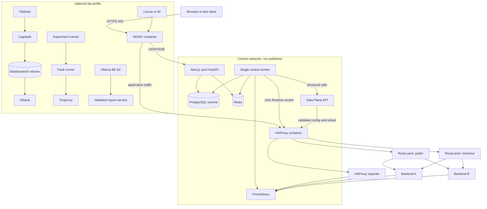

# Zero-Mandatory-Cost Deployment Plan

## 1. Deployment position

The complete product can run on user-owned x86-64 or ARM64 Linux hardware using open-source components. There is no required paid API, SaaS account, managed database, hosted model, or cloud control plane. “Zero mandatory recurring cost” does **not** mean electricity, hardware, storage, domain names, Internet connectivity, or every optional tunnel/provider is free.

Four supported profiles are frozen:

1. **Local Development:** deterministic Docker Compose environment with compact telemetry.
2. **Full Research Lab:** complete observability, controlled faults, repeatable trials, and optional local LLM.
3. **Public Zero-Mandatory-Cost Demo:** self-hosted data/control plane with a deliberately narrow remote surface and a local/VPN fallback.
4. **Future Customer-Integrated:** isolated multi-host installation adjacent to customer-owned NGINX/HAProxy and applications.

Docker Compose is the orchestration mechanism for local/lab/demo. Multi-machine deployment uses one Compose project per host with explicitly managed private connectivity; Compose is not treated as a cluster orchestrator.

## 2. Frozen version strategy

- Pin exact container image digests and Python/Node lockfiles during implementation.
- Baseline HAProxy family: **HAProxy 3.2 LTS with the matching HAProxy Data Plane API 3.2 family**, because Runtime and Data Plane API behaviour must be tested as a pair. Re-evaluate supported patch versions immediately before implementation; do not silently float tags.
- NGINX stable/mainline choice is frozen to an exact tested patch before the implementation milestone.
- PostgreSQL, Redis, Prometheus, Elasticsearch stack, and Ollama versions are likewise pinned by digest after compatibility testing.
- Research manifests record every image digest, model digest, configuration hash, host kernel, and CPU architecture.

The version choice is a compatibility decision, not a claim that the named versions will remain current.

## 3. Compose services and profiles

| Service/container | Always | Lab/full | On demand | Responsibility | Typical limit/expectation |
|---|---:|---:|---:|---|---:|
| `edge-nginx` | Yes | Yes | No | TLS/public ingress, frontend/API proxy | 64–128 MB |
| `traffic-haproxy` | Yes | Yes | No | Request routing/data plane | 128–256 MB |
| `haproxy-dataplane` | Yes | Yes | No | Validated structural transactions | 128–256 MB |
| `control-api` | Yes | Yes | No | FastAPI REST/SSE; no HAProxy socket | 256–512 MB |
| `control-worker` | Yes | Yes | No | Sole actuator, scheduler, reconciliation | 384–768 MB |
| `frontend` | Yes | Yes | No | Next.js built application | 192–384 MB |
| `postgres` | Yes | Yes | No | Durable system of record | 512 MB–2 GB |
| `redis` | Yes | Yes | No | Ephemeral coordination/windows | 128–512 MB |
| `prometheus` | Yes | Yes | No | Numeric evidence | 512 MB–2 GB |
| `haproxy-exporter` | Yes | Yes | No | HAProxy metrics | 64–128 MB |
| `demo-backend-a..c` | Local/demo | Yes | No | Controlled application instances | 128–256 MB each |
| `demo-dependency` | Local/demo | Yes | No | Controlled downstream failure | 128–256 MB |
| `node-exporter` | Optional | Yes | No | Host metrics | <64 MB |
| `cadvisor` | Optional | Yes | No | Container metrics in lab | 128–256 MB |
| `elasticsearch` | No | Yes | No | Structured/raw log search | 3–5 GB |
| `logstash` | No | Yes | No | Parsing/normalization | 512 MB–1 GB |
| `kibana` | No | Yes | No | Administrative log exploration | 512 MB–1 GB |
| `filebeat` | No | Yes | No | Bounded file log shipping | 64–128 MB |
| `toxiproxy` | No | Yes | No | Dependency/network fault proxy | 128–256 MB |
| `fault-runner` | No | Yes | Yes | Authorized scenario lifecycle | 128–256 MB |
| `experiment-runner` | No | Yes | Yes | Sequential trial orchestration | 256–512 MB |
| `locust` or `k6` | No | Yes | Yes | Load generation | CPU/workload dependent |
| `ollama` | No | Optional | Yes | Local report generation only | 6–10 GB with 8B Q4 |
| `notebook` | No | Optional | Yes | Offline research analysis | 512 MB–2 GB |

Expected count: about **13–14 running containers** in the compact local profile (including three demo backends), **19–21** with ELK and fault infrastructure, and **up to 23** while a load generator, experiment runner, notebook, or Ollama job is active. On a 16 GB machine, ELK and Ollama must not run together.

## 4. Network topology and trust boundaries

Create separate internal Docker networks rather than one flat bridge:

| Network | Attached services | External reachability |
|---|---|---|
| `edge_net` | NGINX, HAProxy, frontend/control API upstream listeners | NGINX alone publishes host ports |
| `backend_net` | HAProxy, demo/customer backends, dependency proxy where needed | None by default |
| `control_net` | control API, worker, PostgreSQL, Redis, Prometheus | None |
| `actuation_net` | worker, DPA, HAProxy; plus shared Runtime socket volume | None; API/frontend excluded |
| `observability_net` | Prometheus/exporters, ELK components, worker read clients | None; admin access through authenticated NGINX/VPN only |
| `lab_net` | fault runner, load generator, Toxiproxy, lab targets | Omitted outside lab profile |

Network attachment is minimized. In particular, Ollama reaches neither `actuation_net` nor backend/control credentials; it receives report bundles through a narrow internal reporting endpoint or filesystem handoff. Fault runner cannot attach to production/customer profiles.

### Published ports

| Port | Binding | Purpose |
|---|---|---|
| 80/tcp | Public/demo as needed | Redirect to HTTPS; local may use HTTP |
| 443/tcp | Public/demo | NGINX TLS and application surface |
| development alternate (for example 8080) | Loopback only | Local NGINX when privileged ports are inconvenient |

PostgreSQL 5432, Redis 6379, HAProxy stats/Runtime, DPA, Prometheus 9090, Elasticsearch 9200, Kibana 5601, Ollama 11434, Docker API, and fault endpoints are never publicly published. Local debugging binds them to `127.0.0.1` only and remains profile-gated.

## 5. Deployment diagram

**Explanation:** only NGINX is an Internet entry point. The FastAPI process serves product calls but lacks HAProxy credentials. One worker holds physical actuation authority. The lab plane is optional and omitted from a public/customer production-style profile.

## 6. Volumes and file ownership

| Volume | Writer | Readers | Backup |
|---|---|---|---|
| PostgreSQL data | PostgreSQL | PostgreSQL | Required encrypted logical backup |
| HAProxy config/maps/state | DPA/HAProxy under controlled ownership | HAProxy, worker read | Required after validated structural change |
| HAProxy Runtime socket | HAProxy | worker read/write only | Never backed up |
| HAProxy Runtime state snapshots | worker/HAProxy | worker | Durable snapshots represented in PostgreSQL; file is restart aid |
| Prometheus TSDB | Prometheus | Prometheus | Optional for demo; experiment results exported durably |
| Elasticsearch data | Elasticsearch | Elasticsearch | Not a system-of-record backup; usually disposable |
| bounded JSON logs | each service/Filebeat | Filebeat/admin | Rotate; no indefinite backup |
| reports/exports | report service | authorized API | Required if records policy requires |
| model cache | Ollama | Ollama | Re-downloadable; digest manifest required |
| research artifacts | experiment runner | analysis/notebook | Required, checksummed |
| TLS material | NGINX/renewal job | NGINX | Encrypted backup; least privilege |

Run containers as non-root where images support it. Explicit UID/GID and read-only root filesystems prevent accidental ownership changes. HAProxy/DPA configuration mounts are read-only except to the dedicated structural writer path. Never mount the Docker socket into the control plane or fault runner.

## 7. Configuration and secrets

- Commit only documented templates and non-secret defaults; implementation will provide an environment example with sentinel values.
- Generate independent high-entropy secrets for session signing, PostgreSQL, Redis if authenticated across hosts, DPA, backup encryption, and service-to-service credentials.
- Local Compose uses mounted permission-restricted secret files, not command-line arguments or image layers. Docker secrets may be used where available but are not assumed to provide enterprise secret management.
- Multi-host/customer mode uses locally operated secret files plus mTLS certificates or an existing customer secret manager; no paid manager is mandatory.
- Backend CIDRs, route patterns, project identity, feature flags, retention, policy, and model digests are versioned configuration, not ad hoc environment switches.
- Validate at startup; missing/placeholder production secret, public debug mode, lab flag, wildcard backend CIDR, or exposed datastore causes startup refusal.
- Redact values in startup output, diagnostics, action records, logs, and reports.

## 8. Health checks and startup order

Compose `depends_on` is not readiness. Every service exposes or has a native health command with meaningful semantics.

1. Networks, permissions, and persistent volumes exist.
2. PostgreSQL and Redis become reachable; PostgreSQL reports read/write and expected major version.
3. A one-shot migration job obtains an advisory lock, verifies a backup/migration policy, applies Alembic, and exits. API/worker never auto-migrate concurrently.
4. HAProxy validates static configuration before starting; Runtime socket and stats endpoint become ready. NGINX validates its config before start/reload.
5. DPA starts against the expected config directory/version and reports config transaction readiness.
6. Prometheus starts and validates configuration; exporters become scrapeable.
7. API starts after durable schema readiness, but may report degraded dependencies.
8. The sole worker verifies writer ownership, increments controller generation, reads desired/observed state, and initially enters reconciliation safe mode.
9. Frontend starts; NGINX exposes `/ready` only when it can serve the frontend and API status.
10. Optional ELK, lab, notebook, and Ollama services start independently and cannot block traffic readiness.

Worker readiness is distinct from liveness: liveness means its process/event loop works; readiness means writer authority, stores, evidence, HAProxy read access, and reconciliation have passed. Failure to become ready suppresses automatic action but does not stop NGINX/HAProxy.

## 9. Resource profiles

### A. Local Development Profile

| Resource | Minimum workable | Recommended |
|---|---:|---:|
| CPU | 4 logical cores | 6–8 logical cores |
| RAM | 8 GB host | 12–16 GB host |
| Free disk | 20 GB | 40 GB |
| Prometheus retention | 24 h / 1–2 GB cap | 3 days / 4 GB cap |
| Logs | JSON rotation, 100 MB × 3/service | 3 days, bounded |

ELK, Ollama, Kibana, cAdvisor, notebook, and sustained load generation are off. Use structured file logs and product-level incident summaries. Run small three-instance backends; experiments are smoke-scale only. Start services sequentially to avoid peak pressure.

### B. Full Research Lab Profile

| Resource | Practical target |
|---|---:|
| CPU | 8–12 logical cores; 16 preferred for load and LLM |
| RAM | 24 GB without concurrent LLM/ELK pressure; 32 GB preferred |
| Free disk | 100–150 GB |
| Prometheus retention | 15 days or 30 GB, whichever occurs first |
| Elasticsearch retention | 7 days hot, 20–30 GB hard watermark |
| Experiment artifacts | 30–60 GB managed by run manifest |

Run load generation on a second student machine when measuring control-plane overhead or high request rates; otherwise generator contention invalidates results. On 16 GB, run experiments with ELK, then stop ELK and run LLM reporting separately.

### C. Public Zero-Mandatory-Cost Demo Profile

| Resource | Practical target |
|---|---:|
| CPU | 4–8 logical cores |
| RAM | 12–16 GB |
| Free disk | 40–60 GB |
| Prometheus retention | 3–7 days / 8 GB cap |
| Logs | 3–7 days; ELK off unless host has ≥24 GB |
| Reports/audit | 90 days for demo data, then purge/export |

Use synthetic/non-sensitive data and demo backends only. Fault execution is accessible solely from local/VPN administration, not the public UI. Ollama and notebooks are off. Rate-limit login/API, cap SSE clients, and reset demo state on a documented schedule.

### D. Future Customer-Integrated Profile

Initial production-style minimum: two data-plane hosts for externally managed HA, one dedicated control/DB host plus backup target, and optional observability host. This project does **not** implement automatic HA across HAProxy nodes in MVP; customer failover mechanisms, state convergence, and capacity semantics require a separate qualification. PostgreSQL HA is also outside the student scope.

## 10. Local single-machine workflow

Implementation should expose named Compose profiles: `core`, `demo`, `observability`, `lab`, `llm`, and `analysis`. A deterministic bootstrap will:

- preflight CPU/RAM/disk/ports and display expected footprint;
- create local secrets and self-signed development certificates;
- validate every config and pinned artifact;
- migrate PostgreSQL once;
- seed only explicitly requested demo topology/policies;
- start core, then demo, then optional profiles;
- wait for semantic readiness and perform request/control smoke checks;
- print only NGINX URL and non-secret status.

Offline-after-download use is supported by exporting pinned images/model artifact separately. A fresh environment without cached images still needs Internet once unless an offline bundle is supplied; documentation must say this honestly.

## 11. Multi-machine self-hosted deployment

### Recommended layout

- **Edge/data host:** NGINX, HAProxy, exporter; no database/LLM.
- **Control host:** FastAPI, single worker, DPA adjacent to controlled HAProxy or a narrow mutually authenticated management path, PostgreSQL, Redis, frontend build.
- **Observability/research host (optional):** Prometheus, ELK, Ollama, experiments; load generator preferably separate.

Hosts use a private VLAN or WireGuard tunnel. WireGuard is optional open-source supporting infrastructure justified by authenticated encrypted host connectivity; an existing private network/mTLS is acceptable. Firewall rules allow only necessary directed flows. Runtime socket remains host-local. If DPA is remote, bind it to the private interface with mTLS/reverse proxy and narrow allowlisting; a local actuator is safer and preferred.

Clock synchronization (NTP/chrony) is required; the controller monitors skew. Loss of the private management path freezes control while data traffic continues on last-known-good state.

## 12. Public demonstration without mandatory recurring service

### Stable safe default

Run on user/college-owned hardware. Demonstrate over a local LAN or a WireGuard/SSH port-forwarded reviewer session. This has no third-party availability dependency and remains the documented fallback.

### Optional public reachability

- direct router port-forward to NGINX 443 with an owned hostname and free ACME certificate;
- an optional free tunnel or dynamic-DNS hostname, explicitly labelled replaceable and non-guaranteed;
- optional static hosting for the public landing page only, while the authenticated console remains self-hosted.

A universally trusted public HTTPS URL generally needs a DNS name or tunnel/provider; the dossier does not pretend otherwise. If no hostname is available, use VPN/local demonstration or a reviewer-approved self-signed certificate. The project remains operable when an optional free tier disappears.

### Public restrictions

- synthetic project and backend aliases only;
- fault APIs not routed by NGINX and lab profile absent;
- admin/datastore/observability/model ports private;
- Viewer demo account read-only; operator session via VPN/local network;
- no raw logs, backend addresses, topology secrets, model prompt input, or system configuration export;
- hard rate/connection limits, request-body cap, login throttling, short sessions, CSP/HSTS when TLS is stable;
- demo reset/restore procedure and kill switch at NGINX/firewall.

## 13. Future customer integration boundaries

Customer supplies:

- authorized route-group definitions and request criticality/idempotency semantics;
- physical instance/service/version identity and capacity assumptions;
- application metrics/log schema or approved exporters;
- isolated management connectivity and HAProxy ownership/change window;
- TLS/DNS/identity requirements, retention policy, backup target, and operational approvers;
- independent HA/failover for ingress if production availability requires it.

The deployment starts in observe-only mode, then rules-only recommendation, then approved bounded actuation. Shadow evidence collection must cover normal and failure-like periods. A public URL alone cannot provide host metrics, version identity, controlled probes, HAProxy authority, capacity truth, or safe fault injection; therefore it is insufficient for self-healing integration.

## 14. Logging and retention

All containers write JSON to stdout or a bounded file driver. Avoid unlimited default Docker logs. Filebeat reads explicit read-only paths; Logstash rejects unbounded fields. Elasticsearch index lifecycle uses size/age limits and a disk watermark. Prometheus TSDB enforces time and size retention.

| Data | Local | Lab | Public demo | Durable? |
|---|---|---|---|---|
| Prometheus raw metrics | 1–3 days | 15 days/30 GB | 3–7 days/8 GB | No; export experiment aggregates |
| Raw structured logs | 1–3 days, no ES | 7 days/30 GB | 3–7 days | No |
| Incidents/actions/audit | 180 days in development | Project duration + archive | 90 days/reset | Yes within policy |
| Fingerprints | 30–90 days | Full experiment + archive | 30 days | Selected summaries |
| Research manifests/results | Explicit export | Indefinite project archive | Not applicable | Yes |
| LLM reports | Template by default | 90 days or study policy | Disabled/template | Yes if generated |

Deletion is project-scoped and audited. Audit records retain a tombstone/hash even when lawful deletion removes sensitive payload fields. Research data uses synthetic requests and a separate retention agreement.

## 15. Backup and recovery

### Backup set

1. Nightly `pg_dump`-style logical backup plus pre-migration backup; weekly restore verification.
2. HAProxy/NGINX validated configurations, maps, state-file configuration, desired-state generation, and image-digest manifest after every structural commit.
3. Research manifests, raw trial summaries, seeds, analysis environment lock, model/config hashes.
4. Report exports where retention requires them.
5. TLS/private keys only in separately encrypted backup with restricted recovery procedure.

Redis, Prometheus TSDB, Elasticsearch, and model cache are reconstructable and need not be primary backups. Optional open-source `restic` or equivalent can encrypt/deduplicate to a USB disk, second student machine, or customer-owned storage; no cloud target is required. Keep at least one offline/off-host copy. Do not store backup encryption keys beside backups.

### Recovery objectives for the student deployment

- Data-plane config recovery target: 30 minutes from validated local backup.
- Control metadata recovery target: 4 hours; acceptable data loss target 24 hours for nightly backup, tighter before/after experiments and structural changes.
- Research run artifacts: backup immediately after accepted run.

These are project targets, not production SLAs. Restore drills, not backup command success, establish confidence.

## 16. Graceful shutdown, upgrade, and rollback

### Shutdown

1. Put worker in safe mode; stop scheduling and stage advancement.
2. Finish or mark in-flight action attempts with bounded deadline; never begin a broad action.
3. Persist cursor/checkpoint and release writer lease after actuation socket closes.
4. Stop API/frontend/optional services.
5. Gracefully stop NGINX/HAProxy last only when the operator intends a data-plane outage.

SIGTERM handling is bounded; Compose restart policies apply to unexpected exit but do not create multiple actuator replicas.

### Upgrade

- Export backup and current observed/desired state; verify no unowned in-flight action.
- Pull pinned candidate images, scan/record digests, run migrations in a cloned/staging volume, and validate configs.
- Upgrade control/report/UX components while HAProxy keeps serving LKG.
- HAProxy/NGINX upgrades use config validation, graceful reload, connection-drain observation, and request smoke test.
- Controller starts rules-only/safe, performs complete reconciliation, then an operator re-enables automatic mode.

### Rollback

Application image rollback is allowed only if schema compatibility is confirmed. Destructive database down-migrations are not assumed; restore the pre-upgrade backup to a separate volume and cut over deliberately. HAProxy rollback restores the exact last validated structural config plus desired runtime generation, then verifies observed state. Never “roll back” by applying an unversioned copied config.

## 17. Disaster and partial-failure behaviour

- **Control host lost:** NGINX/HAProxy continue last-known-good routing; no healing/reintegration progresses. Restore PostgreSQL and controller, acquire new generation, read all observed state, then resume.
- **Data host lost:** traffic through that host is unavailable unless an external pair/failover exists. The student MVP does not solve ingress host HA.
- **Database volume corrupt:** freeze automatic control, retain HAProxy state, restore to a new volume, reconcile before writes.
- **HAProxy config corrupt/rejected:** running process remains; DPA transaction aborts. Restore last validated config; never restart into invalid config.
- **Full disk:** retention alarms at 70/80/90%; stop optional ELK/experiments first. Preserve PostgreSQL/audit headroom. Full evidence storage suppresses new automatic actions.
- **Compromise suspected:** revoke sessions/credentials, isolate control network, preserve audit/config snapshots, enter manual/safe mode, rotate secrets, restore from known-good artifacts.

## 18. Operational limitations

- A single machine is a demonstration/research environment with a shared hardware failure domain.
- Docker Compose supplies restart and dependency management, not distributed HA or consensus.
- The single-writer safety choice means automatic control pauses during worker maintenance/failure.
- Full ELK plus an 8B model is not resource-conscious on an 8–16 GB laptop.
- CPU-only local report generation may take minutes; reports are asynchronous and optional.
- Prometheus/ELK retention is intentionally short; this is not an enterprise archival platform.
- Public home hosting depends on ISP/router policy and power/network availability.
- Customer multi-HAProxy convergence, PostgreSQL HA, global traffic management, and zero-downtime control-plane upgrade require later engineering.

## 19. Deployment acceptance checklist

- Fresh compact setup reaches semantic readiness on an 8 GB host without ELK/Ollama.
- Killing API, worker, Redis, Prometheus, Elasticsearch, Ollama, or frontend does not interrupt a sustained request stream through healthy NGINX/HAProxy.
- Only documented NGINX ports are externally visible; control and lab networks pass isolation tests.
- HAProxy refuses invalid structural config without replacing the running valid config.
- Worker restart increments generation, rejects stale attempts, reconstructs observed state, and remains safe until reconciliation.
- Resource caps, log rotation, Prometheus retention, Elasticsearch watermark, and disk alerts are demonstrably active.
- PostgreSQL/config backup restores into a clean host and reproduces the last committed topology/audit chain.
- Public demo works through the documented LAN/VPN fallback after every optional tunnel/free service is disabled.

