# Research and Evaluation Plan

## 1. Research framing

### Problem statement

Conventional active health checks and outlier ejection commonly make a backend-wide decision even when failure evidence is confined to one route-instance membership. Removing the whole instance may discard healthy capacity; retaining it may continue sending the affected route to failure. The research problem is whether an evidence-bounded controller can choose and safely verify the smallest supported routing target set while avoiding unsafe retry, overload transfer, and overconfident action under incomplete telemetry.

### Exact research gap

The individual ingredients—URL/request-type health, target-group-specific health, outlier ejection, weighted routing, safety caps, canary verification, model confidence, and rollback—have strong prior art. The narrower unresolved engineering question tested here is:

> Does explicitly constructing an evidence-support matrix across route, instance, and version, then optimizing among expressible routing target sets under capacity/retry/evidence constraints and verifying both symptom relief and unaffected-capacity preservation, produce a measurable benefit over backend-wide and static healing baselines?

This is a testable gap, not proof of legal novelty. The experiments must be reported even if the proposed controller is no better.

### Proposed contribution

1. A privacy-minimized route × instance × version failure-support representation with completeness/conflict evidence.
2. Evidence-Bounded Minimum-Scope Healing (EBMSH): feasible-scope enumeration, evidence rejection, safety-envelope filtering, blast-radius minimization, durable application, dual-objective verification, and evidence-gated recovery.
3. A reproducible fault/workload corpus and matched comparison against three required load-balancing/healing baselines.
4. Measurements of healthy capacity preservation, success, false action, retry amplification, recovery, calibration, and overhead.

The contribution remains a traffic-routing method. It is not a generic anomaly platform.

## 2. Research questions and hypotheses

| ID | Research question | Pre-registered hypothesis |
|---|---|---|
| RQ1 | Does EBMSH preserve ground-truth healthy route capacity during scoped incidents? | H1: median normalized healthy-capacity preservation is higher than all baselines for route-instance and version faults, without reducing successful-request fraction beyond the guardrail. |
| RQ2 | Does smaller-scope selection reduce unnecessary whole-instance removal? | H2: the proposed system has a lower unnecessary full-instance removal rate than standard health checks and static backend-wide healing. |
| RQ3 | Are safety and verification effective against harmful actions? | H3: false-action and harmful-commit rates remain below predeclared limits and are lower than an ablated controller without evidence/safety verification. |
| RQ4 | Does scope-aware retry suppression limit amplification during shared failures/overload? | H4: retry amplification is lower than configurations that retain a generic cross-instance retry. |
| RQ5 | Does hybrid classification generalize to unseen runs/intensities? | H5: calibrated hybrid macro-F1 and false-action-aware utility exceed rules-only and logistic baselines on grouped held-out runs; otherwise the simpler model is selected. |
| RQ6 | What overhead and detection/intervention delay does the controller add? | H6: controller work remains outside the request path and stays within the declared CPU/memory, MTTD, and actuation budgets at the target load. |
| RQ7 | How does incomplete/conflicting telemetry affect safety? | H7: reducing completeness increases abstention/manual review rather than broad automatic actions. |

Null hypotheses and all thresholds are frozen in the experiment manifest before final trials. A failure to reject a null is reported plainly.

## 3. Primary outcome

### Ground-truth healthy route capacity preserved (HCP)

For each time interval `t`, the injector manifest defines which route-instance memberships are genuinely capable of serving the route within the experiment’s success/latency criterion. Let `C_ri` be the registered capacity of membership `(route r, instance i)` and `A_ri(t)` its effective admitted fraction after routing state and concurrency limits.

```text
HCP(t) = sum(C_ri * A_ri(t) for ground-truth-healthy memberships)
         / sum(C_ri for ground-truth-healthy memberships)

Trial HCP = time-weighted integral of HCP(t)
            from fault onset through verified recovery cutoff
```

The **primary metric is trial HCP**. It directly tests the selected invention nucleus: preserving unaffected traffic-bearing memberships rather than ejecting an entire physical instance.

### Anti-gaming guardrail

HCP is interpreted only when the trial’s successful-request fraction is not worse than the best safety-valid baseline by more than a pre-registered non-inferiority margin (initial lab proposal: 1 percentage point; confirm with pilot variance). A controller cannot “win” by keeping unusable capacity enabled or doing nothing. Faulty memberships do not count as healthy capacity, and admission without successful service is separately visible in success and latency outcomes.

If non-inferiority is not supported, report HCP as exploratory and reject H1 regardless of its numeric improvement.

## 4. Secondary and diagnostic outcomes

| Outcome | Definition |
|---|---|
| Successful requests during incident | 2xx/expected application success divided by offered requests; route-weighted and per critical route |
| Unnecessary full-instance removal | fraction of incidents where an instance with ≥1 ground-truth healthy membership is completely disabled |
| Healthy requests displaced | weighted requests that could have used a healthy membership but are queued/rejected/rerouted because it was removed |
| Retry amplification factor | total backend attempts / admitted client requests; also excess attempts over one |
| False-action rate | actions whose target contains no ground-truth faulty membership or violates the scope/capacity oracle |
| Scope excess | capacity-weighted size of selected target minus minimum oracle-expressible safe target |
| Harmful commit | committed action worsens predeclared success/latency/capacity criteria versus its pre-action control window |
| MTTD | injected fault onset to incident detection |
| MTTI | detection to observed-state-confirmed intervention |
| MTTR | onset to verified effective state/recovery criterion |
| Tail latency | p95/p99 of completed requests, with timeouts/rejections separately counted rather than silently excluded |
| Reintegration failure | recovery stage reverted/failed divided by attempted stage advances |
| Rollback rate/success | rolled-back actions and successful restoration confirmation |
| Controller overhead | worker CPU/RAM, Prometheus queries, DB writes, action latency, HAProxy admin time |
| Classifier quality | macro-F1; per-class precision/recall; confusion matrix; expected calibration error; Brier score; false-action rate |
| Abstention utility | error/unsafe-action avoided versus percentage of incidents sent to review |

Do not combine unrelated measures into an opaque “healing score.”

## 5. Required baselines

All baselines use the same NGINX/HAProxy versions, backend images, route maps, capacities, workload trace, host allocation, connection/timeouts, and fault seed. Only the declared policy changes.

### B1. Plain Round Robin

- Equal weights and no proposed controller intervention.
- Only unavoidable connect failure behaviour needed for a viable proxy is retained and documented.
- Cross-instance retry disabled unless the exact experiment explicitly compares retry; this avoids granting a hidden policy advantage.
- Purpose: no healing reference, not a production recommendation.

### B2. Standard HAProxy Health Checks

- Documented active checks at the **physical instance** level, conventional rise/fall values, equal weights.
- Backend removed/restored by standard check state; no route-instance evidence controller.
- Any default passive retry/failover setting is explicitly recorded.

### B3. Static Threshold-Based Healing

- Same telemetry windows but fixed hand-authored thresholds.
- A breached route/instance signal maps to a predetermined backend-wide weight reduction/drain, fixed cooldown, and fixed staged return.
- No ML, evidence support matrix, minimum-scope optimizer, dual-objective verification, or counter-hypothesis conflict resolution.
- Thresholds are selected on pilot data, frozen before evaluation, and not tuned per final trial.

### B4. Proposed Self Healing Load Balancer

- Rules-first fingerprint/classification; the frozen model version only if it passed selection criteria.
- EBMSH target enumeration, evidence certificate, safety envelope, durable action, verification, and reintegration.
- Same retry ceiling and capacity assumptions as comparable baselines except where adaptive retry suppression itself is the declared treatment.

### Ablations (secondary)

- Proposed minus peer/version counter-evidence.
- Proposed minus safety capacity envelope (lab-limited; never public).
- Proposed with fixed instead of evidence-gated verification windows.
- Proposed with rules only versus hybrid classifier.

Ablations test mechanism attribution; they are not substitutes for the four required baselines.

## 6. Testbed

### Controlled application topology

- NGINX → HAProxy → four logical route pools: `/public`, `/auth`, `/catalog`, `/checkout`.
- Four physical backend instances. Each appears in every applicable logical route pool; two instances can carry version `v1` and two `v2` for version trials.
- One controllable dependency behind checkout/catalog to create shared dependency failure without killing instances.
- Deterministic endpoints with configurable latency, status/signature, connection behaviour, and bounded resource work. Payment/order-like POST tests use synthetic idempotency keys and a deduplication oracle.
- Independent ground-truth event log from the fault harness, not derived from the controller’s own signals.

### Host allocation

Preferred lab: data/control plane on one host, load generator on a second, and optional ELK/analysis on a third or stopped during timing trials. If only one host exists, pin CPU/memory, record contention, cap load, disable ELK/Ollama, and label external-validity limits.

### Workload mixes

At least three frozen mixes:

1. **Balanced:** equal route demand, predominantly GET/HEAD.
2. **Critical checkout:** 50% public/catalog, 20% auth, 30% checkout with conditional POST/idempotency semantics.
3. **Skewed low-volume:** checkout ≤5% to test sparse evidence/reintegration.

Arrival pattern is open-loop where the generator supports it, so failures do not reduce offered load through coordinated omission. Record offered, admitted, attempted, completed, timed out, and rejected requests separately. Payloads are synthetic and fixed-size.

### Trial timeline

Initial default, refined by pilot:

1. 120 s initialization, not measured.
2. 180 s healthy warm-up and baseline evidence.
3. 300 s fault-active interval.
4. 300–600 s recovery/reintegration interval or bounded manual-review cutoff.
5. 60 s cool-down and artifact flush.

Trials that fail infrastructure validity checks are marked invalid with a machine-readable reason and rerun under the same seed; they are never silently deleted.

## 7. Fault scenarios and ground truth

| Scenario | Injection mechanism | Ground-truth faulty scope | Expected safe direction |
|---|---|---|---|
| Instance crash | Stop one backend process/container after warm-up | All route memberships on instance B | Complete-instance drain/ejection; no route-local pretence |
| Slow instance | Toxiproxy or app mode adds global service delay on B | All B memberships, latency class | Instance weight reduction/drain if capacity permits |
| Route-instance failure | B returns deterministic 5xx/signature only for checkout | `(checkout, B, version)` | Route × instance quarantine; preserve B elsewhere |
| Shared-route failure | Dependency makes checkout fail consistently on every instance | Complete checkout route | Suppress cross-instance retry; fail fast/rate/concurrency policy rather than eject all instances |
| Traffic overload | Open-loop offered load exceeds declared capacity, queue rises broadly | Traffic condition, not faulty instance | Admission/concurrency protection; avoid cascading ejection |
| Version regression | All v2 members fail/degrade checkout while v1 controls remain healthy | `(checkout, version v2)` or v2 group as supported | Drain affected version memberships/group with capacity check |
| Flapping recovery | Alternate healthy/fault condition at fixed/random intervals | Scope of base fault with unstable recovery | Adaptive cooldown, stop stage advance, bounded attempts |
| Unknown mixed anomaly | Combine modest latency, sparse timeouts, one telemetry source loss, conflicting peers | Deliberately non-separable/under-evidenced | UNKNOWN, no destructive automatic action, review |

Each fault has intensity levels established in pilot (for example mild/medium/severe) but final values are frozen. Fault start/end, target, mechanism state, and cleanup confirmation are timestamped independently. A fault that accidentally changes another scope is invalidated or relabelled by the predeclared contamination rule.

## 8. Experiment design and number of trials

### Main confirmatory matrix

- 4 baselines × 8 required scenarios × **30 independent matched trials** = 960 trial executions for the core workload/intensity.
- A “trial” has a fresh experiment-run ID, randomized seed, cleaned ephemeral state, randomized safe baseline order, and an independent injection cycle. Metric windows inside one trial are not independent replicates.
- Run one matched block (all four baselines) with the same workload/fault seed close in time. Randomize baseline order within each block using a Latin-square schedule to reduce host drift/order bias.
- Reboot is not required between every trial, but container/state reset, connection drain, queue zero, controller incident closure, and resource-stability checks are.

960 trials are substantial but automatable; at roughly 12 minutes each they require about 192 serial hours. Use sequential overnight runs across several weeks or two **identically qualified** rigs, with rig as a recorded block. Do not reduce trial duration or independence merely to create more samples.

### Pilot and power

Run 5–10 pilot blocks per scenario to set fault intensity, time windows, thresholds, variance, and non-inferiority margin. Pilot data is excluded from confirmatory testing. A power/simulation analysis based on paired HCP variance determines whether 30 blocks detect the minimum practically relevant effect (initial proposal: 5 percentage points). If underpowered, increase blocks or narrow the confirmatory scenario set before unblinding—not after observing favourable results.

Additional workload mixes, intensity levels, missing-telemetry sweeps, and ablations are secondary experiments and may use 15–20 blocks initially, clearly labelled exploratory.

## 9. Statistical analysis

### Primary confirmatory analysis

1. Pre-register exclusions, HCP calculation, non-inferiority guardrail, scenarios, and hypotheses.
2. Summarize trial distributions by median, IQR, mean, standard deviation, and 95% bootstrap confidence interval; show every trial.
3. For the four matched baselines, use a **Friedman test** as the non-parametric repeated-measures omnibus test within the predeclared scoped-fault family (route-instance and version-specific) and separately by scenario as secondary.
4. If justified, compare Proposed versus each baseline with paired **Wilcoxon signed-rank tests**, Holm-corrected across the planned comparisons.
5. Report paired Hodges–Lehmann location shift and rank-biserial correlation (plus confidence interval) as effect sizes; a p-value alone is insufficient.
6. Test the successful-request non-inferiority guardrail with a paired confidence interval against the frozen margin. H1 requires both guardrail and HCP evidence.

If difference distributions make signed-rank assumptions untenable, use a predeclared paired permutation test. Zero-heavy metrics use exact/permutation or bootstrap intervals, not forced normal approximations. For all eight scenarios together, a secondary mixed-effects model may include baseline/fault fixed effects and seed/rig block effects, but it cannot replace the simple predeclared primary test.

### Multiple outcomes

HCP is the single primary outcome. Successful-request fraction is a gate. All other operational metrics are secondary; adjust families of planned comparisons with Holm. Exploratory analyses are labelled and cannot retroactively become confirmatory.

### Time-series handling

Aggregate to the independent trial before hypothesis testing. For plots of within-trial trajectories, show block-bootstrap uncertainty or trial quantiles; do not treat per-second samples as thousands of independent observations.

## 10. Dataset generation and labels

### Record per request/window/action

- experiment/run/seed/baseline/fault IDs and exact monotonic/UTC timing;
- route, instance, deployment version, method category;
- sanitized outcome/status/signature/timeout/connect class and latency;
- request rate, retries/attempts, connections, queues, capacity, CPU/memory;
- fingerprints, source completeness/conflicts, rule outputs, candidate probabilities;
- selected/rejected scopes, safety constraints, desired/observed changes;
- verification/reintegration outcomes and independent fault truth.

Raw payloads, credentials, tokens, cookies, and student/user personal traffic are prohibited. Hashes use experiment-scoped keyed hashing where identity linkage is needed.

### Label hierarchy

Ground-truth primary label comes from the injected fault manifest and confirmed injector state. Derived health observations cannot label themselves. For overload and mixed faults, label criteria are frozen (offered load/capacity, queue/saturation, affected sets). A trial with disputed ground truth is excluded from model training and recorded in an ambiguity set for UNKNOWN evaluation.

### Split discipline

- Split by complete experiment run/seed, never random rows/windows.
- Keep all windows from one injection and its recovery in one split.
- Hold out fault intensities and at least one workload mix for generalization testing.
- Fit preprocessing, imputation, class weights, calibration, and thresholds only on training/validation runs.
- Use nested grouped cross-validation for model selection and one untouched grouped test set for the final reported model.
- Deduplicate configuration-identical repeated windows and check fingerprint leakage.

## 11. Model comparison and the meaning of “90%”

Compare:

1. deterministic rules only;
2. logistic regression with documented scaling/regularization/class weights;
3. random forest with bounded depth/trees and calibrated probabilities.

No deep learning or additional model is justified for the structured, modest-sized student dataset. Random Forest is selected only if grouped held-out macro-F1, important minority-class recall, calibration, inference cost, and false-action-aware utility materially beat logistic/rules. Otherwise ship the simpler system.

A defensible statement is not “90% accurate.” It would be:

> On a frozen, run-grouped held-out test set containing every supported failure class, the hybrid system achieved macro-F1 ≥0.90, with a 95% bootstrap confidence interval, while every actionable class met its predeclared precision/recall floor, expected calibration error met its threshold, and false automatic-action rate remained below its safety limit.

If any condition fails, report the actual values. HEALTHY-dominated raw accuracy, random window split, or tuning on the test set cannot support the statement.

Initial selection gates to refine during pilot:

- actionable-class precision ≥0.95 where false quarantine is costly;
- per-class recall ≥0.80 for supported classes;
- expected calibration error ≤0.05;
- false automatic-action rate ≤1% of evaluated incidents;
- UNKNOWN/abstention is evaluated rather than forced into a known class.

These are project targets, not expected production guarantees.

## 12. Research experiment pipeline

```mermaid
flowchart LR
    M[Versioned experiment manifest] --> V[Validate topology, images, policy, seed]
    V --> R[Randomized matched baseline block]
    R --> W[Healthy warm-up]
    W --> L[Open-loop workload]
    L --> F[Independent fault injector]
    F --> T[Controller and data-plane telemetry]
    F --> G[Ground-truth event ledger]
    T --> A[Immutable per-run artifact bundle]
    G --> A
    A --> Q{Validity checks passed?}
    Q -->|No| I[Keep invalid run and reason; schedule same-seed rerun]
    Q -->|Yes| D[Grouped dataset builder]
    D --> S[Pre-registered metric computation]
    S --> X[Paired statistics, effect size, confidence intervals]
    X --> P[Tables, figures, limitations, reproducibility package]
```



**Explanation:** the independent injector ledger provides labels; invalid trials remain visible; only complete runs enter grouped analysis; baseline order and seeds are controlled before results are viewed.

## 13. Reproducibility package

Every accepted experiment emits:

- immutable manifest with schema version, hypothesis family, scenario/intensity, workload, duration, seed, baseline order, routes, capacities, retries, safety and verification policy;
- Git commit (once implementation exists), dirty-tree status, image and model digests, dependency locks;
- host OS/kernel/CPU/RAM, clock synchronization, container limits, rig ID;
- validated NGINX/HAProxy configs and Runtime/DPA state snapshots before/after;
- fault ground-truth ledger and cleanup proof;
- raw bounded metrics/log extracts, fingerprint/classification/action/verification tables;
- validity report, exclusion reason if any, checksums, and analysis output;
- notebook and non-interactive analysis script producing identical tables/figures from the bundle.

Random seeds do not make scheduling/network timing deterministic; repeat trials quantify that variance. Store artifacts in a documented open format (CSV/Parquet as appropriate plus JSON manifest) and redact environment secrets.

## 14. Threats to validity

### Internal validity

- **Fault leakage:** injected checkout dependency may affect catalog; use independent ground truth and contamination checks.
- **Order/warm-cache effects:** randomized Latin-square order, cleanup, matched seeds.
- **Shared-host contention:** separate generator, container limits, resource stability gate; record rig.
- **Controller oracle leakage:** controller never reads fault manifest; analysis joins after run.
- **Threshold/model overfit:** pilot/final separation and grouped untouched test.
- **Clock skew:** synchronized clocks plus monotonic timestamps per host.
- **Coordinated omission:** open-loop generation and timeout/rejection accounting.

### Construct validity

- Registered capacity may not equal useful capacity; calibrate capacity with healthy load tests and include success guardrail.
- HTTP success alone may hide business failure; demo endpoints return deterministic application outcome signatures.
- HCP rewards preserved routing membership, so successful-request/latency and false-action outcomes are mandatory companions.
- MTTD depends on window settings; report them and compare equal evidence availability.

### External validity

- Four routes/four instances and synthetic failures do not represent every application, protocol, or traffic distribution.
- HTTP request semantics, dependency chains, encrypted payloads, and real customer observability vary.
- Single-host HAProxy/control results do not establish multi-region or clustered control safety.
- Injected faults are cleaner than production gray failures; UNKNOWN scenario only partially addresses this.

### Conclusion validity

- 30 blocks may still be underpowered for rare false actions; report exact binomial intervals and accumulate safety evidence separately.
- Multiple scenarios/metrics inflate false discovery; pre-registration and Holm correction are required.
- Non-significance is not equivalence; equivalence/non-inferiority needs explicit margin and interval.

## 15. Research ethics, privacy, and safety

- Use synthetic application data only; no production user traffic or credentials.
- Run faults solely on isolated lab targets with automatic expiry and cleanup.
- Never expose fault endpoints publicly or permit the LLM/model to actuate.
- Preserve unfavourable and invalid-run records; distinguish engineering exclusions from outcome-based exclusion.
- Publish datasets only after secret/identifier scanning and license review.
- Patent/IP review may require delaying public disclosure of the detailed mechanism; coordinate before paper, repository, poster, or demo publication.

## 16. Publication decision rules

The paper may claim:

- implemented mechanism details actually present in the frozen evaluated build;
- controlled-test improvements with effect sizes and uncertainty;
- observed safety/overhead bounds limited to the tested environment;
- negative or mixed results.

It may not claim:

- guaranteed patentability or global novelty;
- production reliability, cloud-scale generalization, causal root cause, or zero failures;
- “90% accuracy” without the full grouped metrics definition;
- that route-instance quarantine alone is novel;
- that an LLM contributes to healing.

## 17. Evidence needed for IP review

Preserve mechanism-specific evidence beyond aggregate performance:

1. pairs of identical incidents where standard backend ejection loses healthy memberships and EBMSH retains them;
2. evidence certificates showing why smaller/larger target sets were accepted or rejected;
3. action snapshots and desired/observed confirmation proving bounded application;
4. dual-objective verification showing symptom reduction plus unaffected-capacity preservation;
5. incomplete/conflicting evidence trials showing abstention;
6. ablations demonstrating which claimed mechanism, rather than generic ML or canarying, causes the technical effect.

This supports technical review but does not replace a professional patent search or legal assessment.

## 18. Research exit criteria

- All four baselines and eight fault scenarios run from versioned manifests.
- At least 30 valid matched blocks exist for the primary scoped-fault comparison, or a documented power-based revision was frozen before final analysis.
- HCP and its success guardrail can be independently recomputed from ground truth and artifacts.
- Classifier results use grouped held-out data and include macro-F1, every class, calibration, confusion matrix, and false-action rate.
- Primary statistics, effect sizes, uncertainty, exclusions, negative findings, and threats are reported.
- A fresh machine can reproduce at least one trial and regenerate final figures from the archived bundle.

