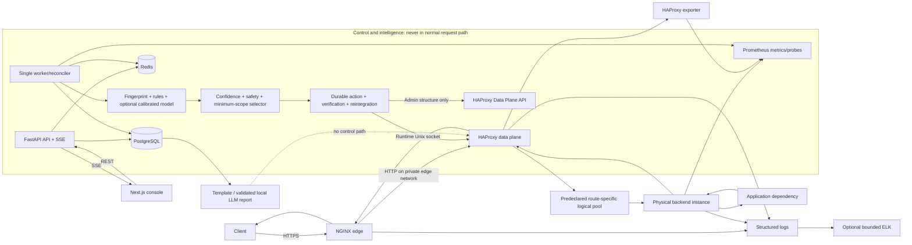

# Final Frozen Specification

> **Status:** Design approved for review, not implementation.  
> **Baseline audit:** The repository contained no implementation, configuration, manifest, test, or prior design file when this dossier began. Only these design documents have been added. Every product capability below is therefore specified, not claimed as implemented.  
> **Change rule:** Implementation begins only after explicit review/approval. A material change to routing semantics, safety, research protocol, or patent-exploration mechanism requires a superseding decision record.

## 1. Final project name

# Self Healing Load Balancer

The capitalization is a product name, not a claim that every failure or the proxy host itself can be healed.

## 2. One-line product statement

An open-source, self-hosted NGINX/HAProxy traffic controller that uses cross-route, cross-instance, and version evidence to select the smallest evidence-supported safe routing intervention, verifies its technical effect, and either commits, rolls back, or cautiously reintegrates capacity.

## 3. Exact technical problem

Backend health is not a single Boolean. A physical instance can fail globally, degrade across routes, fail only one route, share a route/dependency failure with healthy peers, become overloaded, or carry a faulty deployment version. Backend-wide health checks can remove healthy route capacity; indiscriminate retry can amplify a shared failure; route-level failure can be hidden by a globally healthy probe; overconfident automation can convert incomplete telemetry into a larger outage.

The exact problem is:

> Given bounded black-box telemetry for route × instance × version memberships and a finite set of HAProxy-expressible target sets, choose the lowest-blast-radius target that the evidence supports and the capacity/retry/conflict safety constraints allow; apply it durably despite non-atomic external controls; then establish that the affected symptom improved **and** unaffected traffic capacity was preserved before committing or restoring traffic.

### Operating assumptions

- MVP traffic is HTTP/HTTPS with a finite, ordered route-group registry.
- The application owner supplies stable physical instance ID, service, version, conservative capacity, criticality, and retry/idempotency policy.
- Route pools and every eligible route-instance membership are predeclared in HAProxy before an incident.
- Prometheus/probe observations can be gathered within bounded windows; missing evidence explicitly reduces completeness.
- One control worker has physical Runtime/DPA access. High-availability control/data planes are outside MVP.
- Demo faults and data are synthetic and isolated.

### Customer integration requirements

The customer must provide management connectivity to HAProxy; route definitions; backend/version identity; allowed CIDRs; capacity assumptions; metrics/exporters or approved probes; retry/idempotency/deduplication semantics; deployment change events; TLS/identity/retention/backup policy; and operational approvers. Integration starts observe-only, then recommendation/rules-only, then bounded actuation after validation.

A public URL alone is insufficient. It cannot reveal trustworthy instance identity, version cohorts, host/queue metrics, HAProxy authority, capacity, controlled probes, dependency scope, or retry guarantees. URL-only monitoring may demonstrate external symptoms but may not autonomously heal customer traffic.

## 4. Exact invention nucleus

The preliminary patent-exploration nucleus is **Evidence-Bounded Minimum-Scope Healing (EBMSH)**.

### Inputs

- synchronized observation window keyed by route group, physical instance, and deployment version;
- outcome/status/signature/timeout/connect/latency evidence;
- same-route peer and same-instance other-route comparison;
- version-control cohort comparison;
- request load, retry, active connection, queue, and physical capacity state;
- source freshness/completeness/conflict;
- current desired/observed routing state, active incidents/actions, cooldown and rollback availability;
- route criticality and deterministic retry/idempotency policy.

### Decision procedure

1. **Build failure-support representation.** For each populated `(route r, instance i, version v)` cell, compute bounded anomaly evidence, healthy counter-evidence, sample sufficiency, source completeness, and conflicts. Preserve affected route, instance, and version sets.
2. **Generate evidence certificate.** Record which comparisons support or contradict each candidate scope: local membership, complete instance, complete route, version cohort, or traffic condition. Rules/ML estimate class probabilities but do not select actions directly.
3. **Enumerate concrete target sets.** Convert each routing unit—`NO_CHANGE`, `INSTANCE_WEIGHT`, `COMPLETE_INSTANCE`, `ROUTE_INSTANCE`, `COMPLETE_ROUTE`, `VERSION_GROUP`, `GLOBAL_TRAFFIC_POLICY`—into the exact predeclared HAProxy members/maps it would change.
4. **Reject unsupported candidates.** A candidate is invalid when its target includes strong healthy counter-evidence, excludes materially supported faulty cells without a containment reason, lacks samples/completeness, conflicts with a higher-trust source, or cannot be expressed without a structural incident reload.
5. **Apply the safety envelope.** Reject/downgrade/block candidates that breach physical residual capacity, queue/concurrency, active quarantine, criticality, cooldown, retry, operator override, action conflict, generation, or rollback constraints. `UNKNOWN` cannot cause destructive automatic removal.
6. **Minimize blast radius.** Among evidence-supported, expressible, safety-valid candidates, minimize a deterministic cost based on healthy traffic/capacity displaced, criticality, target size, and intervention risk. Log every rejected candidate and tie-break.
7. **Prepare a durable action.** Persist action ID, controller generation, exact target set, evidence certificate, prior desired and complete observed snapshots, requested state, expected technical effect, verification/rollback criteria, actor, expiry, and idempotency key.
8. **Apply and confirm.** The sole actuator performs bounded Runtime operations, reads complete affected state, and compares it with the requested generation. A timeout/acknowledgment loss becomes `RESULT_UNKNOWN`, not an automatic retry.
9. **Verify two objectives.** Measure affected symptom relief and preservation of unaffected-route/healthy capacity, plus queue/retry/residual-capacity guardrails. Verdict is `EFFECTIVE`, `INEFFECTIVE`, `HARMFUL`, or `INSUFFICIENT_EVIDENCE`.
10. **Commit, compensate, or review.** Effective actions persist; harmful/ineffective actions restore the exact safe snapshot; unavailable evidence pauses; failed compensation requires review.
11. **Reintegrate by evidence.** Move through policy stages only after observed state, fresh samples/window, hysteresis, and both objectives pass; flapping increases cooldown and eventually requires review.

### Selection abstraction

```text
Candidates = HAProxyExpressible(routing_units, topology)
Supported  = [u for u in Candidates if EvidenceCertificate(u).passes]
Safe       = [u for u in Supported if SafetyEnvelope(u).passes]

selected = argmin_u in Safe (
    healthy_capacity_displaced(u)
  + critical_traffic_displaced(u)
  + intervention_risk(u)
  + scope_complexity_penalty(u)
)

if Safe is empty: NO_CHANGE + REQUIRE_REVIEW
```

The exact thresholds and coefficients are versioned policy and calibrated in pilot experiments; they are not learned online.

### Technical effect to test

Preserve more ground-truth healthy route capacity during scoped failures, while maintaining successful requests and bounding false actions/retry amplification, compared with round robin, standard HAProxy instance health checks, and static backend-wide healing.

This is more than renaming standard canary behaviour because target-set feasibility/evidence and capacity-preservation are decided **before** actuation, and verification checks displaced healthy scope as well as symptom relief. The prepare/apply/verify stages alone are not asserted as novel.

## 5. Supporting mechanisms

No more than three mechanisms support the nucleus:

1. **Privacy-minimized multidimensional failure fingerprint:** canonical route/instance/version/method/outcome/latency/resource/retry/affected-set/completeness representation with keyed signature hashing and no payloads/secrets.
2. **Deterministic action safety envelope:** hard capacity, retry, criticality, conflict, cooldown, operator, generation, rollback, and maximum-quarantine constraints that ML/LLM cannot override.
3. **Evidence-gated verification and reintegration:** dual-objective verification, observed-state confirmation, sample/time bounds, hysteresis, adaptive cooldown, staged recovery, and exact-state rollback.

These are candidate dependent concepts for engineering/IP review, not independent novelty conclusions.

## 6. Standard features not claimed as novel

The project expressly does **not** claim novelty for:

- active/passive health checks, readiness/liveness probes, connection failure detection;
- target/server ejection, draining, weight changes, weighted routing, target groups/pools;
- route/path matching or representing a target in multiple pools;
- circuit breaking, retries, retry budgets/suppression, rate/concurrency limits, fail-fast;
- outlier/anomaly detection, peer comparison, ML failure prediction/classification;
- canary release, version cohorts, gradual traffic shifting, rollback, staged recovery;
- container/process restart, deployment rollback, autoscaling;
- Prometheus/ELK dashboards, incident timelines, topology/matrix displays;
- LLM-generated incident summaries.

Important confirmed prior art includes [US20110238733A1 / US9058252B2, request-type or URL-namespace server health](https://patents.google.com/patent/US20110238733A1), [US8949658B1, peer-relative backend anomaly/ejection with ejection caps](https://patents.google.com/patent/US8949658B1), and [US11943131B1, confidence-gated remediation with post-action service testing](https://patents.google.com/patent/US11943131B1/en). Official systems also provide overlapping point mechanisms, including [Envoy outlier detection](https://www.envoyproxy.io/docs/envoy/latest/intro/arch_overview/upstream/outlier), [Istio DestinationRule outlier detection](https://istio.io/latest/docs/reference/config/networking/destination-rule/), and [AWS target-group health](https://docs.aws.amazon.com/elasticloadbalancing/latest/application/target-group-health-checks.html).

## 7. Final failure classes

| Class | Evidence pattern | Permitted automatic direction |
|---|---|---|
| `HEALTHY` | No supported anomaly; sufficient fresh evidence | No healing change; normal policy |
| `INSTANCE_DOWN` | Hard connect/probe failure across memberships | Complete-instance drain/disable if residual capacity safe |
| `INSTANCE_DEGRADED` | Cross-route peer-relative latency/errors on one instance | Bounded instance weight reduction, then drain if verified/safe |
| `ROUTE_INSTANCE_FAILURE` | One membership fails; same instance’s other routes and same route’s peers counter-support larger scopes | Route × instance quarantine |
| `SHARED_ROUTE_FAILURE` | Same route/signature fails across multiple/all instances while other routes remain healthy | Suppress retry; predeclared route fail-fast/rate/concurrency protection; do not mass-eject |
| `TRAFFIC_OVERLOAD` | Broad saturation, queue/connections and offered load explain degradation without localized fault support | Admission/rate/concurrency protection; no fault-based instance ejection |
| `VERSION_SPECIFIC_FAILURE` | A version cohort regresses against a contemporaneous control cohort | Drain affected route-version memberships/version group if capacity safe |
| `UNKNOWN` | Sparse, low-completeness, conflicting, OOD, tied, or unsafe evidence | No destructive automatic action; review; hard retry rules still apply |

Classes are mutually resolved by priority/evidence rules for one classification version, but an incident may be revised with history preserved. A class is not a root-cause assertion.

## 8. Final healing actions

### Runtime-expressible MVP actions

- no change and require/manual review;
- reduce/restore one logical membership weight;
- reduce/restore every membership of one physical instance;
- drain/quarantine a route × instance membership;
- drain a complete instance;
- suppress/limit cross-instance retry under the route’s hard policy;
- activate predeclared route rate limit, concurrency cap, or fail-fast map;
- drain/restore a predeclared deployment-version membership set;
- start, advance, pause, or roll back route/instance/version reintegration;
- expire or supersede an operator-approved override.

### Structural administrative actions

Add/remove routes, pools, memberships, and raw structure only through an authenticated, versioned HAProxy Data Plane API transaction, native configuration validation, and graceful reload. Automatic incident handling does not invent pools or structurally reload HAProxy in MVP.

“Disable entire backend” is complete-instance membership drain/maintenance across every logical pool, applied as a durable compensatable saga. Partial apply cannot be reported as complete success.

## 9. Final architecture

### Request and control architecture



### Plane responsibilities

| Plane | Frozen responsibility | Failure behaviour |
|---|---|---|
| Client/Edge | Browser/client; NGINX TLS, headers, logs, UI/API/application forwarding | NGINX failure is a real data-plane outage |
| Data | HAProxy route matching, logical pools, health, queue/retry/weights/state | Continues LKG without controller; process/host HA outside MVP |
| Backend/Dependency | Customer/demo service instances and downstream effects | Source of failures; controller never restarts arbitrary customer code |
| Observability | Prometheus/exporters/probes; bounded structured log/optional ELK | Missing evidence lowers completeness/suppresses action; traffic continues |
| Control | FastAPI modular monolith; worker desired/observed reconciliation | API/worker failure leaves LKG; no request-path hop |
| Intelligence | fingerprint, rules, LR/RF candidate, confidence, safety, selector | Model failure → rules-only; inadequate evidence → UNKNOWN |
| Persistence | PostgreSQL durable; Redis ephemeral; metrics/log stores specialized | Durable/coordination loss → safe mode; no new mutations |
| Reporting | deterministic template and optional local validated LLM | LLM loss → template; never actuates |
| Presentation | Next.js console, REST snapshots, SSE events | UI/SSE loss does not affect traffic or controller |
| Research/Fault | manifest runner, Locust/k6, Toxiproxy, Pandas/Matplotlib | Lab-only; absent from public/customer profile |
| Deployment/Ops | Compose profiles, networks, secrets, backups, CI | Optional services fail independently; restore/reconcile explicitly |

### Control modules

The Python modular monolith contains Authentication/Authorization, Project/Environment Manager, Backend/Route/Policy Registry, Health Scheduler, Telemetry Ingestion, Feature Window Builder, Fingerprint Engine, Rule/ML Classifier, Hybrid Resolver, Confidence, Safety, Routing Unit Selector, Action Planner, HAProxy Adapter, Desired Store, Observed Reader, Reconciler, Verification, Reintegration, Incident/Audit/Report/Event/Experiment Manager. These are modules, not microservices.

### Exact control semantics

- **Authority:** exactly one worker has the Runtime Unix socket and DPA capability. The API/frontend/model/report containers do not.
- **Cadence:** Runtime observation/reconciliation every 2–5 s during active state and 10–15 s idle; evidence windows commonly 15–60 s; all are versioned/tunable.
- **Generation:** worker acquires advisory ownership, increments a durable controller generation, then may write only actions with current entity/action generation. Redis lease/domain locks are coordination, not external fencing.
- **Desired/observed:** PostgreSQL desired state is durable intent; complete HAProxy Runtime/config read is observed truth. Drift is corrected only when recognized/safe; unknown structural drift enters `UNMANAGED_DRIFT`.
- **Idempotency:** API idempotency key plus action ID, target/state digest, entity version, generation, and per-attempt durable record. Same request returns same action; conflicting reuse rejects.
- **Rejection/timeout:** HAProxy rejection records failure and preserves/reverts desired intent; ambiguous timeout triggers read/reconcile without blind retry.
- **Restart:** state file may aid HAProxy restart, but durable desired state reconstructs runtime state after full observation and safety review. Automation stays safe until reconciliation/fresh evidence.
- **Split brain:** prevented in MVP by physical access isolation and one replica, not by claiming Redis consensus.

### Healing action lifecycle

```text
PLANNED → SAFETY_CHECKED → PREPARED → APPLIED
        → STATE_CONFIRMED → VERIFYING → COMMITTED
                                  ↘ ROLLED_BACK
                                  ↘ NEEDS_REVIEW
```

Each action stores action/incident/generation/target, exact previous desired+observed snapshots, requested state, evidence, confidence/completeness, safety result, expected effect, verification/rollback criteria, expiry/actor/timestamps, idempotency key, every HAProxy attempt/result, and audit chain. This is a saga, not a distributed atomic transaction.

### Reintegration

`QUARANTINED → PROBING → 5% → 20% → 50% → 100% → HEALTHY`. Percentages are initial policy defaults. Advancement requires observed current stage, fresh probes/traffic, minimum samples or bounded low-traffic procedure, affected/unaffected criteria, no conflict/flap/capacity breach, and cooldown. Harm reverses to the last safe stage; repeated flap/maximum attempts requires review.

## 10. Final technology stack

| Concern | Frozen choice |
|---|---|
| Core/control | Python, FastAPI, Pydantic, SQLAlchemy, Alembic |
| Public edge | NGINX |
| Dynamic data plane | HAProxy Runtime API; HAProxy Data Plane API for structural admin changes |
| Durable/ephemeral | PostgreSQL / Redis |
| Metrics | Prometheus, HAProxy exporter; Node Exporter/cAdvisor only where justified |
| Logs | Structured JSON; Filebeat→Logstash→Elasticsearch→Kibana in full profile |
| ML/research | scikit-learn, Pandas, Jupyter, Matplotlib, Locust or k6, Toxiproxy |
| Local reporting | Ollama with a pinned, license-reviewed 7B–8B instruction model; preferred candidate Qwen3 8B Q4_K_M |
| Frontend | Next.js, TypeScript, Tailwind, shadcn/ui primitives, Recharts, React Flow, TanStack Query, SSE |
| Deployment/CI/test | Docker Compose, GitHub Actions, pytest, Playwright, integration/fault/security/model tests |

No Kubernetes, service mesh, Kafka, RabbitMQ, Celery, paid API/SaaS, managed database, hosted LLM, or generic microservice decomposition. Optional WireGuard/private VLAN and encrypted `restic`-style backup solve multi-host transport/backup without becoming product dependencies.

## 11. Final database choices

### PostgreSQL: durable system of record

Users/roles, projects/environments/services, physical instances, route groups/memberships, versions, routing/retry policies, desired generations, incidents, fingerprint summaries, classifications, evidence references, actions/attempts/snapshots, verification, reintegration, reports, models, experiments, audit, controller generations and overrides. Use foreign keys, check/unique constraints, optimistic entity versions, transactionally appended audit, project-scoped access, and indexed active/time queries.

### Redis: rebuildable runtime state

Writer/domain leases, monotonic coordination token cache, recent windows/fingerprints, active incident/action cache, cooldowns/reintegration progress, dedup/rate counters, SSE cursors. TTL and bounded size are mandatory. Redis loss suppresses mutation; it never erases durable desired truth.

### Specialized stores

- Prometheus owns numeric time series, not incidents/actions.
- Elasticsearch owns bounded raw/structured logs, not desired state/audit truth.
- Raw payloads/secrets are never fingerprint data.

Compact retention: metrics 1–3 days, file logs 1–3 days, ELK off. Lab: metrics 15 days/30 GB, ELK 7 days/20–30 GB. Durable incident/audit/research retention follows project policy with export/deletion/audited tombstones. Nightly encrypted PostgreSQL/config backup and weekly restore drill; Redis/Prometheus/ES/model cache are reconstructable.

## 12. Final HAProxy strategy

- Start with an exact qualified **HAProxy 3.2 LTS + matching DPA 3.2 patch pair**; pin digests and compatibility tests. Re-evaluate before implementation rather than floating “latest.”
- HAProxy owns ordered exact/prefix route-group matching, predeclared logical backend pools, active checks, weights, drains/maintenance, queue/connection limits, per-route retry and predeclared protection maps. The design uses the documented [HAProxy Runtime API](https://www.haproxy.com/documentation/haproxy-runtime-api/) and [Data Plane API configuration workflow](https://www.haproxy.com/documentation/haproxy-data-plane-api/tutorials/backends/) rather than an invented control interface.
- A physical instance `B` appears as stable logical members such as `public/B`, `auth/B`, `catalog/B`, `checkout/B`. They share physical identity/version/capacity but have independent membership state/weight.
- Route × instance quarantine changes only `checkout/B` (for example weight 0/drain); B remains selectable in the other pools. Capacity calculations never sum B four times.
- Runtime API performs volatile weight/state actions and reads observed state. DPA uses configuration-version optimistic concurrency for structural administration, native validation, graceful reload, and exact-config rollback.
- No automatic structural edit/reload during an incident in MVP. If the smallest supported unit is not pre-expressible, select a larger unit only if independently evidence-supported and safe; otherwise no change/review.

## 13. Final NGINX role

NGINX is the single public listener for TLS termination/renewal, host allowlisting, request-size/connection limits, security headers, correlation/access logging, frontend delivery, API proxying, SSE no-buffer route, and forwarding application traffic to HAProxy. It does not duplicate HAProxy route pools, backend health, retry, weight, outlier, queue, or healing logic. Its failure is a real ingress outage; an external redundant edge is future/customer responsibility.

## 14. Final ML design

### Rules versus model

Hard rules own connection refusal/repeated failed probe, unsafe retry, insufficient physical capacity, low data completeness/conflict, stale generation/action collision, and reintegration failure. The model assists ambiguous degradation/scope classification only.

### Feature vector

Bounded route/method/outcome/timeout/connect/signature categories; latency and peer-relative deviation; error-rate and request-rate deviation; retry/attempt ratio; queue/connections; CPU/memory where trusted; affected-route/instance fractions; version-cohort delta; prior action/cooldown; sample/freshness/completeness/conflicts. No raw body, token, user ID, high-cardinality URL, or secret.

### Models and selection

- Rules-only deployment baseline.
- Logistic Regression interpretable statistical baseline.
- Calibrated Random Forest candidate, not predetermined winner.
- No fourth model/deep learning/RL because the dataset is structured/modest and safety/explainability dominate.

Train on independently injected/labeled synthetic trials. Split by complete experiment run/injection, hold out intensity/workload, fit preprocessing/calibration only on training, and retain one untouched grouped test. Address imbalance with class weights/stratified grouped design, not leakage-prone row resampling. Missingness is explicit; OOD/low margin/completeness → UNKNOWN. Artifacts include schema/config/data/code digest and can be rolled back; no automatic retraining/deployment.

Selection/reporting uses macro-F1, every class precision/recall, confusion matrix, expected calibration error/Brier score, abstention, false automatic-action rate, and inference latency. A defensible “90%” requires grouped held-out macro-F1 ≥0.90 with confidence interval **and** predeclared per-class, calibration, and false-action gates; raw accuracy is prohibited.

## 15. Final LLM role

The optional local model produces incident prose only. It receives a redacted allowlisted fact bundle containing incident/time, evidence values and fact IDs, class/confidence/completeness, recorded action/observed state, verification/recovery, and approved developer checklist IDs. It cannot choose/recommend/execute routing, override safety/retry, see credentials/control endpoints/raw bodies, claim code lines, or assert unsupported root cause.

Use Ollama with a pinned 7B–8B instruction model; the preferred [Qwen3 8B Q4_K_M catalog artifact](https://ollama.com/library/qwen3%3A8b) is about 5.2 GB and needs roughly 6–10 GB extra RAM. One bounded asynchronous job, low temperature/non-thinking mode, 60–180 s timeout. Validate JSON schema, fact references, numbers/entities, category/action/outcome equality, forbidden claims and secrets. Repair once; then deterministic template. Store input/model/prompt/validator digest and output audit. The compact/public profile can disable Ollama completely.

## 16. Final frontend direction

### Visual system

Premium dark-first interface using OLED black (`#000000`–`#0A0A0A`), subtle charcoal (`#1F1F1F`) structure, electric indigo active-routing context, crisp emerald verified health, muted rose quarantine, and amber unresolved obligations. Geist Sans and Geist Mono are locally bundled with Inter/system fallback. Generous spacing, fluid grids, fact-linked natural-language situation briefs, progressive disclosure, shape-matched skeletons, and restrained Framer Motion create a human-readable enterprise experience. Soft clipped glows may identify active topology/trace context; neon, decorative gradients, chat-first logs, random KPI cards, AI sparkles, and generic shadcn appearance are prohibited. Light/Dark/System use semantic tokens, with premium dark as the canonical operations expression.

### Product spine

- **Decision Trace:** an interactive diagnostic narrative—Observe → Localize → Bound → Act → Verify → Recover—that preserves Evidence → Fingerprint → Classification → Safety → Minimum Routing Unit → HAProxy Saga/Readback → Verification → Outcome. It shows competing hypotheses, rejected scopes, versions, provenance, and audit. Verification visibly splits into equally weighted affected-cohort relief and preserved-cohort capacity tracks on one time axis; both must pass before `EFFECTIVE`/commit.
- **Blast Radius Map:** mandatory before manual approval and in automated-action review. It centers the physical instance, renders changed logical memberships as before→after ribbons, explicitly labels healthy memberships preserved on that same instance, calculates unique residual capacity, and compares rejected broader scopes.
- **Route × Instance Matrix:** route rows and physical-instance/version columns with Overview/Operational/Forensic density modes. Default cells remain calm; hover/focus and a side inspector reveal state, weight, latency, errors, samples, controls, and quarantine/stage. Desired frame and observed interior remain distinct; drift cannot resemble success.

All required screens ship in the information architecture: Landing, Login, Setup, Command Center, Topology, Matrix, Inventory/Details, Traffic, Incident List/Details, Decision Trace, Healing Actions, Reintegration, Version Health, Policies, Metrics, Logs, Fault Lab, Research Experiments, Baseline Comparison, Settings. Deep polish prioritizes command/matrix/incident/action/recovery/research workflows.

TanStack Query owns REST snapshots/mutations; ordered cursor-based SSE supplies one-way events with REST resync on gaps. WebSockets are unnecessary. A Raycast-style `Cmd/Ctrl+K` hub is the primary navigation/workflow entry but cannot bypass Blast Radius review, approval, or observed confirmation. WCAG 2.2 AA, keyboard alternatives for matrix/trace/topology/Blast Radius, non-color states, reduced motion, chart tables, stale/result-unknown/safe-mode states, and accessible split verification are release gates. Mobile is read/acknowledge limited; high-impact editing/faults are desktop-only.

## 17. Final deployment model

### A. Local Development

Docker Compose compact profile: about 13–14 containers including three demo backends; 4 logical CPU minimum, 8 GB RAM/20 GB free disk workable, 12–16 GB/40 GB recommended. Prometheus 1–3 days; structured rotated logs; ELK/Ollama/notebook/cAdvisor off.

### B. Full Research Lab

Complete Prometheus, bounded ELK, four backends/dependency, Toxiproxy, fault and experiment runners, Locust/k6, optional notebook and Ollama. 8–12 logical CPU, 24–32 GB RAM, 100–150 GB disk. Use a second load-generator machine; do not run ELK and 8B Ollama together on 16 GB.

### C. Public Zero-Mandatory-Cost Demo

Self-host on user/college hardware; 4–8 CPU, 12–16 GB RAM, 40–60 GB disk; synthetic data; Viewer public account; fault/admin/store/observability/model surfaces private. Stable fallback is LAN/WireGuard/SSH forwarding. Direct 443 with owned hostname/free ACME or an optional free tunnel/static landing host is allowed but replaceable—not guaranteed permanently free.

### D. Future Customer-Integrated

Separate edge/data host, control/database host, optional observation host over private VLAN/WireGuard/mTLS. Observe-only→recommendation→approved automatic rollout. Redundant HAProxy/NGINX, PostgreSQL HA, multi-writer control, multi-region/global routing, and production SLA are separate future qualifications.

Networks isolate edge, backend, control, actuation, observability, and lab. Only NGINX 80/443 publishes publicly. API has no Runtime/DPA access; Ollama/fault runner have no actuation network. Pinned images, non-root/read-only where possible, bounded health/startup, graceful control shutdown, config validation, pre-upgrade backup, LKG rollback, and clean-host restore are required.

## 18. Final security model

- Local credentials/session authentication, Argon2id-class password hashing at implementation, secure HttpOnly/SameSite cookies, CSRF protection, login/API rate limits; external OIDC is optional later.
- Roles: Viewer, Researcher (lab only), Operator, Approver, Project Admin, System Admin; project/environment object authorization on every API/query/event.
- HAProxy Runtime Unix socket is writable only by the sole worker; DPA is private and least privilege; frontend/API/LLM/ELK/backends cannot reach it.
- Backend/probe SSRF protection: approved CIDR/port/scheme, canonical resolution at connection, redirect off, metadata/link-local/private denial except explicitly approved customer ranges, DNS-rebinding checks.
- Route/config/log injection controls: canonical exact/prefix route forms, no raw HAProxy directives in MVP, length/character/control-newline limits, structured logging and output escaping.
- Telemetry is authenticated where possible, bounded, cross-source compared, freshness/completeness weighted; model output is advisory to hard safety.
- Secrets use permission-restricted mounted files, never repo/image/arguments/logs; TLS on public/private multi-host paths; encrypted offline/off-host backups.
- Fault endpoints are absent outside isolated lab; public demo operator uses VPN/local administration.
- Audit is append-only for application roles, versioned and hash-chained with off-host backup; it is tamper-evident within the declared trust boundary, not immutable against full host/DB-admin compromise.
- LLM has a one-way fact/report boundary and no control credentials/API path.

Fail-open for normal data traffic when control/intelligence/reporting/frontend/PG/Redis/Prometheus/ELK/model/Ollama is unavailable: keep HAProxy LKG and suppress new mutations/reintegration where evidence/coordination is incomplete. Fail-closed for control authorization, fault execution, unsafe retry, new mutations, and evidence-insufficient stage advancement. HAProxy/NGINX process/host loss remains an actual traffic failure.

## 19. Final research design

### Research question

Does EBMSH preserve more ground-truth healthy route capacity during scoped incidents than standard and static policies, without materially reducing successful requests or increasing unsafe actions/retries?

### Baselines

1. Plain Round Robin.
2. Standard HAProxy instance health checks.
3. Static threshold-based backend-wide healing.
4. Proposed Self Healing Load Balancer.

Same images/routes/capacities/workload/timeouts/fault seed; only declared policy differs. Required faults: crash, slow instance, route-instance, shared-route/dependency, overload, version regression, flapping recovery, unknown mixed anomaly.

### Primary metric

Time-integrated **ground-truth healthy route capacity preserved (HCP)**: admitted fraction of capacity belonging to truly healthy route-instance memberships during fault-to-recovery. Successful-request fraction is a non-inferiority guardrail (initial pilot proposal: no worse by >1 percentage point; freeze from pilot). A do-nothing/unusable membership cannot win.

Secondary: successful requests, unnecessary full removal, retry amplification, false action/scope excess, MTTD/MTTI/MTTR, p95/p99, classifier macro-F1/calibration, reintegration/rollback, overhead.

### Protocol and statistics

- Independent fault ledger; open-loop workload; 120 s initialize, 180 s warm-up, 300 s fault, 300–600 s recovery defaults.
- Pilot 5–10 blocks/scenario, excluded from confirmation, establishes intensity/windows/variance/margin/power.
- Main core: 4 baselines × 8 faults × **30 independent matched trials** = 960 runs; randomized Latin-square baseline order and matched seed, one injection cycle is the replicate.
- Primary scoped-fault omnibus: Friedman repeated-measures test; planned Proposed-versus-baseline Wilcoxon signed-rank comparisons with Holm correction; Hodges–Lehmann shift, rank-biserial effect and bootstrap confidence intervals. Predeclare paired permutation fallback if assumptions fail.
- Aggregate by trial; per-second windows are not replicates. Group model split by run/injection. Report exclusions, invalid trials, negative results, multiplicity, threats and exact artifacts.

Threats: synthetic topology/fault cleanliness, capacity construct, host contention, coordinated omission, scenario contamination, model leakage, limited rare-event power, and no multi-region/customer external validity. Reproducibility bundle records manifest/seed, commit and dirty state, image/model/config hashes, host, truth ledger, raw bounded data, validity, analysis and checksums.

## 20. Final patent-exploration statement

EBMSH is a **patent-exploration candidate and potentially differentiated mechanism, subject to formal prior-art and legal review**. It is not declared patentable, novel, non-obvious, or infringement-free.

Prior-art risk is **medium-high** because route/request-specific health, peer-relative ejection, confidence-gated remediation, active diagnostics, weighted targeting, feedback verification, and staged recovery are known independently. The narrower question is whether the exact evidence-certificate + expressible-target optimization + physical-capacity/retry safety + dual-objective verification combination has an unanticipated claimable distinction and technical effect.

Required next legal/technical search: Google Patents, Espacenet, WIPO Patentscope, USPTO Patent Center/search, Lens, Google Scholar, IEEE/ACM/USENIX; forward/backward citations and INPADOC families; HAProxy/NGINX/Envoy/Istio/F5/AWS/Google/Azure/Cisco/IBM literature; CPC areas around network traffic distribution, fault monitoring/recovery, and computer-system availability. Build element-by-element claim charts rather than keyword-count conclusions.

Keep the detailed mechanism, unpublished diagrams, experiment data, source implementation, and claim-oriented alternatives confidential until the college IP cell/patent professional decides filing/publication order. This is non-legal engineering guidance.

## 21. Exact MVP

### Traffic and control

- single-host Docker Compose compact and lab profiles;
- NGINX edge plus HAProxy with configurable exact/prefix groups and demo `/public`, `/auth`, `/catalog`, `/checkout`;
- three/four physical demo instances across predeclared logical pools; version/cohort metadata;
- one FastAPI modular monolith with API/worker roles, PostgreSQL, Redis, Prometheus/exporter, structured logs;
- single physical HAProxy writer, desired/observed reconciliation, generation/idempotency/drift/restart recovery/safe mode;
- eight final classes, rules-first resolver, UNKNOWN, capacity/retry/conflict safety;
- route-instance, instance weight/drain, shared-route retry/fail-fast protection, overload rate/concurrency protection, version-set drain;
- durable action saga, observed confirmation, verification, rollback, staged reintegration and operator override/audit;
- no automatic structural change during incident.

### Product

- authenticated project/environment/RBAC REST API and ordered SSE;
- all 22 required screens in one semantic design system; deepest workflows Command Center, Topology, Matrix, Incident/Decision Trace, Actions, Reintegration, Fault/Experiments/Baseline;
- Light/Dark/System and WCAG 2.2 AA critical workflow;
- deterministic incident report; optional validated local LLM in lab only.

### Research/operations

- four baselines, eight faults, independent truth and reproducibility bundles;
- rules/LR/RF evaluation with conditional model deployment;
- compact clean-host setup, full lab, safe public demo fallback, bounded retention/backups;
- full acceptance/security/failure/recovery/test suite and 30-block confirmatory protocol.

## 22. Stretch scope

Only after MVP/research gates:

- local per-HAProxy actuator that enforces fencing generations for controlled multi-node writers;
- qualified redundant NGINX/HAProxy topology and synchronized desired state;
- richer route match categories and safe precompiled maps;
- OpenTelemetry control-plane/request tracing when customer instrumentation exists;
- alternative evidence-window policies and larger/unseen topologies;
- external OIDC/LDAP and customer secret manager adapters;
- notification connectors and signed/timestamped audit export;
- additional deployment/protocol/version cohort experiments;
- formal privacy analysis and federated/aggregate learning only if real multi-customer need appears;
- formally reviewed structural change workflow—not automatic incident topology invention.

Stretch is not promised for the four-student delivery.

## 23. Explicit non-goals

- Kubernetes replacement, service mesh, generic cloud platform, autoscaler, AIOps/observability platform;
- WAF, DDoS scrubbing service, identity provider, generic monitoring product;
- source-code debugger, exact root-cause locator, chatbot/LLM control plane;
- application/container restart, deployment rollback execution, database/dependency repair;
- arbitrary raw HAProxy commands/config generation through UI;
- autonomous model retraining, reinforcement learning, deep learning;
- TCP/UDP/global anycast/multi-region traffic management in MVP;
- HAProxy/NGINX host self-repair, zero-downtime data-plane HA, PostgreSQL HA;
- paid APIs/SaaS/managed cloud requirement or “permanently free cloud” promise;
- guaranteed patentability, production SLA, or universal accuracy/performance.

## 24. Main technical risks

1. Prior art may anticipate/obviate the candidate; route-instance quarantine alone clearly is not enough.
2. Logical membership can double-count physical capacity unless the physical ledger is exact.
3. HAProxy external actions are non-atomic and do not enforce Redis fencing; single-writer isolation is mandatory.
4. Incomplete/poisoned telemetry or shared failures can cause harmful scope selection; UNKNOWN/safety/rollback must dominate availability optimism.
5. Retry can duplicate side effects or amplify overload despite correct classification.
6. HAProxy restart/runtime volatility and manual drift can re-enable traffic until durable desired state reconciles.
7. Low traffic and flapping make verification/reintegration slow or ambiguous.
8. Full ELK + 8B model exceeds many student laptops; optional profiles and sequential operation are required.
9. Synthetic data/model leakage/baseline unfairness can invalidate research claims.
10. 960 confirmatory runs need early reliable automation and possibly a qualified second rig.
11. Public misconfiguration can expose faults/control/stores; public profile must be materially different.
12. Single-machine ingress remains a single point of failure and limits production claims.

Stop-ship if two writers reach HAProxy; UNKNOWN can destructively actuate; unsafe retry can be model-overridden; action is committed without observed confirmation/verification; rollback/audit snapshot is absent; invalid config replaces running config; cross-project/SSRF/control/fault boundary fails; or control failure stops otherwise healthy request traffic.

## 25. Feasibility verdict

**Feasible, with disciplined scope, for four undergraduate students over 22 weeks.** The hard but achievable contribution is a rules-only, single-data-plane vertical slice with correct logical memberships, evidence/safety target selection, durable reconciliation/action, verification/reintegration, and repeatable experiments. Random Forest is conditional, Ollama and ELK are optional, and multi-node HA is excluded. Distribute UI by domain and cut optional polish before compromising safety or research validity.

The implementation is not easy: HAProxy state reconstruction, ambiguous action results, capacity accounting, retry semantics, and statistically valid automation are the genuine engineering work.

## 26. Zero-operational-cost verdict

**Meets the stated requirement as “zero mandatory recurring external service cost.”** Every core component is open-source/self-hosted; no paid API, SaaS, managed database, hosted model, or cloud is required. A complete compact system works on an 8 GB host with optional components off; the lab is practical at 24–32 GB. Public demonstration always has a user-owned LAN/VPN/SSH fallback. Hardware, electricity, storage, Internet, and an optional public domain/tunnel can still cost money or fail; the project makes no permanent-free-cloud claim.

## 27. 60-second professor explanation

Most load balancers decide whether an entire backend is healthy. That is too coarse when one server fails only `/checkout` but still serves `/public`, `/auth`, and `/catalog`. Our system represents the same physical server in separate HAProxy route pools and compares evidence across routes, peer instances, and deployment versions. The core is not simply route-level quarantine—that already has prior art. The proposed research mechanism builds an evidence certificate for every possible routing scope, rejects scopes contradicted by healthy evidence or unsafe remaining capacity, and chooses the lowest-blast-radius HAProxy target. One physically isolated, generation-checked controller records the exact previous state, applies the bounded change, confirms actual HAProxy state, and verifies both that the failure improved and that unrelated healthy capacity was preserved. It then commits, rolls back, or reintegrates traffic in evidence-gated stages. Hard rules govern retries and safety; machine learning only helps classify ambiguous patterns, and a local LLM only writes grounded reports. We compare it with round robin, normal HAProxy health checks, and static healing across eight controlled faults, using healthy route capacity preserved as the primary metric with successful requests as a guardrail.

## 28. Abstract (217 words)

Conventional load-balancer health mechanisms frequently make backend-wide decisions, although a physical backend may fail for only one route or deployment cohort. Removing the backend can discard healthy capacity, while retaining it or retrying across peers can amplify shared-route and overload failures. This project specifies a Self Healing Load Balancer in which NGINX provides public ingress and HAProxy provides predeclared route-specific pools and dynamic traffic control. Its proposed research mechanism, Evidence-Bounded Minimum-Scope Healing, constructs a privacy-minimized failure-support representation across route, instance, and deployment version. Deterministic rules and an optional calibrated classifier estimate failure scope, but a separate safety engine enumerates concrete HAProxy target sets, rejects candidates contradicted by evidence or constrained by retry, capacity, conflict, and rollback policies, and selects the lowest-blast-radius valid intervention. A single-writer controller persists prior desired and observed state, applies the action as a compensatable saga, confirms HAProxy state, and verifies both symptom improvement and preservation of unaffected healthy capacity. Ineffective or harmful actions are restored; recovery proceeds through evidence-gated stages with hysteresis. The design remains operational without machine learning, Elasticsearch, the frontend, or the local reporting LLM. Evaluation compares round robin, standard HAProxy checks, static threshold healing, and the proposed controller across eight injected failure classes, with ground-truth healthy route capacity preserved as the primary outcome and successful requests as a safety guardrail.

## 29. Resume-ready project description

Designed an open-source self-healing load balancer using NGINX, HAProxy, FastAPI, PostgreSQL, Redis, and Prometheus. Defined an evidence-bounded controller that compares route × instance × version behaviour, selects the smallest capacity- and retry-safe HAProxy target, reconciles desired/observed state through idempotent compensatable actions, verifies unaffected-capacity preservation, and performs staged rollback-aware reintegration. Designed grouped ML evaluation, eight-scenario fault injection, four load-balancing baselines, a security-isolated local LLM reporting path, and zero-mandatory-cost Docker deployment for student hardware.

Do not state this as “implemented” on a resume until the corresponding implementation/evaluation is complete; use “designed” at the current stage.

## 30. Suggested research-paper title

**Evidence-Bounded Minimum-Scope Remediation for Route-Scoped Failures in HAProxy Load Balancing**

Alternative if experimental results are negative or mixed: **An Empirical Evaluation of Failure-Scope-Aware Remediation in Route-Partitioned HAProxy Pools**.

## 31. Suggested patent-disclosure title

**Evidence-Constrained Selection and Verification of Minimum Traffic-Routing Remediation Scope**

This is a non-legal working title. A patent professional should revise it after claim-chart/prior-art review.

## 32. Immediate next implementation phase

Implementation may begin only after design and IP/public-disclosure review. The first approved phase is a **two-week deterministic traffic-and-contract spike**, not UI or ML:

1. freeze exact supported HAProxy/DPA/NGINX/PostgreSQL/Redis patch versions and image-license/digest plan;
2. implement the static demo request path NGINX→HAProxy→four logical pools→three/four physical instances;
3. prove manually, with independent request counts, that quarantining `checkout/B` preserves B for public/auth/catalog;
4. define stable physical-instance/logical-membership/version/capacity IDs and canonical route matching;
5. validate required Runtime state/weight reads/writes, DPA versioned structural transaction, native config validation, graceful reload, restart state behaviour, and ambiguous socket response;
6. create the initial PostgreSQL/domain/API contract and independent fault-truth event schema;
7. run the compact resource, isolation, config-rejection, restart, and routing acceptance checks;
8. update risks/ADRs with measured incompatibilities before building the controller.

Exit criterion: a deterministic, version-pinned, non-self-healing laboratory proves the routing representation and control primitives without claiming product behaviour. Only then proceed to desired/observed reconciliation and rules-based safety.
