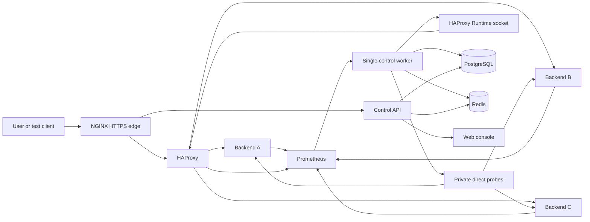
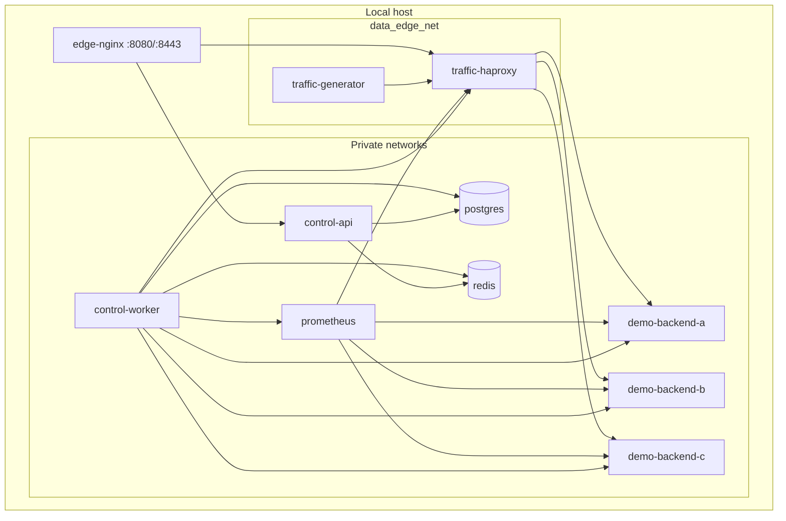
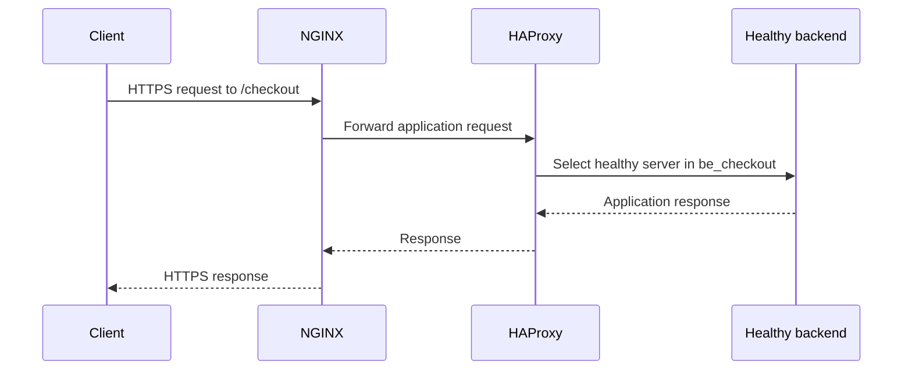
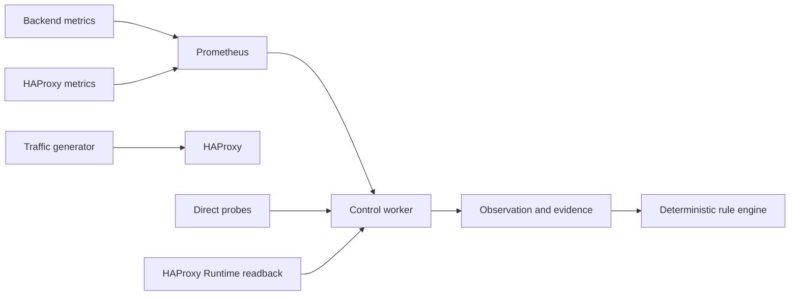
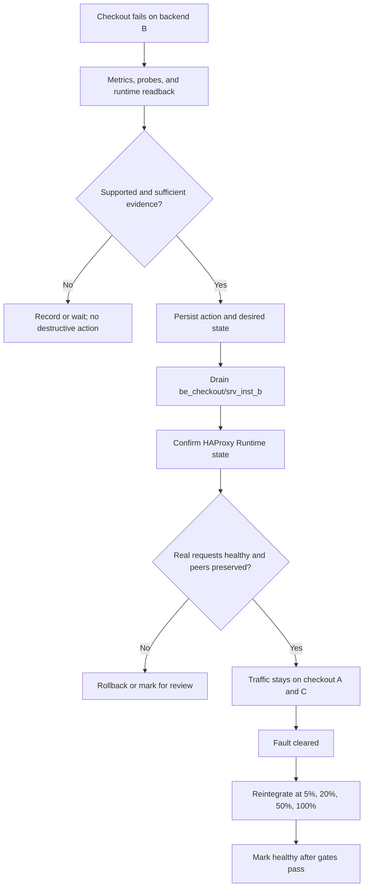

# Architecture

## Scope

The implemented system is a local Docker Compose lab. Its data plane is separate from its control plane. NGINX is the only published edge service. HAProxy handles application traffic. The control worker alone has access to HAProxy's private Runtime socket and the private backend/observability networks.

## Overall Architecture

## Container Diagram

## Request Flow

## Monitoring Flow

## Failure Recovery Flow

## Recovery Boundary

The demo application's `instance_down` fault makes the backend health endpoint fail. HAProxy then marks it unhealthy through its own checks. The control worker can also classify that supported case and drain the affected instance memberships. For the primary route-specific demo, the backend container remains running and only checkout on backend B fails. The recovery is a routing change, not a backend restart.
